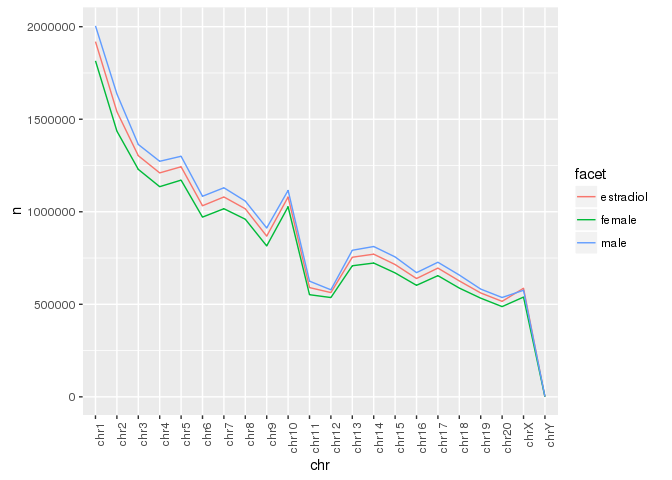
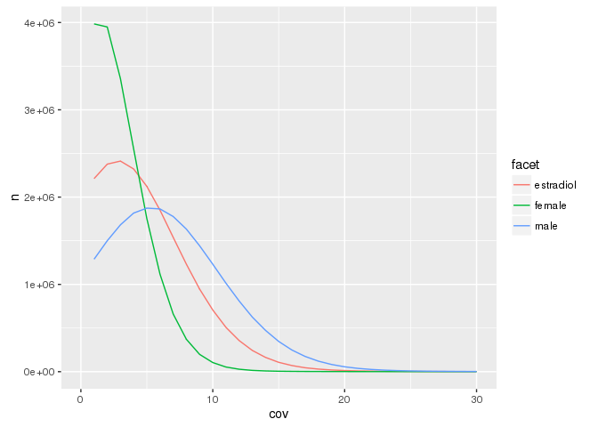
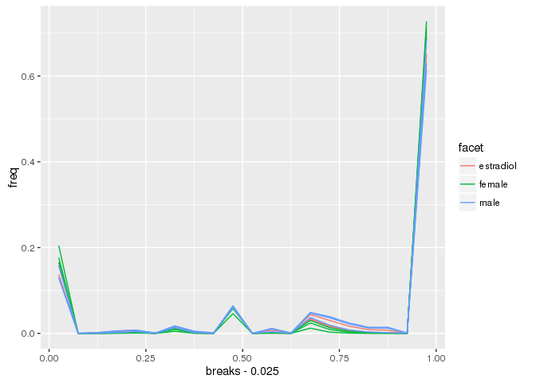
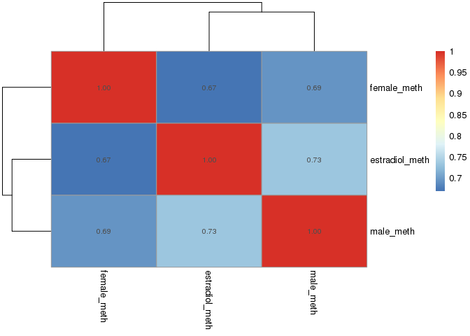

# Processing DNA Methylation Data

# Processing and sanity checking DNA methylation data

Warning, the data files come out to be 2.5 GB! Check that your computer has more than 2.5 GB of RAM, or else your computer will crash!

## Load libraries


```r
require(data.table)
require(foreach)
require(doMC)
require(knitr)
require(dplyr)
require(ggplot2)
require(pheatmap)
# setwd("Data_Analysis")
```

## Load data


```r
cpg_file_names <- dir("../methylation_data/", "^SRR.*.CG.bed", full.names = T)

file_table <- read.delim("../methylation_data/sample_table.txt", header = FALSE) %>% arrange(V1)

registerDoMC(9)
cpg_files <- foreach(i=seq_along(cpg_file_names), .combine = c) %dopar% {
  tmp <- fread(input = cpg_file_names[i]) %>% 
    setnames(c("chr","pos","end","converted_C","cov")) %>% 
    filter(chr != "chrMT") %>%
    select(-end)
#     mutate(sample = file_table$V2[i]) %>%
#     mutate(sampel = gsub("[1-3]", "", sample)
  # save(tmp, file = paste0("../methylation_data/",file_table$V2[i],".RData"), compress = TRUE)
  list(tmp)
}

names(cpg_files) <- file_table$V2
```

## Merge replicates


```r
samples <- gsub("[1-3]", "", names(cpg_files)) %>% unique()

samples_replicates <- foreach(i=samples, .combine=c) %do% {
  list(paste0(i, 1:3))
} 

registerDoMC(9)
cpg_files_merged <- foreach(i=seq_along(samples_replicates), .combine = c) %do% {
  tmp <- rbindlist(cpg_files[samples_replicates[[i]]]) %>% group_by(chr, pos) %>% summarize(converted_C = sum(converted_C), cov = sum(cov))
  list(tmp)
}

names(cpg_files_merged) <- samples

# for (i in names(cpg_files_merged)) { 
#   tmp <- cpg_files_merged[[i]]
#   save(tmp, file = paste0("../methylation_data/", i, ".RData"), compress = TRUE)
#   }

rm(cpg_files)
```

## Analysis begins

### Number of CpGs

#### Per sample


```r
lapply(cpg_files_merged, nrow) %>% data.frame() %>% t() %>% data.frame() %>% add_rownames() %>% arrange(rowname)
```

```
## Source: local data frame [3 x 2]
## 
##     rowname        .
##       (chr)    (int)
## 1 estradiol 19313755
## 2    female 18172632
## 3      male 20194551
```

#### Per chromosome per sample


```r
cpg_per_chrom_per_sample <- foreach(i=1:length(cpg_files_merged), .combine = rbind) %dopar%{
  cpg_files_merged[[i]] %>% group_by(chr) %>% tally() %>% mutate(sample = names(cpg_files_merged)[i])
} 
```

```
## Warning: executing %dopar% sequentially: no parallel backend registered
```

```r
cpg_per_chrom_per_sample %>% 
  mutate(facet = gsub("[1-3]", "", sample),
         chr = factor(chr, levels = paste0("chr", c(1:20, "X", "Y")))) %>%
  ggplot(aes(chr, n, color = facet, group = sample)) +
  # facet_wrap(~facet) +
  geom_line() +
  theme(axis.text.x = element_text(angle = 90, hjust = 1))
```



Well that sucks. Looks like the female libraries have less reads overall. Luckily, the coverage seems even.

### Average coverage per CpG


```r
foreach(i=1:length(cpg_files_merged), .combine = rbind) %dopar%{
  cpg_files_merged[[i]] %>% summarize(average_Cov = sum(cov)/n()) %>% mutate(sample = names(cpg_files_merged)[i])
} %>% arrange(sample)
```

```
##       chr average_Cov    sample
##  1:  chr1    5.476094 estradiol
##  2: chr10    5.736801 estradiol
##  3: chr11    5.023292 estradiol
##  4: chr12    6.004234 estradiol
##  5: chr13    5.199681 estradiol
##  6: chr14    5.142296 estradiol
##  7: chr15    5.050131 estradiol
##  8: chr16    5.331243 estradiol
##  9: chr17    5.288710 estradiol
## 10: chr18    5.175203 estradiol
## 11: chr19    5.711336 estradiol
## 12:  chr2    4.874629 estradiol
## 13: chr20    5.562254 estradiol
## 14:  chr3    5.400609 estradiol
## 15:  chr4    5.161965 estradiol
## 16:  chr5    5.397723 estradiol
## 17:  chr6    5.256861 estradiol
## 18:  chr7    5.418862 estradiol
## 19:  chr8    5.423918 estradiol
## 20:  chr9    5.219304 estradiol
## 21:  chrX    4.524123 estradiol
## 22:  chrY    1.300971 estradiol
## 23:  chr1    3.390722    female
## 24: chr10    3.471091    female
## 25: chr11    3.152111    female
## 26: chr12    3.563584    female
## 27: chr13    3.242084    female
## 28: chr14    3.216801    female
## 29: chr15    3.173796    female
## 30: chr16    3.300844    female
## 31: chr17    3.284080    female
## 32: chr18    3.219313    female
## 33: chr19    3.482373    female
## 34:  chr2    3.091982    female
## 35: chr20    3.381829    female
## 36:  chr3    3.329683    female
## 37:  chr4    3.225020    female
## 38:  chr5    3.310127    female
## 39:  chr6    3.272852    female
## 40:  chr7    3.331780    female
## 41:  chr8    3.336972    female
## 42:  chr9    3.262578    female
## 43:  chrX    2.925713    female
## 44:  chrY    1.344633    female
## 45:  chr1    7.439010      male
## 46: chr10    7.774309      male
## 47: chr11    6.817459      male
## 48: chr12    7.978227      male
## 49: chr13    7.047682      male
## 50: chr14    6.981192      male
## 51: chr15    6.891583      male
## 52: chr16    7.246655      male
## 53: chr17    7.237178      male
## 54: chr18    7.080687      male
## 55: chr19    7.758012      male
## 56:  chr2    6.658024      male
## 57: chr20    7.439348      male
## 58:  chr3    7.347554      male
## 59:  chr4    7.039484      male
## 60:  chr5    7.274793      male
## 61:  chr6    7.173864      male
## 62:  chr7    7.302060      male
## 63:  chr8    7.403394      male
## 64:  chr9    7.137286      male
## 65:  chrX    3.583729      male
## 66:  chrY    1.533679      male
##       chr average_Cov    sample
```

### Coverage distribution


```r
cov_distribution <- foreach(i=1:length(cpg_files_merged), .combine = rbind) %dopar%{
  cpg_files_merged[[i]] %>% group_by(cov) %>% tally() %>% mutate(sample = names(cpg_files_merged)[i])
}

cov_distribution %>%
  mutate(facet = gsub("[1-3]", "", sample)) %>%
  ggplot(aes(cov, n, group = sample, color = facet))+
  geom_line() +
  xlim(0,30)
```

```
## Warning: Removed 493 rows containing missing values (geom_path).
```



Distribution of coverage looks poisson!

### Average methylation per sample


```r
foreach(i=1:length(cpg_files_merged), .combine = rbind) %dopar%{
  cpg_files_merged[[i]] %>% ungroup %>% summarize(mean_meth = mean(converted_C/cov) %>% round(3)) %>% mutate(sample = names(cpg_files_merged)[i])
} %>% arrange(sample)
```

```
##    mean_meth    sample
## 1:     0.780 estradiol
## 2:     0.775    female
## 3:     0.776      male
```

Looks like methylation is generally very similar across samples (xxcept female 1, what's up with that?)

### Distribution of DNA methylation per sample


```r
dist_DNA_meth <- foreach(i=1:length(cpg_files_merged), .combine = rbind) %dopar%{
  tmp <- cpg_files_merged[[i]]
  tmp$meth <- tmp$converted_C/tmp$cov
  tmp <- hist(tmp$meth, plot=FALSE, breaks = seq(0,1,0.05))
  data.table(
    breaks = tmp$breaks[-1],
    counts = tmp$counts 
  ) %>% mutate(sample = names(cpg_files_merged)[i])
}

dist_DNA_meth %>%
  group_by(sample) %>%
  mutate(total = sum(counts),
         freq = counts/total) %>%
  mutate(facet = gsub("[1-3]", "", sample)) %>%
  ggplot(aes(x = breaks-0.025, y = freq, group = sample, color = facet)) +
  geom_line()
```



Yep, super low coverage = higher chance of 0% or 100%...

### Pairwise correlation of DNA methylation


```r
all_cpgs <- rbindlist(cpg_files_merged) %>% select(chr, pos) %>% unique()

cpg_files_merged_cbind <- foreach(i=1:length(cpg_files_merged), .combine = cbind) %do% {
  file_name <- names(cpg_files_merged)[[i]]
  tmp <- cpg_files_merged[[i]] %>% mutate(meth = converted_C/cov)
  left_join(all_cpgs, tmp) %>%
    select(meth) %>%
    setnames(paste0(file_name, c("_meth")))
}
```

```
## Joining by: c("chr", "pos")
## Joining by: c("chr", "pos")
## Joining by: c("chr", "pos")
```

```r
cpg_files_merged_cbind <- cbind(all_cpgs, cpg_files_merged_cbind)
```


```r
pairwise_cor <- cpg_files_merged_cbind %>%
  select(contains("meth")) %>%
  cor(use = "pairwise.complete.obs")

diag(pairwise_cor) <- 1

hclust <- hclust(as.dist(1-pairwise_cor))

pheatmap(pairwise_cor, cluster_rows = hclust, cluster_cols = hclust)
```



Holy crap, the correlation values are atrocious. We might need to increase coverage by pooling replicates.

At least male and estradiol are clustering together.


