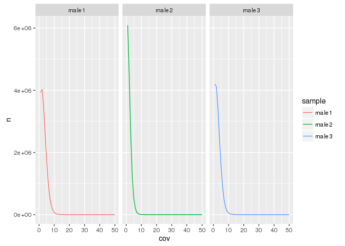

# Processing DNA Methylation Data

# Processing and sanity checking DNA methylation data

Warning, the data files come out to be 2.5 GB! Check that your computer has more than 2.5 GB of RAM, or else your computer will crash!

## Load libraries


```r
require(data.table)
require(foreach)
require(doMC)
require(knitr)
require(dplyr)
require(ggplot2)
require(pheatmap)
```

## Load data


```r
cpg_file_names <- dir("../methylation_data/", "^SRR.*.CG.bed", full.names = T)

file_table <- read.delim("../methylation_data/sample_table.txt", header = FALSE) %>% arrange(V1)

registerDoMC(9)
cpg_files <- foreach(i=seq_along(cpg_file_names), .combine = c) %dopar% {
  tmp <- fread(input = cpg_file_names[i]) %>% 
    setnames(c("chr","pos","end","converted_C","cov")) %>% 
    filter(chr != "chrMT") %>%
    mutate(meth = (converted_C/cov) %>% round(3)) %>%
    select(chr, pos, meth, cov)
  # save(tmp, file = paste0("../methylation_data/",file_table$V2[i],".RData"), compress = TRUE)
  list(tmp)
}

names(cpg_files) <- file_table$V2
```


```r
all_cpgs <- rbindlist(cpg_files) %>% select(chr, pos) %>% unique()

cpg_files_merged <- foreach(i=1:length(cpg_files), .combine = cbind) %dopar% {
  file_name <- names(cpg_files)[[i]]
  left_join(all_cpgs, cpg_files[[i]]) %>%
    select(meth, cov) %>%
    setnames(paste0(file_name, c("_meth", "_cov")))
}

cpg_files_merged <- cbind(all_cpgs, cpg_files_merged)
```

## Analysis begins

### Number of CpGs

#### Per sample


```r
lapply(cpg_files, nrow) %>% data.frame() %>% t() %>% data.frame() %>% add_rownames() %>% arrange(rowname)
```

```
## Source: local data frame [9 x 2]
## 
##      rowname        .
##        (chr)    (int)
## 1 estradiol1 13811801
## 2 estradiol2 14178594
## 3 estradiol3 16619149
## 4    female1  8922668
## 5    female2 12345885
## 6    female3 13632672
## 7      male1 18058509
## 8      male2 15173572
## 9      male3 17688957
```

#### Per chromosome per sample


```r
cpg_per_chrom_per_sample <- foreach(i=1:length(cpg_files), .combine = rbind) %dopar%{
  cpg_files[[i]] %>% group_by(chr) %>% tally() %>% mutate(sample = names(cpg_files)[i])
} 

cpg_per_chrom_per_sample %>% 
  mutate(facet = gsub("[1-3]", "", sample),
         chr = factor(chr, levels = paste0("chr", c(1:20, "X", "Y")))) %>%
  ggplot(aes(chr, n, color = facet, group = sample)) +
  # facet_wrap(~facet) +
  geom_line() +
  theme(axis.text.x = element_text(angle = 90, hjust = 1))
```


Well that sucks. Looks like the female libraries have less reads overall. Luckily, the coverage seems even.

### Average coverage per CpG


```r
foreach(i=1:length(cpg_files), .combine = rbind) %dopar%{
  cpg_files[[i]] %>% summarize(average_Cov = sum(cov)/n()) %>% mutate(sample = names(cpg_files)[i])
} %>% arrange(sample)
```

```
##    average_Cov     sample
## 1:    2.013134 estradiol1
## 2:    2.103462 estradiol2
## 3:    2.696568 estradiol3
## 4:    1.409210    female1
## 5:    1.720337    female2
## 6:    1.901558    female3
## 7:    3.191067      male1
## 8:    2.138167      male2
## 9:    3.048415      male3
```

### Coverage distribution


```r
cov_distribution <- foreach(i=1:length(cpg_files), .combine = rbind) %dopar%{
  cpg_files[[i]] %>% group_by(cov) %>% tally() %>% mutate(sample = names(cpg_files)[i])
}

cov_distribution %>%
  mutate(facet = gsub("[1-3]", "", sample)) %>%
  ggplot(aes(cov, n, group = sample, color = facet))+
  geom_line() +
  xlim(0,50)
```

```
## Warning: Removed 240 rows containing missing values (geom_path).
```


Distribution of coverage looks poisson at least...

Actually, the male samples seem screwed up somehow?


```r
cov_distribution %>%
  mutate(facet = gsub("[1-3]", "", sample)) %>%
  filter(facet == "male") %>%
  ggplot(aes(cov, n, group = sample, color = sample))+
  facet_wrap(~sample) +
  geom_line() +
  xlim(0,50)
```

```
## Warning: Removed 108 rows containing missing values (geom_path).
```



Hmm... not sure what this means... hope it wont affect results.

### Average methylation per sample


```r
foreach(i=1:length(cpg_files), .combine = rbind) %dopar%{
  cpg_files[[i]] %>% summarize(mean_meth = mean(meth) %>% round(3)) %>% mutate(sample = names(cpg_files)[i])
} %>% arrange(sample)
```

```
##    mean_meth     sample
## 1:     0.772 estradiol1
## 2:     0.776 estradiol2
## 3:     0.777 estradiol3
## 4:     0.763    female1
## 5:     0.774    female2
## 6:     0.776    female3
## 7:     0.771      male1
## 8:     0.774      male2
## 9:     0.775      male3
```

Looks like methylation is generally very similar across samples (xxcept female 1, what's up with that?)

### Distribution of DNA methylation per sample


```r
dist_DNA_meth <- foreach(i=1:length(cpg_files), .combine = rbind) %dopar%{
  tmp <- hist(cpg_files[[i]]$meth, plot=FALSE, breaks = seq(0,1,0.05))
  data.table(
    breaks = tmp$breaks[-1],
    counts = tmp$counts 
  ) %>% mutate(sample = names(cpg_files)[i])
}

dist_DNA_meth %>%
  group_by(sample) %>%
  mutate(total = sum(counts),
         freq = counts/total) %>%
  mutate(facet = gsub("[1-3]", "", sample)) %>%
  ggplot(aes(x = breaks-0.025, y = freq, group = sample, color = facet)) +
  geom_line()
```


Yep, super low coverage = higher chance of 0% or 100%...

### Pairwise correlation of DNA methylation


```r
pairwise_cor <- cpg_files_merged %>%
  select(contains("meth")) %>%
  cor(use = "pairwise.complete.obs")

diag(pairwise_cor) <- NA

hclust <- hclust(as.dist(1-pairwise_cor))

pheatmap(pairwise_cor, cluster_rows = hclust, cluster_cols = hclust)
```


Holy crap, the correlation values are atrocious. We might need to increase coverage by pooling replicates.

At least male and estradiol are clustering together.


