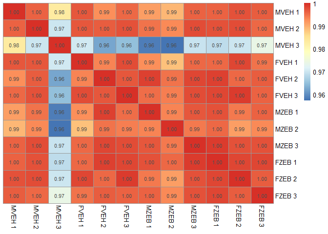

# 1-RNA_Seq_sanity_checks
Emma  
10 February 2016  


**Processing RNA Seq Data and Sanity Checks**
================================================

**Load Libraries**
-------------------


```r
require(ggplot2)
require(data.table)
require(knitr)
require(dplyr)
require(reshape)
require(reshape2)
require(pheatmap)
require(RColorBrewer)
```

**Import Data**
----------------


```r
row.merged <- read.table("C:/Users/Emma/Documents/Masters/STAT540/team_treed_rats-DNA-methylation/RNASeq_data/row.merged.txt", header=TRUE, row.names = 1)
```

The data (rnadata) is arranged in the following table, displaying the gene, rpkm value, as well as the group and replication it belongs to - that is, for example, female vehicle 1, or female z 1. 

```r
head(row.merged)
```

```
##                genes rpkm_value gene.no replication group group.fct
## 1 ENSRNOG00000000001  0.3067553       1           1     1      FVEH
## 2 ENSRNOG00000000007 76.5608522       2           1     1      FVEH
## 3 ENSRNOG00000000008  0.0557963       3           1     1      FVEH
## 4 ENSRNOG00000000009  0.2127083       4           1     1      FVEH
## 5 ENSRNOG00000000010  7.3180708       5           1     1      FVEH
## 6 ENSRNOG00000000012  0.5348094       6           1     1      FVEH
```

Another data set was made (rpkmlog) with the same data but with log2 rpkm values, as this may be useful for some plots.

**Taking a peek at the data**
------------------------------

Getting a summary of the data set shows that there are 88,548 genes for each of the groups; FVEH, FZEB, MVEH, MZEB. This is good as each of the replicates should have 1/3 of this - 29,516 as expected! 

```r
summary(row.merged)
```

```
##                 genes          rpkm_value           gene.no     
##  ENSRNOG00000000001:    12   Min.   :    0.000   Min.   :    1  
##  ENSRNOG00000000007:    12   1st Qu.:    0.000   1st Qu.: 7380  
##  ENSRNOG00000000008:    12   Median :    0.789   Median :14758  
##  ENSRNOG00000000009:    12   Mean   :   15.194   Mean   :14758  
##  ENSRNOG00000000010:    12   3rd Qu.:    9.759   3rd Qu.:22137  
##  ENSRNOG00000000012:    12   Max.   :12039.940   Max.   :29516  
##  (Other)           :354120                                      
##   replication     group      group.fct   
##  Min.   :1    Min.   :1.00   FVEH:88548  
##  1st Qu.:1    1st Qu.:1.75   FZEB:88548  
##  Median :2    Median :2.50   MVEH:88548  
##  Mean   :2    Mean   :2.50   MZEB:88548  
##  3rd Qu.:3    3rd Qu.:3.25               
##  Max.   :3    Max.   :4.00               
## 
```

Looking at the rpkm values of the genes as a whole, there are a LOT that have a value of 0. Is this bad? Shouldn't every gene have some expression?  


```r
test <- subset(row.merged, rpkm_value == 0)
summary(test)
```

```
##                 genes          rpkm_value    gene.no       replication   
##  ENSRNOG00000000039:    12   Min.   :0    Min.   :    3   Min.   :1.000  
##  ENSRNOG00000000050:    12   1st Qu.:0    1st Qu.:17461   1st Qu.:1.000  
##  ENSRNOG00000000199:    12   Median :0    Median :21800   Median :2.000  
##  ENSRNOG00000000252:    12   Mean   :0    Mean   :20612   Mean   :2.001  
##  ENSRNOG00000000326:    12   3rd Qu.:0    3rd Qu.:25921   3rd Qu.:3.000  
##  ENSRNOG00000000401:    12   Max.   :0    Max.   :29516   Max.   :3.000  
##  (Other)           :116184                                               
##      group       group.fct   
##  Min.   :1.000   FVEH:28801  
##  1st Qu.:2.000   FZEB:29378  
##  Median :2.000   MVEH:28593  
##  Mean   :2.505   MZEB:29484  
##  3rd Qu.:4.000               
##  Max.   :4.000               
## 
```

It also needs to be checked for each group, how many have a readout of 0, as this may cause some problems / bias.

The mean RPKM values for each of the gene sets are roughly the same. Again, is this good? 


```r
meanrpkms <- aggregate(row.merged[, 2], list(row.merged$group.fct), mean)
meanrpkms
```

```
##   Group.1        x
## 1    FVEH 15.24095
## 2    FZEB 15.17979
## 3    MVEH 15.19049
## 4    MZEB 15.16369
```

**Arranging the data into sets of each group** 
-----------------------------------------------

To take a look at the correlation between each replicate for each group (FVEH etc), subsets were first made. 


```r
FVEH.set <- subset(row.merged, group.fct == "FVEH")
```

And then rearranged.. 

```r
FVEH.set <- cast(FVEH.set, gene.no + genes ~ replication, value = "rpkm_value")
head(FVEH.set)
```

```
##   gene.no              genes          1           2          3
## 1       1 ENSRNOG00000000001  0.3067553  0.34937193  0.2068158
## 2       2 ENSRNOG00000000007 76.5608522 72.84595259 69.4314626
## 3       3 ENSRNOG00000000008  0.0557963  0.01308340  0.5595697
## 4       4 ENSRNOG00000000009  0.2127083  0.07980306  0.2509657
## 5       5 ENSRNOG00000000010  7.3180708 14.39158730 26.5290822
## 6       6 ENSRNOG00000000012  0.5348094  0.68972645  0.3943746
```


The same was done for each set - FZEB, MZEB and MVEH.


```
##   gene.no              genes          1           2           3
## 1       1 ENSRNOG00000000001  0.2421934  0.22098735  0.24217070
## 2       2 ENSRNOG00000000007 83.3136515 67.79241856 74.78969651
## 3       3 ENSRNOG00000000008  0.0000000  0.02557915  0.02371864
## 4       4 ENSRNOG00000000009  0.1410698  0.07801088  0.07233670
## 5       5 ENSRNOG00000000010  8.0890022 18.30070229 14.41252577
## 6       6 ENSRNOG00000000012  0.9606181  0.98070826  0.79570374
```

```
##   gene.no              genes           1          2           3
## 1       1 ENSRNOG00000000001  0.29265232  0.1406568  0.13247706
## 2       2 ENSRNOG00000000007 69.51902744 80.7306331 76.36488333
## 3       3 ENSRNOG00000000008  0.06986581  0.0000000  0.01686755
## 4       4 ENSRNOG00000000009  0.07102520  0.1365467  0.15432717
## 5       5 ENSRNOG00000000010 15.42670804  8.7244650 17.07601107
## 6       6 ENSRNOG00000000012  0.33483308  0.6437203  1.05089455
```

```
##   gene.no              genes          1           2          3
## 1       1 ENSRNOG00000000001  0.3142311  0.11537004  0.2086471
## 2       2 ENSRNOG00000000007 68.4164006 74.40058336 69.0384660
## 3       3 ENSRNOG00000000008  0.0000000  0.08813648  0.8799938
## 4       4 ENSRNOG00000000009  0.2542075  0.00000000  0.0000000
## 5       5 ENSRNOG00000000010 20.2018857 13.63452893  8.5958703
## 6       6 ENSRNOG00000000012  0.5592566  0.63359340  0.7161597
```

Now they can be correlated:

**Female Vehicle**


```r
cor(FVEH.set$"1", FVEH.set$"2")
```

```
## [1] 0.9932365
```

```r
cor(FVEH.set$"1", FVEH.set$"3")
```

```
## [1] 0.9975319
```

```r
cor(FVEH.set$"2", FVEH.set$"3")
```

```
## [1] 0.9966658
```

**Male Vehicle**


```r
cor(MVEH.set$"1", MVEH.set$"2")
```

```
## [1] 0.9960681
```

```r
cor(MVEH.set$"1", MVEH.set$"3")
```

```
## [1] 0.983293
```

```r
cor(MVEH.set$"2", MVEH.set$"3")
```

```
## [1] 0.9700041
```

**Male Treated (Zeb)**


```r
cor(MZEB.set$"1", MZEB.set$"2")
```

```
## [1] 0.9932658
```

```r
cor(MZEB.set$"1", MZEB.set$"3")
```

```
## [1] 0.9967958
```

```r
cor(MZEB.set$"2", MZEB.set$"3")
```

```
## [1] 0.9944379
```

**Female Treated (Zeb)**


```r
cor(FZEB.set$"1", FZEB.set$"2")
```

```
## [1] 0.9979379
```

```r
cor(FZEB.set$"1", FZEB.set$"3")
```

```
## [1] 0.9980947
```

```r
cor(FZEB.set$"2", FZEB.set$"3")
```

```
## [1] 0.9962542
```

The lowest correlations are in Male Vehicle, but at 0.97.. and 0.98... I don't think that's bad! 


Merge it all into a nice table (allmerged): 


```
##   gene.no              genes     MVEH 1     MVEH 2     MVEH 3     FVEH 1
## 1       1 ENSRNOG00000000001  0.2421934  0.2209874  0.2421707  0.3067553
## 2      10 ENSRNOG00000000024 11.2726827 12.0375602 12.4575883 11.1751783
## 3     100 ENSRNOG00000000216 10.3626247 12.6648670 10.8688670 12.7944888
## 4    1000 ENSRNOG00000001679  0.4669478  0.9102248  0.4669041  0.5914228
## 5   10000 ENSRNOG00000016152 42.5467833 40.2653592 38.9479979 41.8355791
## 6   10001 ENSRNOG00000016156 93.9048372 86.6980274 97.1320678 81.5365123
##       FVEH 2     FVEH 3     MZEB 1     MZEB 2     MZEB 3     FZEB 1
## 1  0.3493719  0.2068158  0.2926523  0.1406568  0.1324771  0.3142311
## 2 13.2669812 11.7098678  8.9046960 11.7891685 11.4815734 14.6629739
## 3  9.9922632 12.2506807 11.1142980 11.9430377 12.1408394 10.3842503
## 4  0.5745306  0.5731888  0.7758196  0.8813538  0.6640795  0.6563226
## 5 39.1814571 42.1969380 41.8177772 54.0336479 45.7812674 44.0310977
## 6 93.0507039 86.2484257 72.7538741 79.2727923 89.9651241 90.6005284
##        FZEB 2     FZEB 3
## 1   0.1153700  0.2086471
## 2  12.6323996 12.4646913
## 3  10.8138634 11.9137773
## 4   0.6005689  0.4274125
## 5  37.4191832 45.0650039
## 6 101.9832738 80.0663162
```


```r
mypalette <- colorRampPalette(brewer.pal(1, "Reds"))(50)
```

```
## Warning in brewer.pal(1, "Reds"): minimal value for n is 3, returning requested palette with 3 different levels
```

```r
matrix <- subset(allmerged, select = 3:14)
pairwise_cor <- matrix %>%
   cor(use = "pairwise.complete.obs")
diag(pairwise_cor) <- 1
pheatmap(pairwise_cor, cluster_rows = F, color = mypalette, cluster_cols = F, display_numbers = T)
```



As the heatmap is comparing the mean of all gene expression for each sample, we would expect the correlation between each to be high. 

