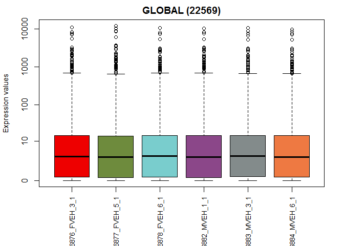
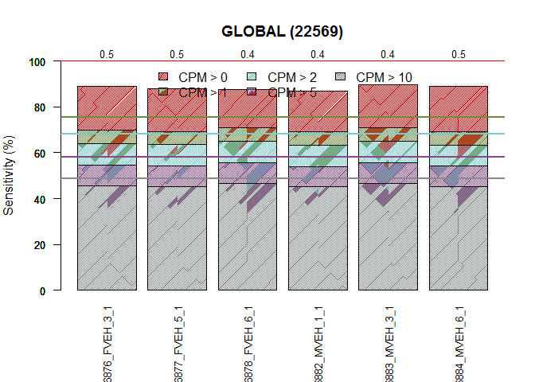
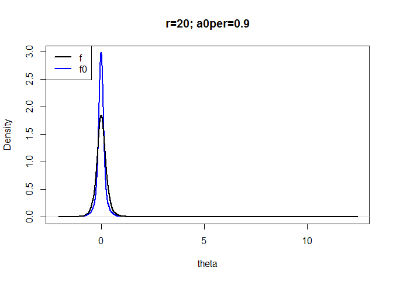

# Analysis pipeline for finding differentially expressed genes from RNAseq `rpkm` read counts using `R` package `NOISeq`
Rashed  
February 24, 2016  

# Data preparation for comparing male and female vehicle


```r
#setwd("team_treed_rats-DNA-methylation/RNASeq_data/RNASeq_data")
#dir()

datn <- read.table(file=
                     "C:/Users/Rashed/Documents/all_github/team_treed_rats-DNA-methylation/RNASeq_data/RNAseq_all_merged.txt", 
                   header = TRUE)
rownames(datn) <- datn$genes
datn <- datn[,c(2:14)]
head(datn)
```

```
##                    GSM1616876_FVEH_3_1 GSM1616877_FVEH_5_1
## ENSRNOG00000000001           0.3067553          0.34937193
## ENSRNOG00000000007          76.5608522         72.84595259
## ENSRNOG00000000008           0.0557963          0.01308340
## ENSRNOG00000000009           0.2127083          0.07980306
## ENSRNOG00000000010           7.3180708         14.39158730
## ENSRNOG00000000012           0.5348094          0.68972645
##                    GSM1616878_FVEH_6_1 GSM1616879_FZEB_2_1
## ENSRNOG00000000001           0.2068158           0.3142311
## ENSRNOG00000000007          69.4314626          68.4164006
## ENSRNOG00000000008           0.5595697           0.0000000
## ENSRNOG00000000009           0.2509657           0.2542075
## ENSRNOG00000000010          26.5290822          20.2018857
## ENSRNOG00000000012           0.3943746           0.5592566
##                    GSM1616880_FZEB_3_1 GSM1616881_FZEB_5_1
## ENSRNOG00000000001          0.11537004           0.2086471
## ENSRNOG00000000007         74.40058336          69.0384660
## ENSRNOG00000000008          0.08813648           0.8799938
## ENSRNOG00000000009          0.00000000           0.0000000
## ENSRNOG00000000010         13.63452893           8.5958703
## ENSRNOG00000000012          0.63359340           0.7161597
##                    GSM1616882_MVEH_1_1 GSM1616883_MVEH_3_1
## ENSRNOG00000000001           0.2421934          0.22098735
## ENSRNOG00000000007          83.3136515         67.79241856
## ENSRNOG00000000008           0.0000000          0.02557915
## ENSRNOG00000000009           0.1410698          0.07801088
## ENSRNOG00000000010           8.0890022         18.30070229
## ENSRNOG00000000012           0.9606181          0.98070826
##                    GSM1616884_MVEH_6_1 GSM1616885_MZEB_3_1
## ENSRNOG00000000001          0.24217070          0.29265232
## ENSRNOG00000000007         74.78969651         69.51902744
## ENSRNOG00000000008          0.02371864          0.06986581
## ENSRNOG00000000009          0.07233670          0.07102520
## ENSRNOG00000000010         14.41252577         15.42670804
## ENSRNOG00000000012          0.79570374          0.33483308
##                    GSM1616886_MZEB_5_1 GSM1616887_MZEB_6_1 gene.no
## ENSRNOG00000000001           0.1406568          0.13247706       1
## ENSRNOG00000000007          80.7306331         76.36488333       2
## ENSRNOG00000000008           0.0000000          0.01686755       3
## ENSRNOG00000000009           0.1365467          0.15432717       4
## ENSRNOG00000000010           8.7244650         17.07601107       5
## ENSRNOG00000000012           0.6437203          1.05089455       6
```

```r
#str(datn)

###comparing male and female vehicle

####data preparation

###count data
#can input raw or norrmalized count. here we put rpkm values as count
countsfm <- datn[,c(1:3, 7:9)]
head(countsfm)
```

```
##                    GSM1616876_FVEH_3_1 GSM1616877_FVEH_5_1
## ENSRNOG00000000001           0.3067553          0.34937193
## ENSRNOG00000000007          76.5608522         72.84595259
## ENSRNOG00000000008           0.0557963          0.01308340
## ENSRNOG00000000009           0.2127083          0.07980306
## ENSRNOG00000000010           7.3180708         14.39158730
## ENSRNOG00000000012           0.5348094          0.68972645
##                    GSM1616878_FVEH_6_1 GSM1616882_MVEH_1_1
## ENSRNOG00000000001           0.2068158           0.2421934
## ENSRNOG00000000007          69.4314626          83.3136515
## ENSRNOG00000000008           0.5595697           0.0000000
## ENSRNOG00000000009           0.2509657           0.1410698
## ENSRNOG00000000010          26.5290822           8.0890022
## ENSRNOG00000000012           0.3943746           0.9606181
##                    GSM1616883_MVEH_3_1 GSM1616884_MVEH_6_1
## ENSRNOG00000000001          0.22098735          0.24217070
## ENSRNOG00000000007         67.79241856         74.78969651
## ENSRNOG00000000008          0.02557915          0.02371864
## ENSRNOG00000000009          0.07801088          0.07233670
## ENSRNOG00000000010         18.30070229         14.41252577
## ENSRNOG00000000012          0.98070826          0.79570374
```

```r
str(countsfm)
```

```
## 'data.frame':	29516 obs. of  6 variables:
##  $ GSM1616876_FVEH_3_1: num  0.3068 76.5609 0.0558 0.2127 7.3181 ...
##  $ GSM1616877_FVEH_5_1: num  0.3494 72.846 0.0131 0.0798 14.3916 ...
##  $ GSM1616878_FVEH_6_1: num  0.207 69.431 0.56 0.251 26.529 ...
##  $ GSM1616882_MVEH_1_1: num  0.242 83.314 0 0.141 8.089 ...
##  $ GSM1616883_MVEH_3_1: num  0.221 67.7924 0.0256 0.078 18.3007 ...
##  $ GSM1616884_MVEH_6_1: num  0.2422 74.7897 0.0237 0.0723 14.4125 ...
```

```r
dim(countsfm)
```

```
## [1] 29516     6
```


## Import data to make `NOISeq object`


```r
###removing rows with all zero counts

countsfmnz <- countsfm[countsfm[,1] != 0 | countsfm[,2] != 0 | countsfm[,3] != 0 | countsfm[,4] != 0 | countsfm[,5] != 0 | countsfm[,6] != 0 , ]
dim(countsfmnz)
```

```
## [1] 22569     6
```

```r
###factor object for NOISeq
factorsfm <- data.frame(Vehicle = c("Female", "Female", "Female", "Male", "Male", "Male"), 
	VehicleRun = c("Female_1", "Female_2", "Female_3", "Male_1", "Male_2", "Male_3"), 
	Run = rep(c("R1", "R2", "R3"), times = 2))
rownames(factorsfm) <- colnames(countsfm)
factorsfm
```

```
##                     Vehicle VehicleRun Run
## GSM1616876_FVEH_3_1  Female   Female_1  R1
## GSM1616877_FVEH_5_1  Female   Female_2  R2
## GSM1616878_FVEH_6_1  Female   Female_3  R3
## GSM1616882_MVEH_1_1    Male     Male_1  R1
## GSM1616883_MVEH_3_1    Male     Male_2  R2
## GSM1616884_MVEH_6_1    Male     Male_3  R3
```

```r
###converting data into a NOISeq object
library(NOISeq)
```

```
## Loading required package: Biobase
```

```
## Loading required package: BiocGenerics
```

```
## Loading required package: parallel
```

```
## 
## Attaching package: 'BiocGenerics'
```

```
## The following objects are masked from 'package:parallel':
## 
##     clusterApply, clusterApplyLB, clusterCall, clusterEvalQ,
##     clusterExport, clusterMap, parApply, parCapply, parLapply,
##     parLapplyLB, parRapply, parSapply, parSapplyLB
```

```
## The following objects are masked from 'package:stats':
## 
##     IQR, mad, xtabs
```

```
## The following objects are masked from 'package:base':
## 
##     anyDuplicated, append, as.data.frame, as.vector, cbind,
##     colnames, do.call, duplicated, eval, evalq, Filter, Find, get,
##     grep, grepl, intersect, is.unsorted, lapply, lengths, Map,
##     mapply, match, mget, order, paste, pmax, pmax.int, pmin,
##     pmin.int, Position, rank, rbind, Reduce, rownames, sapply,
##     setdiff, sort, table, tapply, union, unique, unlist, unsplit
```

```
## Welcome to Bioconductor
## 
##     Vignettes contain introductory material; view with
##     'browseVignettes()'. To cite Bioconductor, see
##     'citation("Biobase")', and for packages 'citation("pkgname")'.
```

```
## Loading required package: splines
```

```
## Loading required package: Matrix
```

```r
require(NOISeq)
datafm <- NOISeq::readData(data = countsfmnz, factors = factorsfm) #using readData function from NOISeq
datafm
```

```
## ExpressionSet (storageMode: lockedEnvironment)
## assayData: 22569 features, 6 samples 
##   element names: exprs 
## protocolData: none
## phenoData
##   sampleNames: GSM1616876_FVEH_3_1 GSM1616877_FVEH_5_1 ...
##     GSM1616884_MVEH_6_1 (6 total)
##   varLabels: Vehicle VehicleRun Run
##   varMetadata: labelDescription
## featureData: none
## experimentData: use 'experimentData(object)'
## Annotation:
```


##check the infirnation included


```r
#check what information is included
str(datafm)
```

```
## Formal class 'ExpressionSet' [package "Biobase"] with 7 slots
##   ..@ experimentData   :Formal class 'MIAME' [package "Biobase"] with 13 slots
##   .. .. ..@ name             : chr ""
##   .. .. ..@ lab              : chr ""
##   .. .. ..@ contact          : chr ""
##   .. .. ..@ title            : chr ""
##   .. .. ..@ abstract         : chr ""
##   .. .. ..@ url              : chr ""
##   .. .. ..@ pubMedIds        : chr ""
##   .. .. ..@ samples          : list()
##   .. .. ..@ hybridizations   : list()
##   .. .. ..@ normControls     : list()
##   .. .. ..@ preprocessing    : list()
##   .. .. ..@ other            : list()
##   .. .. ..@ .__classVersion__:Formal class 'Versions' [package "Biobase"] with 1 slot
##   .. .. .. .. ..@ .Data:List of 2
##   .. .. .. .. .. ..$ : int [1:3] 1 0 0
##   .. .. .. .. .. ..$ : int [1:3] 1 1 0
##   ..@ assayData        :<environment: 0x000000001bf9c020> 
##   ..@ phenoData        :Formal class 'AnnotatedDataFrame' [package "Biobase"] with 4 slots
##   .. .. ..@ varMetadata      :'data.frame':	3 obs. of  1 variable:
##   .. .. .. ..$ labelDescription: chr [1:3] NA NA NA
##   .. .. ..@ data             :'data.frame':	6 obs. of  3 variables:
##   .. .. .. ..$ Vehicle   : Factor w/ 2 levels "Female","Male": 1 1 1 2 2 2
##   .. .. .. ..$ VehicleRun: Factor w/ 6 levels "Female_1","Female_2",..: 1 2 3 4 5 6
##   .. .. .. ..$ Run       : Factor w/ 3 levels "R1","R2","R3": 1 2 3 1 2 3
##   .. .. ..@ dimLabels        : chr [1:2] "sampleNames" "sampleColumns"
##   .. .. ..@ .__classVersion__:Formal class 'Versions' [package "Biobase"] with 1 slot
##   .. .. .. .. ..@ .Data:List of 1
##   .. .. .. .. .. ..$ : int [1:3] 1 1 0
##   ..@ featureData      :Formal class 'AnnotatedDataFrame' [package "Biobase"] with 4 slots
##   .. .. ..@ varMetadata      :'data.frame':	0 obs. of  1 variable:
##   .. .. .. ..$ labelDescription: chr(0) 
##   .. .. ..@ data             :'data.frame':	22569 obs. of  0 variables
##   .. .. ..@ dimLabels        : chr [1:2] "featureNames" "featureColumns"
##   .. .. ..@ .__classVersion__:Formal class 'Versions' [package "Biobase"] with 1 slot
##   .. .. .. .. ..@ .Data:List of 1
##   .. .. .. .. .. ..$ : int [1:3] 1 1 0
##   ..@ annotation       : chr(0) 
##   ..@ protocolData     :Formal class 'AnnotatedDataFrame' [package "Biobase"] with 4 slots
##   .. .. ..@ varMetadata      :'data.frame':	0 obs. of  1 variable:
##   .. .. .. ..$ labelDescription: chr(0) 
##   .. .. ..@ data             :'data.frame':	6 obs. of  0 variables
##   .. .. ..@ dimLabels        : chr [1:2] "sampleNames" "sampleColumns"
##   .. .. ..@ .__classVersion__:Formal class 'Versions' [package "Biobase"] with 1 slot
##   .. .. .. .. ..@ .Data:List of 1
##   .. .. .. .. .. ..$ : int [1:3] 1 1 0
##   ..@ .__classVersion__:Formal class 'Versions' [package "Biobase"] with 1 slot
##   .. .. ..@ .Data:List of 4
##   .. .. .. ..$ : int [1:3] 3 2 2
##   .. .. .. ..$ : int [1:3] 2 30 0
##   .. .. .. ..$ : int [1:3] 1 3 0
##   .. .. .. ..$ : int [1:3] 1 0 0
```

```r
head(assayData(datafm)$exprs) ###give the expression data with rpkm counts
```

```
##                    GSM1616876_FVEH_3_1 GSM1616877_FVEH_5_1
## ENSRNOG00000000001           0.3067553          0.34937193
## ENSRNOG00000000007          76.5608522         72.84595259
## ENSRNOG00000000008           0.0557963          0.01308340
## ENSRNOG00000000009           0.2127083          0.07980306
## ENSRNOG00000000010           7.3180708         14.39158730
## ENSRNOG00000000012           0.5348094          0.68972645
##                    GSM1616878_FVEH_6_1 GSM1616882_MVEH_1_1
## ENSRNOG00000000001           0.2068158           0.2421934
## ENSRNOG00000000007          69.4314626          83.3136515
## ENSRNOG00000000008           0.5595697           0.0000000
## ENSRNOG00000000009           0.2509657           0.1410698
## ENSRNOG00000000010          26.5290822           8.0890022
## ENSRNOG00000000012           0.3943746           0.9606181
##                    GSM1616883_MVEH_3_1 GSM1616884_MVEH_6_1
## ENSRNOG00000000001          0.22098735          0.24217070
## ENSRNOG00000000007         67.79241856         74.78969651
## ENSRNOG00000000008          0.02557915          0.02371864
## ENSRNOG00000000009          0.07801088          0.07233670
## ENSRNOG00000000010         18.30070229         14.41252577
## ENSRNOG00000000012          0.98070826          0.79570374
```

```r
head(pData(datafm))
```

```
##                     Vehicle VehicleRun Run
## GSM1616876_FVEH_3_1  Female   Female_1  R1
## GSM1616877_FVEH_5_1  Female   Female_2  R2
## GSM1616878_FVEH_6_1  Female   Female_3  R3
## GSM1616882_MVEH_1_1    Male     Male_1  R1
## GSM1616883_MVEH_3_1    Male     Male_2  R2
## GSM1616884_MVEH_6_1    Male     Male_3  R3
```

```r
head(featureData(datafm)@data)
```

```
## data frame with 0 columns and 6 rows
```

#Checking Quality control of the data

##Some exploratory plot


```r
#### Quality control of count data
#need not for already normalized count I think

##Generating data for exploratory plots
#can't do so due to lack of information on biotype detection, sequencing depth and expression 
#quantification, sequencing bias detection and batch effect exploration

##count distribution per sample
countsplo <- dat(datafm, factor = NULL, type="countsbio")
```

```
## [1] "Count distributions are to be computed for:"
## [1] "GSM1616876_FVEH_3_1" "GSM1616877_FVEH_5_1" "GSM1616878_FVEH_6_1"
## [4] "GSM1616882_MVEH_1_1" "GSM1616883_MVEH_3_1" "GSM1616884_MVEH_6_1"
```

```r
explo.plot(countsplo, toplot = 1, samples =NULL, plottype = "boxplot")
```

<!-- -->

```r
###not give much info as all samples are normalized

#sensitivity plot

explo.plot(countsplo, toplot = 1, samples =NULL, plottype = "barplot")
```

<!-- -->

```r
#showing number of features with low counts for each samples 
```


##Bias things


```r
###Sequencing bias detection

##not needed as the countsa re already normalized

#length bias plot: he “lengthbias” plot describes the relationship between the feature length 
#and the expression values. For each bin, the 5% trimmed mean of the corresponding expression
#values (CPM if norm=FALSE or values provided if norm=TRUE) is computed and depicted in Y axis.

#lengthbiasfm <- dat(datafm, factor = "Vehicle", norm = TRUE, type = "lengthbias")
#explo.plot(lengthbiasfm, samples = NULL, toplot = "global")
#show(lengthbiasfm)
#can't run as we haven't the feature length

####RNA composition

###to check bias cd plot is used

fmcd <- dat(datafm, type = "cd", norm = TRUE, refColumn = 1)
```

```
## [1] "Reference sample is: GSM1616876_FVEH_3_1"
## [1] "Confidence intervals for median of M:"
##                     0.5%                  99.5%                 
## GSM1616877_FVEH_5_1 "-0.0220429435085717" "-0.00996948991904702"
## GSM1616878_FVEH_6_1 "0"                   "0"                   
## GSM1616882_MVEH_1_1 "-0.0103284811686607" "-0.00215041278825574"
## GSM1616883_MVEH_3_1 "0"                   "0"                   
## GSM1616884_MVEH_6_1 "-0.0159686588878626" "-0.00587951340139591"
##                     Diagnostic Test
## GSM1616877_FVEH_5_1 "FAILED"       
## GSM1616878_FVEH_6_1 "PASSED"       
## GSM1616882_MVEH_1_1 "FAILED"       
## GSM1616883_MVEH_3_1 "PASSED"       
## GSM1616884_MVEH_6_1 "FAILED"       
## [1] "Diagnostic test: FAILED. Normalization is required to correct this bias."
```

```r
explo.plot(fmcd)
```

<!-- -->

```r
###pca plot

fmPCA = dat(datafm, type = "PCA")
explo.plot(fmPCA, factor = "Vehicle")
```

<!-- -->

## QC report


```r
###Quality control report

QCreport(datafm, samples = NULL, factor = "Vehicle", norm = TRUE)
```

```
## [1] "Counts per million distributions are to be computed for:"
## [1] "Female" "Male"  
## [1] "Reference sample is: GSM1616876_FVEH_3_1"
## [1] "Confidence intervals for median of M:"
##                     0.5%                  99.5%                 
## GSM1616877_FVEH_5_1 "-0.0225545118965709" "-0.00997011120799541"
## GSM1616878_FVEH_6_1 "0"                   "0"                   
## GSM1616882_MVEH_1_1 "-0.0109421298138519" "-0.00214919995782814"
## GSM1616883_MVEH_3_1 "0"                   "0"                   
## GSM1616884_MVEH_6_1 "-0.0158204539854179" "-0.00557713735762736"
##                     Diagnostic Test
## GSM1616877_FVEH_5_1 "FAILED"       
## GSM1616878_FVEH_6_1 "PASSED"       
## GSM1616882_MVEH_1_1 "FAILED"       
## GSM1616883_MVEH_3_1 "PASSED"       
## GSM1616884_MVEH_6_1 "FAILED"       
## [1] "Diagnostic test: FAILED. Normalization is required to correct this bias."
```

```
## png 
##   2
```

```r
#diagnostic test failed.
#result shows normalization is required to correct for bias....confused!!!
```


#Normalization


```r
###Normalization
#not needed as normalization is done already.
```


# Low-count Filtering


```r
###Low-count filtering
#Excluding features with low counts improves, in general, differential expression results, 
#no matter the method being used, since noise in the data is reduced.

#NOISeq includes three methods to filter out features with low counts: 1. CPM 2. Wilcoxon test 
#3. Proportion test

##Using CPM
fmfilt <- filtered.data(countsfmnz, factor = factorsfm$Vehicle, norm = TRUE, 
                       depth = NULL, method = 1, cv.cutoff = 100, cpm = 1, p.adj = "fdr")
```

```
## Filtering out low count features...
## 14458 features are to be kept for differential expression analysis with filtering method 1
```

```r
#Filtering out low count features...
#14458 features are to be kept for differential expression analysis with filtering method 1
#The “Sensitivity plot” described in previous section can help to take decisions on the CPM 
#threshold to use in methods 1 and 3. 

##Using proportion test
#cant do as we haven't sequence depth info
```

#Differential Expression

##Several possible options


```r
####Differential expression

#NOISeq-real: using available replicates
fmnoiseq1 <- noiseq(datafm, k = 0.5, norm = "n", factor = "Vehicle", nss = 0, replicates = "technical")
```

```
## [1] "Computing (M,D) values..."
## [1] "Computing probability of differential expression..."
```

```r
head(fmnoiseq1@results[[1]])
```

```
##                    Female_mean   Male_mean          M          D      prob
## ENSRNOG00000000001   0.2876477  0.23511715  0.2909230 0.05253052 0.1485888
## ENSRNOG00000000007  72.9460891 75.29858885 -0.0457922 2.35249971 0.2256192
## ENSRNOG00000000008   0.2094831  0.18309926  0.1942081 0.02638387 0.1184294
## ENSRNOG00000000009   0.1811590  0.09713913  0.8991321 0.08401988 0.2088337
## ENSRNOG00000000010  16.0795801 13.60074341  0.2415442 2.47883668 0.5146514
## ENSRNOG00000000012   0.5396368  0.91234338 -0.7575881 0.37270654 0.3936668
##                       ranking
## ENSRNOG00000000001  0.2956275
## ENSRNOG00000000007 -2.3529453
## ENSRNOG00000000008  0.1959921
## ENSRNOG00000000009  0.9030492
## ENSRNOG00000000010  2.4905772
## ENSRNOG00000000012 -0.8443044
```

```r
fmnoiseq2 <- noiseq(datafm, k = 0.5, norm = "n", factor = "Vehicle", nss = 5, replicates = "biological")
```

```
## [1] "WARNING: Your experiment has biological replicates. You should consider using NOISeqBIO instead of NOISeq."
## [1] "Computing (M,D) values..."
## [1] "Computing probability of differential expression..."
```

```r
head(fmnoiseq2@results[[1]])
```

```
##                    Female_mean   Male_mean          M          D      prob
## ENSRNOG00000000001   0.2876477  0.23511715  0.2909230 0.05253052 0.1485888
## ENSRNOG00000000007  72.9460891 75.29858885 -0.0457922 2.35249971 0.2256192
## ENSRNOG00000000008   0.2094831  0.18309926  0.1942081 0.02638387 0.1184294
## ENSRNOG00000000009   0.1811590  0.09713913  0.8991321 0.08401988 0.2088337
## ENSRNOG00000000010  16.0795801 13.60074341  0.2415442 2.47883668 0.5146514
## ENSRNOG00000000012   0.5396368  0.91234338 -0.7575881 0.37270654 0.3936668
##                       ranking
## ENSRNOG00000000001  0.2956275
## ENSRNOG00000000007 -2.3529453
## ENSRNOG00000000008  0.1959921
## ENSRNOG00000000009  0.9030492
## ENSRNOG00000000010  2.4905772
## ENSRNOG00000000012 -0.8443044
```

```r
#NOISeqBIO: recommended when we have biological replicates
fmnoiseqbio <- noiseqbio(datafm, k = 0.5, norm = "n", factor = "Vehicle", 
                         r = 20, adj = 1.5, plot = TRUE, a0per = 0.9, random.seed = 12345, 
                         filter = 1)
```

```
## Computing Z values...
## Filtering out low count features...
## 14498 features are to be kept for differential expression analysis with filtering method 1
## ...k-means clustering done
## Size of 15 clusters:
##  [1]  307 3523   69    4  198   28   37  121 1889  578   21 6702    8    7
## [15] 1006
## Resampling cluster...[1] 1
## [1] 2
## Size of 15 subclusters of cluster: 2
##  [1] 326  12 502 248 368 120 289 469  23   4 262 249 325 243  83
## [1] 3
## [1] 4
## [1] 5
## [1] 6
## [1] 7
## [1] 8
## [1] 9
## Size of 15 subclusters of cluster: 9
##  [1] 173 147 278 125   1 135  24   1  11 157  95 292 209  70 171
## [1] 10
## [1] 11
## [1] 12
```

```
## Warning: Quick-TRANSfer stage steps exceeded maximum (= 335100)

## Warning: Quick-TRANSfer stage steps exceeded maximum (= 335100)
```

```
## Size of 15 subclusters of cluster: 12
##  [1]    9  703  518  323   40 1074  688   78  438  582  632   83  910  609
## [15]   15
## [1] 13
## [1] 14
## [1] 15
## Size of 15 subclusters of cluster: 15
##  [1]  56  91  73  45 129 117 125  28 119  88  45  44  41   1   4
## Computing Z for noise...
## Computing probability of differential expression...
```

<!-- -->

```
## p0 = 0.617991763919845
## Probability
##    Min. 1st Qu.  Median    Mean 3rd Qu.    Max.    NA's 
##   0.000   0.112   0.388   0.376   0.646   1.000    8071
```


##Select the differentially expressed features/genes

Please remember that, when using `NOISeq`, the probability of differential expression is not equivalent to 1 − pvalue. We recommend for q to use values around 0.8. However, when using `NOISeqBIO`, the probability of differential expression would be equivalent to 1 − F DR, where FDR can be considered as an adjusted p-value. Hence, in this case, it would be more convenient to use q = 0.95. With the argument M we choose if we want all the differentially expressed features, only the differentially expressed features that are more expressed in condition 1 than in condition 2 (M = “up”) or only the differentially expressed features that are under-expressed
in condition 1 with regard to condition 2 (M = “down”):


```r
fmnoiseq1.deg <- degenes(fmnoiseq1, q = 0.8, M = NULL)
```

```
## [1] "25 differentially expressed features"
```

```r
fmnoiseq1.deg1 <- degenes(fmnoiseq1, q = 0.8, M = "up")
```

```
## [1] "16 differentially expressed features (up in first condition)"
```

```r
fmnoiseq1.deg2 <- degenes(fmnoiseq1, q = 0.8, M = "down")
```

```
## [1] "9 differentially expressed features (down in first condition)"
```

```r
fmnoiseq2.deg <- degenes(fmnoiseq2, q = 0.8, M = NULL)
```

```
## [1] "25 differentially expressed features"
```

```r
fmnoiseq2.deg1 <- degenes(fmnoiseq2, q = 0.8, M = "up")
```

```
## [1] "16 differentially expressed features (up in first condition)"
```

```r
fmnoiseq2.deg2 <- degenes(fmnoiseq2, q = 0.8, M = "down")
```

```
## [1] "9 differentially expressed features (down in first condition)"
```

```r
fmnoiseqbio.deg <- degenes(fmnoiseqbio, q = 0.95, M = NULL)
```

```
## [1] "8 differentially expressed features"
```

```r
fmnoiseqbio.deg1 <- degenes(fmnoiseqbio, q = 0.95, M = "up")
```

```
## [1] "7 differentially expressed features (up in first condition)"
```

```r
fmnoiseqbio.deg2 <- degenes(fmnoiseqbio, q = 0.95, M = "down")
```

```
## [1] "1 differentially expressed features (down in first condition)"
```

I am confused at the output found!!! Seems too less differential genes. 


