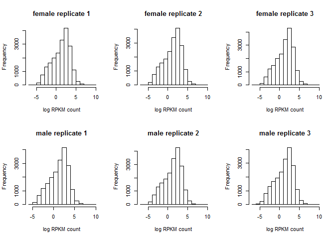
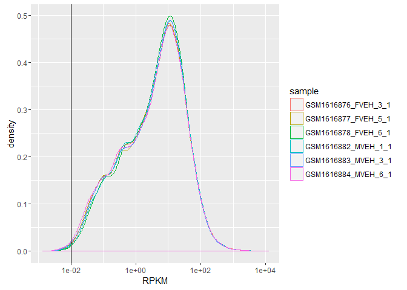
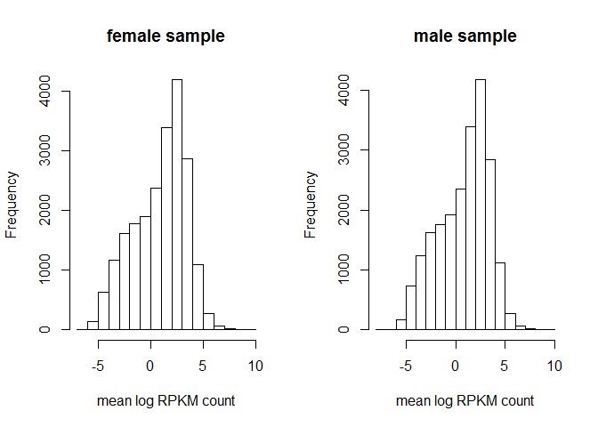
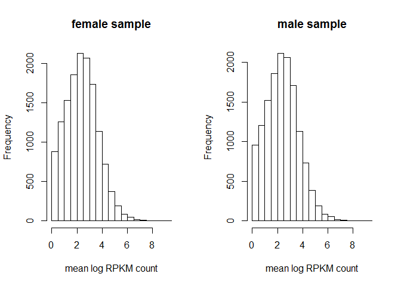

# Finding differentially expressed genes for RNAseq `rpkm` read counts data using multiple `t` test and fold change
Rashed  
February 29, 2016  

# Steps to find out differentially expressed genes using multiple `t` test and fold change

The analysis pipeline consists of the following steps.

 1. Check the distribution of the log rpkm counts of individual samples (replicates) for male and female
 2. Compute the mean of rpkm counts over male and female sample and check the distribution of the mean log rpkm counts for male and female
 3. Filtering the rpkm counts based on discarding some rpkm counts after checking the distribution above
 4. Calculate the fold change and prepare the data for t-test
 5. Perform t-test and adjust p values using `FDR` (or other) for multiple testing

# Check the distribution of the log rpkm counts of individual samples (replicates) for male and female

## Reading Data

```r
#setwd("team_treed_rats-DNA-methylation/RNASeq_data/RNASeq_data")
#dir()
library(knitr)
library(rmarkdown)
library(xtable)
datn <- read.table(file="C:/Users/Rashed/Documents/all_github/team_treed_rats-DNA-methylation/RNASeq_data/RNAseq_all_merged.txt", 
                   header = TRUE)
rownames(datn) <- datn$genes
datn <- datn[,c(2:14)]
head(datn)
```

```
##                    GSM1616876_FVEH_3_1 GSM1616877_FVEH_5_1
## ENSRNOG00000000001           0.3067553          0.34937193
## ENSRNOG00000000007          76.5608522         72.84595259
## ENSRNOG00000000008           0.0557963          0.01308340
## ENSRNOG00000000009           0.2127083          0.07980306
## ENSRNOG00000000010           7.3180708         14.39158730
## ENSRNOG00000000012           0.5348094          0.68972645
##                    GSM1616878_FVEH_6_1 GSM1616879_FZEB_2_1
## ENSRNOG00000000001           0.2068158           0.3142311
## ENSRNOG00000000007          69.4314626          68.4164006
## ENSRNOG00000000008           0.5595697           0.0000000
## ENSRNOG00000000009           0.2509657           0.2542075
## ENSRNOG00000000010          26.5290822          20.2018857
## ENSRNOG00000000012           0.3943746           0.5592566
##                    GSM1616880_FZEB_3_1 GSM1616881_FZEB_5_1
## ENSRNOG00000000001          0.11537004           0.2086471
## ENSRNOG00000000007         74.40058336          69.0384660
## ENSRNOG00000000008          0.08813648           0.8799938
## ENSRNOG00000000009          0.00000000           0.0000000
## ENSRNOG00000000010         13.63452893           8.5958703
## ENSRNOG00000000012          0.63359340           0.7161597
##                    GSM1616882_MVEH_1_1 GSM1616883_MVEH_3_1
## ENSRNOG00000000001           0.2421934          0.22098735
## ENSRNOG00000000007          83.3136515         67.79241856
## ENSRNOG00000000008           0.0000000          0.02557915
## ENSRNOG00000000009           0.1410698          0.07801088
## ENSRNOG00000000010           8.0890022         18.30070229
## ENSRNOG00000000012           0.9606181          0.98070826
##                    GSM1616884_MVEH_6_1 GSM1616885_MZEB_3_1
## ENSRNOG00000000001          0.24217070          0.29265232
## ENSRNOG00000000007         74.78969651         69.51902744
## ENSRNOG00000000008          0.02371864          0.06986581
## ENSRNOG00000000009          0.07233670          0.07102520
## ENSRNOG00000000010         14.41252577         15.42670804
## ENSRNOG00000000012          0.79570374          0.33483308
##                    GSM1616886_MZEB_5_1 GSM1616887_MZEB_6_1 gene.no
## ENSRNOG00000000001           0.1406568          0.13247706       1
## ENSRNOG00000000007          80.7306331         76.36488333       2
## ENSRNOG00000000008           0.0000000          0.01686755       3
## ENSRNOG00000000009           0.1365467          0.15432717       4
## ENSRNOG00000000010           8.7244650         17.07601107       5
## ENSRNOG00000000012           0.6437203          1.05089455       6
```

```r
#str(datn)

###comparing male and female vehicle

####data preparation

###count data
#can input raw or norrmalized count. here we put rpkm values as count
countsfm <- datn[,c(1:3, 7:9, 13)]
#head(countsfm)
#str(countsfm)
#dim(countsfm)
```


## Check the distribution of individual samples


```r
##distribution of all female and male samples
par(mfrow = c(2,3))
hist(log(countsfm$GSM1616876_FVEH_3_1), xlab = "log RPKM count", main ="female replicate 1")
hist(log(countsfm$GSM1616877_FVEH_5_1), xlab = "log RPKM count", main ="female replicate 2")
hist(log(countsfm$GSM1616878_FVEH_6_1), xlab = "log RPKM count", main ="female replicate 3")
hist(log(countsfm$GSM1616882_MVEH_1_1), xlab = "log RPKM count", main ="male replicate 1")
hist(log(countsfm$GSM1616883_MVEH_3_1), xlab = "log RPKM count", main ="male replicate 2")
hist(log(countsfm$GSM1616884_MVEH_6_1), xlab = "log RPKM count", main ="male replicate 3")
```

<!-- -->

```r
#dev.off()

###possible decision is to remove rpkm counts less than 1 (seems so from the histograms)
##revised rpkm counts after revision
```


```r
require(dplyr)
```

```
## Loading required package: dplyr
```

```
## 
## Attaching package: 'dplyr'
```

```
## The following objects are masked from 'package:stats':
## 
##     filter, lag
```

```
## The following objects are masked from 'package:base':
## 
##     intersect, setdiff, setequal, union
```

```r
require(ggplot2)
```

```
## Loading required package: ggplot2
```

```r
require(tidyr)
```

```
## Loading required package: tidyr
```

```r
expression_mf_long <- countsfm %>% 
  add_rownames() %>%
  select(-gene.no) %>%
  gather(key = sample, value = RPKM, ... = -rowname)

expression_mf_long %>%
  ggplot(aes(RPKM, color = sample)) +
  geom_density() +
  scale_x_continuous(trans = "log10") +
  geom_vline(xintercept = 0.01)
```

```
## Warning: Removed 57394 rows containing non-finite values (stat_density).
```

<!-- -->

#Compute the mean of rpkm counts over male and female sample and check the distribution of the mean log rpkm counts for male and female


##ompute the mean of rpkm counts over male and female sample


```r
countsfm$fm.mean <- (countsfm$GSM1616876_FVEH_3_1 + countsfm$GSM1616877_FVEH_5_1 + countsfm$GSM1616878_FVEH_6_1)/3
countsfm$m.mean <- (countsfm$GSM1616882_MVEH_1_1 + countsfm$GSM1616883_MVEH_3_1 + countsfm$GSM1616884_MVEH_6_1)/3
head(countsfm)
```

```
##                    GSM1616876_FVEH_3_1 GSM1616877_FVEH_5_1
## ENSRNOG00000000001           0.3067553          0.34937193
## ENSRNOG00000000007          76.5608522         72.84595259
## ENSRNOG00000000008           0.0557963          0.01308340
## ENSRNOG00000000009           0.2127083          0.07980306
## ENSRNOG00000000010           7.3180708         14.39158730
## ENSRNOG00000000012           0.5348094          0.68972645
##                    GSM1616878_FVEH_6_1 GSM1616882_MVEH_1_1
## ENSRNOG00000000001           0.2068158           0.2421934
## ENSRNOG00000000007          69.4314626          83.3136515
## ENSRNOG00000000008           0.5595697           0.0000000
## ENSRNOG00000000009           0.2509657           0.1410698
## ENSRNOG00000000010          26.5290822           8.0890022
## ENSRNOG00000000012           0.3943746           0.9606181
##                    GSM1616883_MVEH_3_1 GSM1616884_MVEH_6_1 gene.no
## ENSRNOG00000000001          0.22098735          0.24217070       1
## ENSRNOG00000000007         67.79241856         74.78969651       2
## ENSRNOG00000000008          0.02557915          0.02371864       3
## ENSRNOG00000000009          0.07801088          0.07233670       4
## ENSRNOG00000000010         18.30070229         14.41252577       5
## ENSRNOG00000000012          0.98070826          0.79570374       6
##                       fm.mean      m.mean
## ENSRNOG00000000001  0.2876477  0.23511715
## ENSRNOG00000000007 72.9460891 75.29858885
## ENSRNOG00000000008  0.2094831  0.01643260
## ENSRNOG00000000009  0.1811590  0.09713913
## ENSRNOG00000000010 16.0795801 13.60074341
## ENSRNOG00000000012  0.5396368  0.91234338
```

```r
#str(countsfm)
dim(countsfm)
```

```
## [1] 29516     9
```

##check the distribution of the mean log rpkm counts for male and female


```r
####distribution of female and male mean log rpkm counts (raw)
par(mfrow = c(1,2))
hist(log(countsfm$fm.mean), xlab = "mean log RPKM count", main ="female sample")
hist(log(countsfm$m.mean), xlab = "mean log RPKM count", main ="male sample")
```

<!-- -->

```r
#dev.off()
```

#Filtering the rpkm counts based on discarding some rpkm counts after checking the distribution above

##Filtering the rpkm counts discarding genes with mean rpkm counts less than 1 


```r
countsfmnz <- countsfm[countsfm[,8] >= 0.01 & countsfm[,9] >= 0.01, ]
head(countsfmnz)
```

```
##                    GSM1616876_FVEH_3_1 GSM1616877_FVEH_5_1
## ENSRNOG00000000001           0.3067553          0.34937193
## ENSRNOG00000000007          76.5608522         72.84595259
## ENSRNOG00000000008           0.0557963          0.01308340
## ENSRNOG00000000009           0.2127083          0.07980306
## ENSRNOG00000000010           7.3180708         14.39158730
## ENSRNOG00000000012           0.5348094          0.68972645
##                    GSM1616878_FVEH_6_1 GSM1616882_MVEH_1_1
## ENSRNOG00000000001           0.2068158           0.2421934
## ENSRNOG00000000007          69.4314626          83.3136515
## ENSRNOG00000000008           0.5595697           0.0000000
## ENSRNOG00000000009           0.2509657           0.1410698
## ENSRNOG00000000010          26.5290822           8.0890022
## ENSRNOG00000000012           0.3943746           0.9606181
##                    GSM1616883_MVEH_3_1 GSM1616884_MVEH_6_1 gene.no
## ENSRNOG00000000001          0.22098735          0.24217070       1
## ENSRNOG00000000007         67.79241856         74.78969651       2
## ENSRNOG00000000008          0.02557915          0.02371864       3
## ENSRNOG00000000009          0.07801088          0.07233670       4
## ENSRNOG00000000010         18.30070229         14.41252577       5
## ENSRNOG00000000012          0.98070826          0.79570374       6
##                       fm.mean      m.mean
## ENSRNOG00000000001  0.2876477  0.23511715
## ENSRNOG00000000007 72.9460891 75.29858885
## ENSRNOG00000000008  0.2094831  0.01643260
## ENSRNOG00000000009  0.1811590  0.09713913
## ENSRNOG00000000010 16.0795801 13.60074341
## ENSRNOG00000000012  0.5396368  0.91234338
```

```r
#str(countsfmnz)
dim(countsfmnz)
```

```
## [1] 20319     9
```

```r
#reduced to 14046 genes
```

## Distribution of the revised results 


```r
####distribution of female and male mean log rpkm counts after reduction
par(mfrow = c(1,2))
hist(log(countsfmnz$fm.mean), xlab = "mean log RPKM count", main ="female sample")
hist(log(countsfmnz$m.mean), xlab = "mean log RPKM count", main ="male sample")
```

<!-- -->

```r
#dev.off()
```

#Calculate the fold change and prepare the data for t-test


```r
####fold change
##consider male in the denominator
countsfmnz$fold.change <- countsfmnz$fm.mean/countsfmnz$m.mean
#countsfmnz1 <- countsfmnz[(countsfmnz$fold.change >= 2 | countsfmnz$fold.change <= 0.5), ]
countsfmnz<- countsfmnz[order(countsfmnz$gene.no),]
countsfmnz$new.gene.order <- seq(1: dim(countsfmnz)[1])
head(countsfmnz)
```

```
##                    GSM1616876_FVEH_3_1 GSM1616877_FVEH_5_1
## ENSRNOG00000000001           0.3067553          0.34937193
## ENSRNOG00000000007          76.5608522         72.84595259
## ENSRNOG00000000008           0.0557963          0.01308340
## ENSRNOG00000000009           0.2127083          0.07980306
## ENSRNOG00000000010           7.3180708         14.39158730
## ENSRNOG00000000012           0.5348094          0.68972645
##                    GSM1616878_FVEH_6_1 GSM1616882_MVEH_1_1
## ENSRNOG00000000001           0.2068158           0.2421934
## ENSRNOG00000000007          69.4314626          83.3136515
## ENSRNOG00000000008           0.5595697           0.0000000
## ENSRNOG00000000009           0.2509657           0.1410698
## ENSRNOG00000000010          26.5290822           8.0890022
## ENSRNOG00000000012           0.3943746           0.9606181
##                    GSM1616883_MVEH_3_1 GSM1616884_MVEH_6_1 gene.no
## ENSRNOG00000000001          0.22098735          0.24217070       1
## ENSRNOG00000000007         67.79241856         74.78969651       2
## ENSRNOG00000000008          0.02557915          0.02371864       3
## ENSRNOG00000000009          0.07801088          0.07233670       4
## ENSRNOG00000000010         18.30070229         14.41252577       5
## ENSRNOG00000000012          0.98070826          0.79570374       6
##                       fm.mean      m.mean fold.change new.gene.order
## ENSRNOG00000000001  0.2876477  0.23511715   1.2234227              1
## ENSRNOG00000000007 72.9460891 75.29858885   0.9687577              2
## ENSRNOG00000000008  0.2094831  0.01643260  12.7480237              3
## ENSRNOG00000000009  0.1811590  0.09713913   1.8649437              4
## ENSRNOG00000000010 16.0795801 13.60074341   1.1822574              5
## ENSRNOG00000000012  0.5396368  0.91234338   0.5914844              6
```

```r
str(countsfmnz)
```

```
## 'data.frame':	20319 obs. of  11 variables:
##  $ GSM1616876_FVEH_3_1: num  0.3068 76.5609 0.0558 0.2127 7.3181 ...
##  $ GSM1616877_FVEH_5_1: num  0.3494 72.846 0.0131 0.0798 14.3916 ...
##  $ GSM1616878_FVEH_6_1: num  0.207 69.431 0.56 0.251 26.529 ...
##  $ GSM1616882_MVEH_1_1: num  0.242 83.314 0 0.141 8.089 ...
##  $ GSM1616883_MVEH_3_1: num  0.221 67.7924 0.0256 0.078 18.3007 ...
##  $ GSM1616884_MVEH_6_1: num  0.2422 74.7897 0.0237 0.0723 14.4125 ...
##  $ gene.no            : int  1 2 3 4 5 6 7 8 9 10 ...
##  $ fm.mean            : num  0.288 72.946 0.209 0.181 16.08 ...
##  $ m.mean             : num  0.2351 75.2986 0.0164 0.0971 13.6007 ...
##  $ fold.change        : num  1.223 0.969 12.748 1.865 1.182 ...
##  $ new.gene.order     : int  1 2 3 4 5 6 7 8 9 10 ...
```

```r
dat_diffexp <- read.table(file=
            "C:/Users/Rashed/Documents/all_github/team_treed_rats-DNA-methylation/RNASeq_data/row.merged.txt", header = TRUE)
head(dat_diffexp)
```

```
##                genes rpkm_value gene.no replication group group.fct
## 1 ENSRNOG00000000001  0.3067553       1           1     1      FVEH
## 2 ENSRNOG00000000007 76.5608522       2           1     1      FVEH
## 3 ENSRNOG00000000008  0.0557963       3           1     1      FVEH
## 4 ENSRNOG00000000009  0.2127083       4           1     1      FVEH
## 5 ENSRNOG00000000010  7.3180708       5           1     1      FVEH
## 6 ENSRNOG00000000012  0.5348094       6           1     1      FVEH
```

```r
suppressPackageStartupMessages(library(plyr))
suppressPackageStartupMessages(library(dplyr))
suppressPackageStartupMessages(library(magrittr))
suppressPackageStartupMessages(library(ggplot2))

###work with revised rpkm counts after removing genes below cutoff
rev_gene <- countsfmnz$gene.no
dat_diffexpn <- dat_diffexp[dat_diffexp$gene.no %in% rev_gene,]
dat_diffexpn<- dat_diffexpn[order(dat_diffexpn$gene.no),]
dat_diffexpn$new.gene.order <- rep(1:length(rev_gene), each = 12)

##Data preparation for t-test
suppressPackageStartupMessages(library(gdata))
##data with male and female samples only
dat_diff.fvmv <- dat_diffexpn[dat_diffexpn$group.fct == "FVEH" | dat_diffexpn$group.fct == "MVEH",]
dim(dat_diff.fvmv)
```

```
## [1] 121914      7
```


# Perform t-test and adjust p values using `FDR` (or other) for multiple testing

## Perform t-test and observe the results


```r
###individual genes
dat_diff.fvmv<- dat_diff.fvmv[order(dat_diff.fvmv$new.gene.order),]

##storing the raw p-values
resfvmv <- matrix(0, nrow = length(unique(dat_diff.fvmv$gene.no)), ncol = 3)
resfvmv[,1] <- unique(dat_diff.fvmv$gene.no)
resfvmv[,2] <- unique(dat_diff.fvmv$new.gene.order)

for (i in 1: dim(resfvmv)[1]) {
  resfvmv[i,3] <- t.test(dat_diff.fvmv[dat_diff.fvmv$new.gene.order==i,]$rpkm_value ~ dat_diff.fvmv[dat_diff.fvmv$new.gene.order==i,]$group)$p.value
}

resfvmv <- resfvmv
resfvmv <- data.frame(resfvmv)
#resfvmv$genes <- factor(levels(droplevels(dat_fvmv$genes)))
colnames(resfvmv) <- c("gene.no", "new.gene.order", "fvmv.pval")
#dim(resfvmv[resfvmv$fvmv.pval < 0.05,])  ###251 de genes
```

Now we observe the results for raw p values (before adjustment for multiple testing) in the following table. Here we have found 251 differentially expressed genes (seems too low!!!) at 5% level of significance. 


```r
###differentially expression result sheet preparation

diff.exp.fmraw <- data.frame(countsfmnz[,7:10], resfvmv[,3])
diff.exp.fmraw <- diff.exp.fmraw[diff.exp.fmraw$resfvmv...3. < 0.05, ]
str(diff.exp.fmraw)
```

```
## 'data.frame':	417 obs. of  5 variables:
##  $ gene.no     : int  6 167 224 281 357 383 388 491 555 557 ...
##  $ fm.mean     : num  0.5396 0.2265 13.6304 0.1133 0.0389 ...
##  $ m.mean      : num  0.9123 0.0699 11.8349 0.1994 0.091 ...
##  $ fold.change : num  0.591 3.238 1.152 0.568 0.428 ...
##  $ resfvmv...3.: num  0.02787 0.04802 0.00789 0.00548 0.04304 ...
```

```r
head(diff.exp.fmraw) 
```

```
##                    gene.no     fm.mean      m.mean fold.change
## ENSRNOG00000000012       6  0.53963683  0.91234338   0.5914844
## ENSRNOG00000000386     167  0.22649791  0.06994415   3.2382682
## ENSRNOG00000000466     224 13.63036149 11.83488974   1.1517101
## ENSRNOG00000000542     281  0.11332791  0.19944247   0.5682236
## ENSRNOG00000000653     357  0.03894405  0.09102526   0.4278379
## ENSRNOG00000000711     383 10.55377983 12.28708562   0.8589327
##                    resfvmv...3.
## ENSRNOG00000000012  0.027873050
## ENSRNOG00000000386  0.048023209
## ENSRNOG00000000466  0.007886797
## ENSRNOG00000000542  0.005476931
## ENSRNOG00000000653  0.043042904
## ENSRNOG00000000711  0.043340247
```

```r
colnames(diff.exp.fmraw) <- c("gene.no", "fm.mean", "m.mean", "fold.change", "raw.pvalue") 
diff.exp.fmraw1 <- diff.exp.fmraw[1:10,] #10 DE genes
knitr::kable(xtable(diff.exp.fmraw1), digits=3, caption = "Differentially expressed genes based on raw p-value")
```


Table: Differentially expressed genes based on raw p-value

                      gene.no   fm.mean   m.mean   fold.change   raw.pvalue
-------------------  --------  --------  -------  ------------  -----------
ENSRNOG00000000012          6     0.540    0.912         0.591        0.028
ENSRNOG00000000386        167     0.226    0.070         3.238        0.048
ENSRNOG00000000466        224    13.630   11.835         1.152        0.008
ENSRNOG00000000542        281     0.113    0.199         0.568        0.005
ENSRNOG00000000653        357     0.039    0.091         0.428        0.043
ENSRNOG00000000711        383    10.554   12.287         0.859        0.043
ENSRNOG00000000720        388     2.756    3.209         0.859        0.030
ENSRNOG00000000894        491    17.013   17.689         0.962        0.049
ENSRNOG00000000989        555    18.985   20.074         0.946        0.019
ENSRNOG00000000991        557     5.555    4.285         1.296        0.021


##Adjust p values using `FDR` (or other) for multiple testing and observe the results


```r
###differentially expression result sheet preparation considering all

diff.exp.fm <- data.frame(countsfmnz[,7:10], resfvmv[,3])
str(diff.exp.fm)
```

```
## 'data.frame':	20319 obs. of  5 variables:
##  $ gene.no     : int  1 2 3 4 5 6 7 8 9 10 ...
##  $ fm.mean     : num  0.288 72.946 0.209 0.181 16.08 ...
##  $ m.mean      : num  0.2351 75.2986 0.0164 0.0971 13.6007 ...
##  $ fold.change : num  1.223 0.969 12.748 1.865 1.182 ...
##  $ resfvmv...3.: num  0.339 0.668 0.386 0.242 0.722 ...
```

```r
head(diff.exp.fm) 
```

```
##                    gene.no    fm.mean      m.mean fold.change resfvmv...3.
## ENSRNOG00000000001       1  0.2876477  0.23511715   1.2234227   0.33918751
## ENSRNOG00000000007       2 72.9460891 75.29858885   0.9687577   0.66837019
## ENSRNOG00000000008       3  0.2094831  0.01643260  12.7480237   0.38598138
## ENSRNOG00000000009       4  0.1811590  0.09713913   1.8649437   0.24244770
## ENSRNOG00000000010       5 16.0795801 13.60074341   1.1822574   0.72198950
## ENSRNOG00000000012       6  0.5396368  0.91234338   0.5914844   0.02787305
```

```r
colnames(diff.exp.fm) <- c("gene.no", "fm.mean", "m.mean", "fold.change", "raw.pvalue") 

####adjustment in p-value for multiple comparison test: three methods

diff.exp.fm$pvalue.fdr.adj <- round(p.adjust(diff.exp.fm$raw.pvalue, "BH"), 4)
diff.exp.fm$pvalue.hb.adj <- round(p.adjust(diff.exp.fm$raw.pvalue, "BY"), 4)
#diff.exp.fm$pvalue.bn.adj <- round(p.adjust(diff.exp.fm$raw.pvalue, "bonferroni"), 4)

###checking the genes signifcantly different at 5% level of significance between male anf female

sig.fvmv1 <- diff.exp.fm[diff.exp.fm$pvalue.fdr.adj < 0.20,]
dim(sig.fvmv1)
```

```
## [1] 0 7
```

```r
#View(sig.fvmv1)

sig.fvmv2 <- diff.exp.fm[diff.exp.fm$pvalue.hb.adj < 0.20,]
dim(sig.fvmv2)
```

```
## [1] 0 7
```

```r
#View(sig.fvmv2)
```


#Comments

I am confused at the output found!!! Results after adjusting for multiple comparisons seem horrible for differentially expressed genes. No differentially expressed genes are found!!! 


