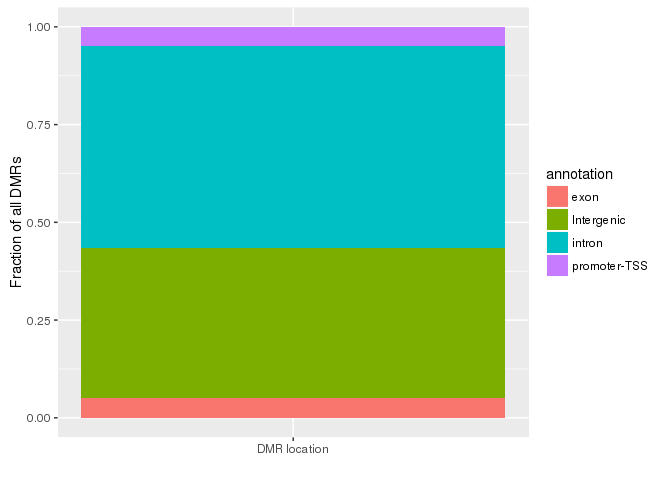
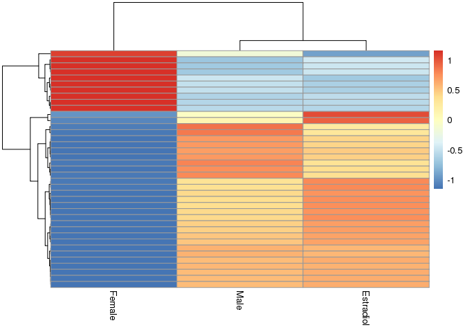

# 2-Calling_DMRs.Rmd
Tony  
February 18, 2016  


```r
require(data.table)
require(foreach)
require(doMC)
require(GenomicRanges)
require(bsseq)
require(ggplot2)
require(tidyr)
require(knitr)
require(dplyr)
require(pheatmap)
```

# Merge data


```r
load("../methylation_data/cpg_files_merged.RData")

bssmooth_cpgs <- lapply(cpg_files_merged, function(x) {
  tmp <- x %>% select(chr, pos) %>% filter(pos >0)
}) %>% rbindlist() %>% unique

registerDoMC(length(cpg_files_merged))
bssmooth <- foreach(f=names(cpg_files_merged), .combine = cbind) %dopar% {
  tmp <- cpg_files_merged[[f]] %>% setnames(c("chr", "pos", paste0(f, "_meth"), paste0(f, "_cov"))) %>% data.table()
  left_join(bssmooth_cpgs, tmp, by = c("chr","pos")) %>% select(-chr,-pos)
} %>% cbind(bssmooth_cpgs, .)

bssmooth[is.na(bssmooth)] <- 0

samples <- names(cpg_files_merged)

rm(bssmooth_cpgs)

bssmooth_smooth <- BSseq(chr = bssmooth$chr, pos = bssmooth$pos, 
                         M = bssmooth %>% select(contains("meth")) %>% as.matrix(), 
                         Cov = bssmooth %>% select(contains("cov")) %>% as.matrix(),
                         sampleNames = samples)

chroms <- granges(bssmooth_smooth) %>% seqnames %>% levels

# rm(bssmooth)

bssmooth_smooth <- BSmooth(bssmooth_smooth, verbose = TRUE, parallelBy = "chromosome", mc.cores = length(chroms))

pData(bssmooth_smooth)$col <- c("#7fc97f","#beaed4","#fdc086")

# save(... = bssmooth_smooth, file = "../methylation_data/bssmooth_smooth.RData", compress = T)
```


```r
samples <- pData(bssmooth_smooth) %>% rownames %>% gsub("_meth_cov", "", x = .)

bssmooth_dt <- cbind(
  as.data.frame(granges(bssmooth_smooth)) %>% setnames(colnames(.[1]), "chr"),
  getMeth(bssmooth_smooth) %>% as.data.frame() %>% setnames(paste0(samples, "_meth")),
  getCoverage(bssmooth_smooth) %>% as.data.frame() %>% setnames(paste0(samples, "_cov"))
) %>% data.table() %>% select(-end, -width, -strand)

save(bssmooth_smooth, bssmooth_dt, file = "../methylation_data/bssmooth_smooth.RData", compress = F)
# load("bssmooth_smooth.RData")
```

# Call DMRs for female vs male


```r
load("/projects/epigenomics/users/thui/stat540/methylation_data/bssmooth_smooth.RData")

rn6_genes <- fread("../methylation_data/homer/rn6_tss_raw.gtf", skip = 1) %>%
  select(nearest.promoter = V1, name = V7) %>% as.data.frame() %>% tbl_df() 
```


```r
bssmooth_dt_maleVsFemale <- bssmooth_dt %>%
  tbl_df() %>%
  select(-contains("estradiol")) %>%
  # filter(female_cov > 0, male_cov > 0) %>%
  mutate(diff = female_meth - male_meth)
```


```r
top_percent <- 1

# summary(bssmooth_dt_maleVsFemale$diff)
diff_quantile <- quantile(x = bssmooth_dt_maleVsFemale$diff, probs = c(top_percent/100/2, 1-(top_percent/100/2)))
diff_quantile
```

```
##       0.5%      99.5% 
## -0.1876567  0.1935138
```

```r
# ggplot(bssmooth_dt_maleVsFemale, aes(diff)) +
#   geom_density() +
#   geom_vline(xintercept = diff_quantile)
```


```r
binsize <- 500
min_cpg <- 3

bssmooth_dt_maleVsFemale_dCPG <- bssmooth_dt_maleVsFemale %>%
  filter(diff < diff_quantile[1] | diff > diff_quantile[2]) %>%
  group_by(chr) %>%
  mutate(dist = c(binsize+1,diff(start)),
         diff_cumul = diff*lag(diff, n = 1)) %>%
  ungroup() %>% mutate(chr = as.character(chr)) %>%
  mutate(bin = 1+cumsum(dist > binsize | diff_cumul < 0 | is.na(diff_cumul))) %>%
  setnames(colnames(.)[2], "pos")

bssmooth_dt_maleVsFemale_DMR <- bssmooth_dt_maleVsFemale_dCPG %>%
  filter(female_cov > 0) %>%
  group_by(chr, bin) %>%
  summarize(start=min(pos),
            end=max(pos), 
            mean_female = mean(female_meth) %>% round(3), 
            mean_male = mean(male_meth) %>% round(3),
            female_cov = sum(female_cov),
            male_cov = sum(male_cov),
            # remove DMRs within transition zones
            slope_clusters = min(
              abs(female_meth[1] - female_meth[n()]),
              abs(male_meth[1] - male_meth[n()])
              ),
            num_cpg = n()
            ) %>%
  filter(num_cpg >= min_cpg) %>%
  filter(slope_clusters < 0.2) %>%
  # filter(female_cov >= 3) %>%
  select(-slope_clusters, -num_cpg)
```

## Annotate DMRs


```r
# save(bssmooth_dt_maleVsFemale_DMR, file = "methylation_data/maleVSfemaleDMRs.RData")
write.csv(x = bssmooth_dt_maleVsFemale_DMR, file = "../methylation_data/maleVSfemaleDMRs.csv", quote = F, row.names = F)

write.table(x = bssmooth_dt_maleVsFemale_DMR %>% select(bin,chr,start,end) %>% mutate(strand = "+"), file = "../methylation_data/homer/maleVSfemaleDMRs.bed", quote = F, row.names = F, col.names = F, sep = "\t")

system("cd ../methylation_data/homer; sh get_DE_tss.sh")
system("cd ../methylation_data/homer; sh homer_annotate.sh maleVSfemaleDMRs.bed")
```


```r
bssmooth_dt_maleVsFemale_DMR_annotated <- read.table("../methylation_data/homer/maleVSfemaleDMRs.bed.annotated", header = T, sep = "\t", quote="")

bssmooth_dt_maleVsFemale_DMR_annotated <- bssmooth_dt_maleVsFemale_DMR_annotated %>%
  select(1:11) %>%
  setnames(c("bin", "chr", "start", "end", "strand", "score", "ratio", "annotation", "detailed.annotation", "dist.to.tss", "nearest.promoter")) %>%
  left_join(., bssmooth_dt_maleVsFemale_DMR) %>%
  tbl_df()
```

```
## Joining by: c("bin", "chr", "start", "end")
```

```
## Warning in left_join_impl(x, y, by$x, by$y): joining character vector and
## factor, coercing into character vector
```

```r
maleVsFemale_DMR_genes <- inner_join(bssmooth_dt_maleVsFemale_DMR_annotated, rn6_genes) %>%
  select(chr, start, end, mean_female, mean_male, annotation, dist.to.tss, nearest.promoter, name, bin)
```

```
## Joining by: "nearest.promoter"
```

```
## Warning in inner_join_impl(x, y, by$x, by$y): joining factor and character
## vector, coercing into character vector
```

### Remove irrelevant DMRs

* Remove DMRs that are promoters of other genes
* Remove DMRs that are > 20000 bp away from nearest promoter


```r
maleVsFemale_DMR_genes_filtered <- maleVsFemale_DMR_genes %>%
  filter(chr != "chrY") %>%
  arrange(chr, start) %>%
  mutate(annotation = gsub("\\(.*", "", annotation) %>% gsub(" ", "", .)) %>%
  filter(abs(dist.to.tss) < 20000) %>%
  filter(ifelse(grepl("promoter-TSS", annotation), abs(dist.to.tss) < 3000, TRUE))

ggplot(maleVsFemale_DMR_genes_filtered, aes("DMR location", fill = annotation)) +
  geom_bar(position = position_fill()) +
  ylab("Fraction of all DMRs") +
  xlab("")
```



## Finalize file


```r
de_genes <- read.table("../Data_Analysis/RNAseq_result/DE_genes/glmQLFit_DE_genes.tsv", header = TRUE)

dmr_set <- maleVsFemale_DMR_genes_filtered %>%
  mutate(hypo_in_female = mean_female < mean_male) %>%
  select(chr, start, end, annotation, dist.to.tss, gene = nearest.promoter, name, hypo_in_female) %>%
  left_join(., de_genes) %>%
  mutate(epi_regulation = hypo_in_female == gExp_up_in_female) %>%
  select(-V7)
```

```
## Joining by: "gene"
```

```
## Warning in left_join_impl(x, y, by$x, by$y): joining factor and character
## vector, coercing into character vector
```

```r
table(dmr_set$epi_regulation)
```

```
## 
## FALSE  TRUE 
##    43    40
```

```r
epi_genes <- dmr_set %>%
  group_by(gene, epi_regulation) %>%
  tally() %>%
  spread(key = epi_regulation, value = n, fill = 0) %>%
  setnames(c("gene", "non_epi_regulated", "epi_regulated")) %>%
  mutate(frac_regulated = epi_regulated/(epi_regulated+non_epi_regulated))

epi_gene_list <- epi_genes %>%
  filter(frac_regulated >= 0.5) %>%
  .$gene

qplot(epi_genes$frac_regulated)
```

```
## `stat_bin()` using `bins = 30`. Pick better value with `binwidth`.
```


```r
final_table <- dmr_set %>% 
  filter(gene %in% epi_gene_list) %>%
  filter(epi_regulation)
  
write.table(final_table, file = "2_genes_DMR_associations.tsv", row.names = F, quote = F, sep = "\t")
```

# Now, the same but for female vs female+ estradiol


```r
bssmooth_dt_FemaleVsEstradiol <- bssmooth_dt %>%
  tbl_df() %>%
  select(-starts_with("male")) %>%
  mutate(diff = female_meth - estradiol_meth)
```


```r
top_percent <- 1

# summary(bssmooth_dt_maleVsFemale$diff)
diff_quantile <- quantile(x = bssmooth_dt_FemaleVsEstradiol$diff, probs = c(top_percent/100/2, 1-(top_percent/100/2)))
diff_quantile
```

```
##       0.5%      99.5% 
## -0.1992926  0.1906262
```

```r
# ggplot(bssmooth_dt_maleVsFemale, aes(diff)) +
#   geom_density() +
#   geom_vline(xintercept = diff_quantile)
```


```r
bssmooth_dt_FemaleVsEstradiol_dCPG <- bssmooth_dt_FemaleVsEstradiol %>%
  filter(diff < diff_quantile[1] | diff > diff_quantile[2]) %>%
  group_by(chr) %>%
  mutate(dist = c(binsize+1,diff(start)),
         diff_cumul = diff*lag(diff, n = 1)) %>%
  ungroup() %>% mutate(chr = as.character(chr)) %>%
  mutate(bin = 1+cumsum(dist > binsize | diff_cumul < 0 | is.na(diff_cumul))) %>%
  setnames(colnames(.)[2], "pos")

bssmooth_dt_FemaleVsEstradiol_DMR <- bssmooth_dt_FemaleVsEstradiol_dCPG %>%
  # filter(female_cov > 0) %>%
  # filter(bin == 2) %>%
  group_by(chr, bin) %>%
  summarise(start = min(pos), end = max(pos)+2, 
            mean_female = mean(female_meth) %>% round(3), 
            mean_estradiol = mean(estradiol_meth) %>% round(3),
            female_cov = sum(female_cov),
            estradiol_cov = sum(estradiol_cov),
            # remove DMRs within transition zones
            slope_clusters = min(
              abs(female_meth[1] - female_meth[n()]),
              abs(estradiol_meth[1] - estradiol_meth[n()])
              ),
            num_cpg = n()
            ) %>%
  filter(num_cpg >= min_cpg) %>%
  select(-slope_clusters, -num_cpg)
```

## Subset DMRs that are overlapping DMRs between male and female

* also with 20kb of nearest DE gene


```r
#maleVsFemale_DMR_genes_filtered
#final_table

bssmooth_dt_maleVsFemale_DMR_GRanges <- maleVsFemale_DMR_genes_filtered %>%
  makeGRangesFromDataFrame(keep.extra.columns = F)

bssmooth_dt_FemaleVsEstradiol_DMR_GRanges <- bssmooth_dt_FemaleVsEstradiol_DMR %>%
  makeGRangesFromDataFrame(keep.extra.columns = F)

overlaps <- findOverlaps(bssmooth_dt_maleVsFemale_DMR_GRanges, bssmooth_dt_FemaleVsEstradiol_DMR_GRanges, select = "all")

bssmooth_dt_FemaleVsEstradiol_DMR_overlap <- bssmooth_dt_FemaleVsEstradiol_DMR[subjectHits(overlaps),] %>% 
  arrange(chr, start) %>% filter(chr != "chrY") %>%
  mutate(hypo_in_female = mean_female < mean_estradiol)

bsmooth_dt_all_DMR_overlap <- (maleVsFemale_DMR_genes_filtered %>% arrange(chr, start))[queryHits(overlaps),] %>% filter(chr != "chrY")

bsmooth_dt_all_DMR_overlap$mean_estradiol <- bssmooth_dt_FemaleVsEstradiol_DMR_overlap$mean_estradiol
```

### Heatmap of these DMRs


```r
heatmap <- bsmooth_dt_all_DMR_overlap %>%
  select(starts_with("mean")) %>%
  setnames(c("Female", "Male", "Estradiol")) %>%
  data.matrix() 

heatmap %>%
  pheatmap(color = colorRampPalette(c("#ffffb2", "#feb24c", "#bd0026"))(10))
```


```r
heatmap %>%
  pheatmap(scale = "row")
```




```r
tabulate <- bsmooth_dt_all_DMR_overlap %>%
  mutate(hypo_in_femaleVSmale = mean_female < mean_male, 
         hypo_in_femaleVSestradiol = mean_female < mean_estradiol)

table(tabulate$hypo_in_femaleVSmale == tabulate$hypo_in_femaleVSestradiol)
```

```
## 
## TRUE 
##   39
```

```r
head(tabulate) %>% kable("markdown")
```


|chr   |     start|       end| mean_female| mean_male|annotation   | dist.to.tss|nearest.promoter     |name   |  bin| mean_estradiol|hypo_in_femaleVSmale |hypo_in_femaleVSestradiol |
|:-----|---------:|---------:|-----------:|---------:|:------------|-----------:|:--------------------|:------|----:|--------------:|:--------------------|:-------------------------|
|chr1  |  15779390|  15779992|       0.453|     0.735|Intergenic   |       -2784|ENSRNOT00000088025.1 |Bclaf1 |  212|          0.693|TRUE                 |TRUE                      |
|chr1  |  71198288|  71198559|       0.409|     0.615|Intergenic   |       -8000|ENSRNOT00000035217.4 |Zfp78  |  809|          0.676|TRUE                 |TRUE                      |
|chr1  |  80072086|  80073449|       0.598|     0.873|promoter-TSS |         456|ENSRNOT00000021456.2 |Gipr   |  947|          0.840|TRUE                 |TRUE                      |
|chr1  | 198229110| 198230411|       0.522|     0.794|exon         |        3455|ENSRNOT00000087928.1 |Aldoa  | 2253|          0.707|TRUE                 |TRUE                      |
|chr1  | 227028048| 227030180|       0.387|     0.116|intron       |       18176|ENSRNOT00000037226.5 |Ms4a15 | 2571|          0.155|FALSE                |FALSE                     |
|chr10 |  46594075|  46594169|       0.283|     0.482|promoter-TSS |       -1113|ENSRNOT00000047053.6 |Srebf1 | 3694|          0.529|TRUE                 |TRUE                      |

Within all 39 regions, the methylation of male and female+zeb are the same, and are different compared to female. This is good, because there isn't any filtering - they just happened to end up this way.

## Subset regions that are epigenetically regulatory


```r
bsmooth_dt_all_DMR_overlap_final <- bsmooth_dt_all_DMR_overlap %>%
  inner_join(., final_table) %>%
  select(chr, start, end, annotation, dist.to.tss, gene, name, hypo_in_femaleVSall = hypo_in_female, gExp_up_in_femaleVSmale = gExp_up_in_female) %>%
  unique()
```

```
## Joining by: c("chr", "start", "end", "annotation", "dist.to.tss", "name")
```

```r
# bsmooth_dt_all_DMR_overlap_final %>% head %>% kable("markdown")

final_DE_genes <- read.table(file = "../Data_Analysis/RNAseq_result/DE_genes/femVSfemZeb_glmQLFit_DE_genes.tsv", header=TRUE) %>%
  select(gene, name = V7)

rn6_de_genes_track <- fread("../methylation_data/homer/rn6_tss_raw.gtf", skip = 1) %>%
  # filter(V1 %in% final_DE_genes$gene) %>%
  filter(V1 %in%  bsmooth_dt_all_DMR_overlap_final$gene) %>%
  select(chr = V2, start = V4, end = V5, gene = V1)

rn6_genes_track <- fread("../methylation_data/homer/rn6_tss_raw.gtf", skip = 1) %>%
  select(chr = V2, start = V4, end = V5, gene = V1)
```

22 of the 34 regions are associated with DE genes

## Filter for DMR-associated genes that are also DE between both conditions


```r
final_DMR_set <- bsmooth_dt_all_DMR_overlap_final %>%
  # inner_join(., final_DE_genes) %>%
  filter(abs(dist.to.tss) < 20000)

final_DMR_set %>% kable("markdown")
```


|chr   |     start|       end|annotation   | dist.to.tss|gene                 |name           |hypo_in_femaleVSall |gExp_up_in_femaleVSmale |
|:-----|---------:|---------:|:------------|-----------:|:--------------------|:--------------|:-------------------|:-----------------------|
|chr1  |  15779390|  15779992|Intergenic   |       -2784|ENSRNOT00000088025.1 |Bclaf1         |TRUE                |TRUE                    |
|chr1  |  80072086|  80073449|promoter-TSS |         456|ENSRNOT00000021456.2 |Gipr           |TRUE                |TRUE                    |
|chr1  | 198229110| 198230411|exon         |        3455|ENSRNOT00000087928.1 |Aldoa          |TRUE                |TRUE                    |
|chr10 |  46594075|  46594169|promoter-TSS |       -1113|ENSRNOT00000047053.6 |Srebf1         |TRUE                |TRUE                    |
|chr10 |  85051230|  85051912|Intergenic   |       -2240|ENSRNOT00000012538.5 |Tbx21          |TRUE                |TRUE                    |
|chr10 | 109502106| 109502623|Intergenic   |       18482|ENSRNOT00000054976.4 |Actg1          |TRUE                |TRUE                    |
|chr13 |  79819503|  79819767|Intergenic   |      -18266|ENSRNOT00000084058.1 |Suco           |FALSE               |FALSE                   |
|chr15 |  61677824|  61678114|intron       |      -14355|ENSRNOT00000015517.5 |Kbtbd6         |TRUE                |TRUE                    |
|chr15 |  61682395|  61683201|intron       |       -9526|ENSRNOT00000015517.5 |Kbtbd6         |TRUE                |TRUE                    |
|chr15 | 106271544| 106272596|intron       |       14422|ENSRNOT00000072538.2 |Ipo5           |TRUE                |TRUE                    |
|chr17 |  55348594|  55349317|Intergenic   |       -2676|ENSRNOT00000025037.8 |Svil           |TRUE                |TRUE                    |
|chr18 |  15542888|  15543214|Intergenic   |       -2874|ENSRNOT00000022113.4 |Ttr            |TRUE                |TRUE                    |
|chr2  |  26798463|  26801141|Intergenic   |       18877|ENSRNOT00000074326.1 |AABR07007744.1 |FALSE               |FALSE                   |
|chr20 |  46654980|  46655463|intron       |      -12231|ENSRNOT00000065890.1 |Sesn1          |TRUE                |TRUE                    |
|chr3  | 170569405| 170570106|Intergenic   |       19443|ENSRNOT00000006991.5 |Tfap2c         |TRUE                |TRUE                    |
|chr4  | 140247500| 140247753|promoter-TSS |         293|ENSRNOT00000041130.5 |Itpr1          |TRUE                |TRUE                    |
|chr4  | 181435857| 181435960|intron       |        1098|ENSRNOT00000002520.7 |Mrps35         |TRUE                |TRUE                    |
|chr6  | 135831163| 135831471|promoter-TSS |       -1364|ENSRNOT00000080623.1 |Cdc42bpb       |TRUE                |TRUE                    |
|chr7  | 126652424| 126654866|intron       |       11695|ENSRNOT00000078928.1 |Ppara          |TRUE                |TRUE                    |
|chr7  | 143985533| 143986187|Intergenic   |      -18997|ENSRNOT00000018828.3 |Sp7            |TRUE                |TRUE                    |
|chr8  | 115182636| 115182875|intron       |       -3564|ENSRNOT00000017224.6 |Parp3          |TRUE                |TRUE                    |
|chrX  |  63292798|  63293699|promoter-TSS |       -2141|ENSRNOT00000092019.1 |Eif2s3         |TRUE                |TRUE                    |

```r
final_DMR_set_visualize <- final_DMR_set %>%
  left_join(., rn6_genes_track, by = "gene") %>%
  mutate(start = pmin(start.x, start.y),
         end = pmax(end.x, end.y))

regions_final_DMR_set <- makeGRangesFromDataFrame(final_DMR_set_visualize, seqnames.field = "chr.x", keep.extra.columns = T)
```


```r
pdf("../methylation_data/final_DMR_plots.pdf")
for (i in seq_along(regions_final_DMR_set)) {
  title <- paste("Transcript", regions_final_DMR_set$gene[i], "for gene", regions_final_DMR_set$name[i])
  plotRegion(BSseq = bssmooth_smooth, region = regions_final_DMR_set[i], extend = 10000, addRegions = makeGRangesFromDataFrame(final_DMR_set), main = title,
             annoTrack = list(
               de = makeGRangesFromDataFrame(rn6_de_genes_track),
               genes= makeGRangesFromDataFrame(rn6_genes_track)
             ))
}
dev.off()
```

```
## png 
##   2
```

```r
final_DMR_set_visualize <- final_DMR_set %>%
  filter(gene %in% final_DE_genes$gene) %>%
  left_join(., rn6_genes_track, by = "gene") %>%
  mutate(start = pmin(start.x, start.y),
         end = pmax(end.x, end.y))

final_DMR_set_visualize %>% kable("markdown")
```


|chr.x |   start.x|     end.x|annotation | dist.to.tss|gene                 |name   |hypo_in_femaleVSall |gExp_up_in_femaleVSmale |chr.y |   start.y|     end.y|     start|       end|
|:-----|---------:|---------:|:----------|-----------:|:--------------------|:------|:-------------------|:-----------------------|:-----|---------:|---------:|---------:|---------:|
|chr1  |  15779390|  15779992|Intergenic |       -2784|ENSRNOT00000088025.1 |Bclaf1 |TRUE                |TRUE                    |chr1  |  15782476|  15860624|  15779390|  15860624|
|chr10 |  85051230|  85051912|Intergenic |       -2240|ENSRNOT00000012538.5 |Tbx21  |TRUE                |TRUE                    |chr10 |  85032798|  85049331|  85032798|  85051912|
|chr10 | 109502106| 109502623|Intergenic |       18482|ENSRNOT00000054976.4 |Actg1  |TRUE                |TRUE                    |chr10 | 109519133| 109520846| 109502106| 109520846|
|chr15 |  61677824|  61678114|intron     |      -14355|ENSRNOT00000015517.5 |Kbtbd6 |TRUE                |TRUE                    |chr15 |  61692325|  61693795|  61677824|  61693795|
|chr15 |  61682395|  61683201|intron     |       -9526|ENSRNOT00000015517.5 |Kbtbd6 |TRUE                |TRUE                    |chr15 |  61692325|  61693795|  61682395|  61693795|
|chr15 | 106271544| 106272596|intron     |       14422|ENSRNOT00000072538.2 |Ipo5   |TRUE                |TRUE                    |chr15 | 106257649| 106292112| 106257649| 106292112|
|chr3  | 170569405| 170570106|Intergenic |       19443|ENSRNOT00000006991.5 |Tfap2c |TRUE                |TRUE                    |chr3  | 170550313| 170558194| 170550313| 170570106|

```r
regions_final_DMR_set <- makeGRangesFromDataFrame(final_DMR_set_visualize, seqnames.field = "chr.x", keep.extra.columns = T)

pdf("../methylation_data/final_DMR_plots_subset.pdf")
for (i in seq_along(regions_final_DMR_set)) {
  title <- paste("Transcript", regions_final_DMR_set$gene[i], "for gene", regions_final_DMR_set$name[i])
  plotRegion(BSseq = bssmooth_smooth, region = regions_final_DMR_set[i], extend = 10000, addRegions = makeGRangesFromDataFrame(final_DMR_set), main = title,
             annoTrack = list(
               de = makeGRangesFromDataFrame(rn6_de_genes_track),
               genes= makeGRangesFromDataFrame(rn6_genes_track)
             ))
}
dev.off()
```

```
## png 
##   2
```


