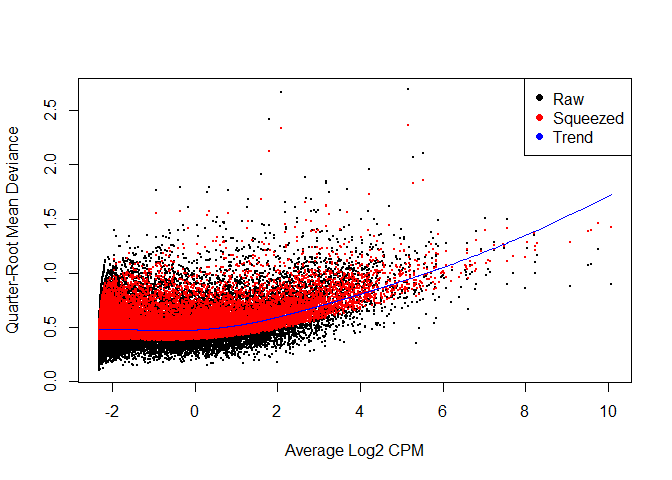

# 2-RNAseq_differential_expression
Tony Hui  
March 8, 2016  


```r
library(dplyr)
library(ggplot2)
require(tidyr)
require(knitr)
require(limma)
require(edgeR)
```


```r
setwd("Data_Analysis/")
```

## Load data


```r
rnaseq <- read.table(file="../RNASeq_data/RNAseq_all_merged.txt", header = TRUE, stringsAsFactors = FALSE) %>% tbl_df()
```

## Plot distribution of RPKMs


```r
rnaseq_male_female <- rnaseq %>%
  select(genes, contains("FVEH"), contains("MVEH")) %>%
  gather(key = sample, value = RPKM, -genes) %>%
  mutate(group = ifelse(grepl("FVEH", sample), "female", "male"))

rnaseq_male_female %>% 
  ggplot(aes(RPKM, color = sample)) +
  geom_density() +
  scale_x_log10()
```

```
## Warning: Removed 57394 rows containing non-finite values (stat_density).
```


## T-test

Since the distribution is not normal, need to log transform first before performing further calculations

Since some values are 0, will do log(x + 1)


```r
rnaseq_male_female_cutoff <- rnaseq_male_female %>%
  # mutate(RPKM = ifelse(RPKM < cutoff, cutoff, RPKM)) %>%
  mutate(RPKM = log(RPKM + 0.5, 10)) %>%
  group_by(genes) %>%
  # remove genes with no variation across samples
  filter(sd(RPKM) > 0) %>%
  ungroup()

rnaseq_male_female_ttest <- rnaseq_male_female_cutoff %>%
  group_by(genes) %>%
  summarize(
    log_female_mean = t.test(RPKM[group == "female"], RPKM[group != "female"])$estimate[1],
    log_male_mean = t.test(RPKM[group == "female"], RPKM[group != "female"])$estimate[2],
    pvalue = t.test(RPKM[group == "female"], RPKM[group != "female"], var.equal = TRUE)$p.value
    ) 

rnaseq_male_female_ttest_corrected <- rnaseq_male_female_ttest %>%
  mutate(log2_fold_change = 10^(log_female_mean - log_male_mean) %>% log(2)) %>%
  mutate(fdr = p.adjust(pvalue, method = "fdr")) %>%
  arrange(fdr)
```


```r
rnaseq_male_female_ttest_corrected %>% head(3) %>% kable("markdown")
```


|genes              | log_female_mean| log_male_mean|   pvalue| log2_fold_change|       fdr|
|:------------------|---------------:|-------------:|--------:|----------------:|---------:|
|ENSRNOG00000037911 |        1.704870|    -0.1898828| 1.50e-06|        6.2942334| 0.0341895|
|ENSRNOG00000009325 |        1.337283|     1.2860355| 1.59e-05|        0.1702392| 0.1797370|
|ENSRNOG00000006587 |        1.365073|     1.3445241| 7.14e-05|        0.0682608| 0.1931957|

Only one significant gene: ENSRNOG00000037911

### Pvalue distribution is "normal"

This suggests there's nothing significant


```r
ggplot(rnaseq_male_female_ttest_corrected) +
  geom_histogram(aes(pvalue, fill = "pvalue"), bins = 20) +
  # geom_density(aes(fdr, color = "fdr")) +
  theme_bw()
```


## Try Limma's `voom` function


```r
samples <- colnames(rnaseq)[grepl("FVEH|MVEH", colnames(rnaseq))]

limma_design_matrix <- data.frame(
  Female = c(1,1,1,0,0,0),
  Male = c(0,0,0,1,1,1)
)

rownames(limma_design_matrix) <- samples

voom_rnaseq <- rnaseq %>%
  select(contains("FVEH"), contains("MVEH")) %>% data.matrix() %>%
  voom(design = limma_design_matrix, plot = T, lib.size = c(rep(1e7, 6)))
```


```r
fit <- lmFit(object = voom_rnaseq, design = limma_design_matrix)

cont.matrix <- makeContrasts(FemaleVsMale=Female-Male, levels=limma_design_matrix)

fit2 <- contrasts.fit(fit, cont.matrix) %>% eBayes()

top_DE_genes <- topTable(fit2, adjust="fdr")
```

One significant gene...! ENSRNOG00000037911


```r
top_DE_genes %>% head(3) %>% kable("markdown")
```


|      |     logFC|    AveExpr|        t| P.Value| adj.P.Val|        B|
|:-----|---------:|----------:|--------:|-------:|---------:|--------:|
|23406 | 6.2942334| -0.8055886| 36.01412| 1.3e-06| 0.0394296| 6.502884|
|5674  | 0.1702392|  1.0353088| 25.38509| 6.2e-06| 0.0607408| 5.074935|
|21863 | 1.0320431| -3.8059067| 25.72073| 5.8e-06| 0.0607408| 5.073143|

```r
rnaseq[23406,]$genes
```

```
## [1] "ENSRNOG00000037911"
```

### Try edgeR


```r
edgeR_DGElist <- DGEList(
  counts = rnaseq %>%
    select(contains("FVEH"), contains("MVEH")) %>%
    data.matrix(),
  lib.size = c(rep(1e7, 6)),
  group=rep(1:2,each=3),
  remove.zeros = TRUE
) %>% 
  # TMM normalization
  calcNormFactors() 
```

```
## Removing 6947 rows with all zero counts
```

```r
plotMDS.DGEList(edgeR_DGElist)
```


```r
edgeR_DGElist <- edgeR_DGElist %>% 
  estimateDisp(design = limma_design_matrix, robust=TRUE)

# plotBCV(edgeR_DGElist)

fit <- glmQLFit(edgeR_DGElist, limma_design_matrix, robust=TRUE)

plotQLDisp(fit)
```



```r
qlf <- glmQLFTest(fit, contrast=cont.matrix)
topTags(qlf) %>% as.data.frame %>% head(., 3) %>% kable("markdown")
```


|      |     logFC|   logCPM|         F|    PValue|       FDR|
|:-----|---------:|--------:|---------:|---------:|---------:|
|23406 | 7.5454868| 1.451248| 520.77912| 0.0000001| 0.0026406|
|3736  | 0.6795234| 2.407732| 115.62452| 0.0000479| 0.5405731|
|18766 | 1.8736898| 1.023241|  28.28255| 0.0012255| 0.9999918|

Same result, only ENSRNOG00000037911 is significant at FDR < 0.05

## Check for cannonical genes that should be differentially expressed


```r
rn6_genes <- read.table("rn6_genes.txt") %>% tbl_df() %>%
  select(genes = V6,V7) %>% 
  mutate(genes = gsub("\\..*", "", genes)) %>%
  unique()

cannonical_genes <- c("Prl", "Xist", "Dby", "Eif2s3y", "Rps4y2", "Smcy", "Uty")

rn6_genes_interest <- rn6_genes %>%
  filter(V7 %in% cannonical_genes)

rn6_genes_interest
```

```
## Source: local data frame [4 x 2]
## 
##                genes      V7
##                (chr)  (fctr)
## 1 ENSRNOG00000031041  Rps4y2
## 2 ENSRNOG00000060617     Uty
## 3 ENSRNOG00000060048 Eif2s3y
## 4 ENSRNOG00000017374     Prl
```

Can't find the other genes haha...


```r
right_join(rn6_genes, rnaseq_male_female_ttest_corrected, by = "genes")  %>%
  filter(genes %in% rn6_genes_interest$genes) %>% kable("markdown")
```


|genes              |V7     | log_female_mean| log_male_mean|    pvalue| log2_fold_change|       fdr|
|:------------------|:------|---------------:|-------------:|---------:|----------------:|---------:|
|ENSRNOG00000017374 |Prl    |      -0.2900319|    -0.3010300| 0.3739010|        0.0365350| 0.9994924|
|ENSRNOG00000031041 |Rps4y2 |       0.8469126|     0.8487454| 0.9835238|       -0.0060884| 0.9994924|

What the heck, these guys didn't even look at ENSRNOG00000060617 or ENSRNOG00000060048.

Anyways, seems like these canonical genes aren't differentially expressed in our sample. Man this is the worst RNA-seq ever.
