# 2-RNAseq_differential_expression
Tony Hui  
March 8, 2016  


```r
library(dplyr)
library(ggplot2)
require(tidyr)
require(knitr)
require(limma)
require(edgeR)
require(gplots)
require(pheatmap)
```


```r
setwd("Data_Analysis/")
```

## Load data


```r
rnaseq <- read.table(file="../RNASeq_data/new_data_Tony_TPM/RNAseq_new_merged_raw.txt", header = TRUE, stringsAsFactors = FALSE)

rnaseq_meta <- read.table(file = "../RNASeq_data/new_data_Tony_TPM/sailfish_file_table.txt", stringsAsFactors = FALSE)

colnames(rnaseq) <- with(rnaseq_meta, paste(V3, V4, 1:12, sep = "_"))

rnaseq_meta$samples <- with(rnaseq_meta, paste(V3, V4, 1:12, sep = "_"))
```

## Plot distribution of gExps


```r
rnaseq_male_Female <- rnaseq %>%
  add_rownames("gene") %>%
  select(gene, contains("vehicle")) %>%
  gather(key = sample, value = gExp, -gene) %>%
  mutate(gender = ifelse(grepl("Female", sample), "Female", "male"))

rnaseq_male_Female %>% 
  ggplot(aes(gExp+0.5, color = gender)) +
  geom_density() +
  scale_x_log10()
```

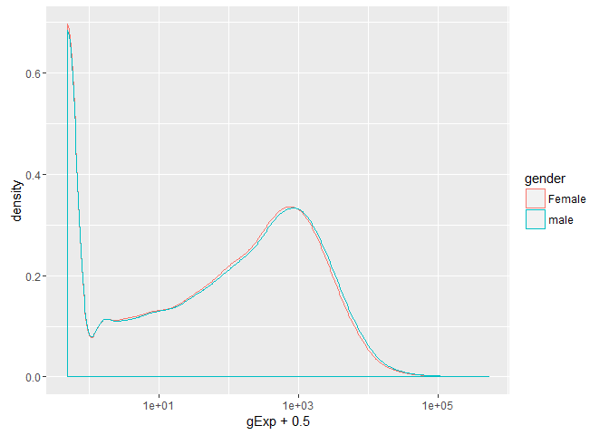

## Try Limma's `voom` function


```r
samples <- rnaseq_meta %>% filter(V4 == "vehicle")

limma_design_matrix <- model.matrix(~V3, samples)

rownames(limma_design_matrix) <- samples$samples

voom_DGElist <- rnaseq %>%
  select(contains("vehicle")) %>%
  DGEList(group = rep(c("f","m"), each = 3)) %>%
  .[rowSums(cpm(.) > 0.3) >= 2, , keep.lib.sizes=FALSE]

voom_rnaseq <- voom_DGElist %>%
  voom(design = limma_design_matrix, plot = T)
```

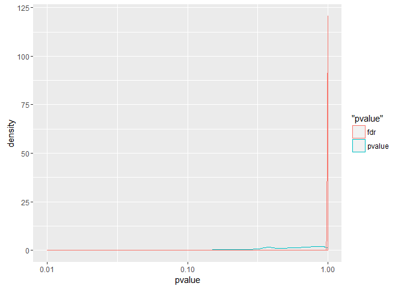

```r
fit_limma <- lmFit(object = voom_rnaseq, design = limma_design_matrix) %>% eBayes()

limma_results <- topTable(fit_limma, adjust="fdr", number = Inf)
```

```
## Removing intercept from test coefficients
```

Pvalues are skewed to the right


```r
limma_results %>% 
  ggplot(aes(P.Value)) +
  geom_density()
```

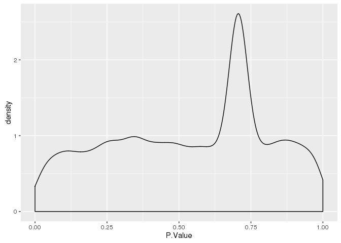

### Double-check nothing funny is going on


```r
correlation <- cor(rnaseq %>% select(contains("vehicle")), method = "spearman")

diag(correlation) <- NA

clustering <- hclust(as.dist(1-correlation), method = "ward.D2")

require(pheatmap)
pheatmap(correlation, cluster_rows = clustering, cluster_cols = clustering, display_numbers = T, color = colorRampPalette(c("#ffffb2", "#bd0026"))(9))
```

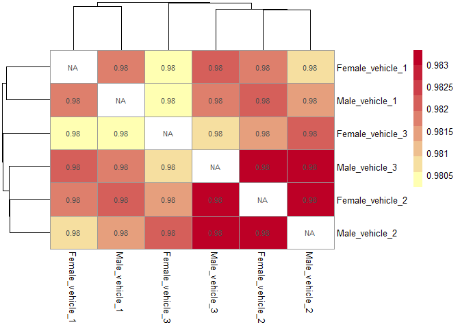

```r
plot(clustering)
```

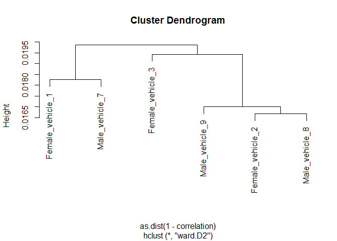

Seems like everything is normal, although there doesn't seem to be a clear separation between male and female

## Try edgeR


```r
edgeR_DGElist <- rnaseq %>%
  select(contains("vehicle")) %>%
  DGEList(group = rep(c("f","m"), each = 3)) %>%
  .[rowSums(cpm(.) > 0.3) >= 2, , keep.lib.sizes=FALSE] %>%
  calcNormFactors()

edgeR_DGElist_trends <- edgeR_DGElist %>%
  estimateGLMCommonDisp(limma_design_matrix, verbose=TRUE) %>%
  estimateGLMTrendedDisp(limma_design_matrix) %>%
  estimateGLMTagwiseDisp(limma_design_matrix)
```

```
## Disp = 0.03377 , BCV = 0.1838
```

```r
plotBCV(edgeR_DGElist_trends)
```

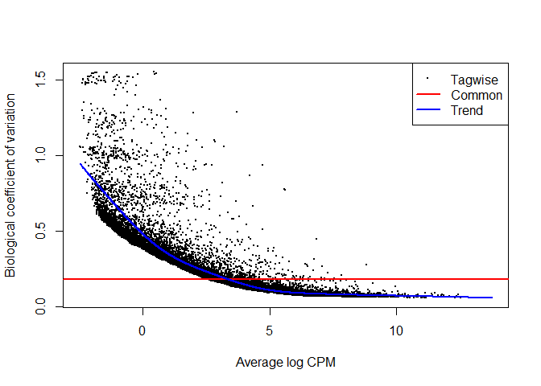

```r
# plotMDS.DGEList(edgeR_DGElist_trends)
```


```r
fit <- glmFit(edgeR_DGElist_trends, limma_design_matrix) %>% glmLRT(coef = 2)

edgeR_results <- topTags(fit, n = Inf) %>% as.data.frame()

edgeR_results %>% head() %>% kable("markdown")
```


|                     |     logFC|   logCPM|        LR| PValue| FDR|
|:--------------------|---------:|--------:|---------:|------:|---:|
|ENSRNOT00000088593.1 | 14.085475| 5.053390| 1540.5503|      0|   0|
|ENSRNOT00000092078.1 | 10.345845| 4.918516| 1486.2852|      0|   0|
|ENSRNOT00000086056.1 | 10.269165| 4.841341| 1354.0319|      0|   0|
|ENSRNOT00000082648.1 | 12.237584| 3.214705|  534.3931|      0|   0|
|ENSRNOT00000075940.1 | -5.390653| 3.780268|  495.2908|      0|   0|
|ENSRNOT00000088616.1 |  6.433413| 2.887938|  347.9084|      0|   0|

Once again, right-skewed Pvalues


```r
qplot(edgeR_results$PValue, geom="density")
```

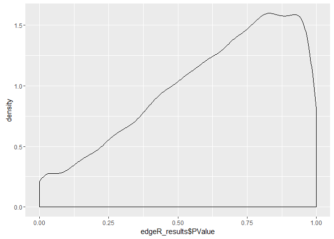

## Try edgeR with quasilinear fit

There is `glmFit` and `glmQLFit` - not sure the difference

Reference here: http://www.statsci.org/smyth/pubs/QLedgeRPreprint.pdf


```r
fitQL <- glmQLFit(edgeR_DGElist_trends, limma_design_matrix) %>% glmLRT(coef = 2)

edgeR_QL_results <- topTags(fitQL, n = Inf) %>% as.data.frame()

edgeR_QL_results %>% head() %>% kable("markdown")
```


|                     |     logFC|   logCPM|        LR| PValue| FDR|
|:--------------------|---------:|--------:|---------:|------:|---:|
|ENSRNOT00000088593.1 | 14.085478| 5.053390| 1481.2323|      0|   0|
|ENSRNOT00000092078.1 | 10.345750| 4.918516| 1333.8447|      0|   0|
|ENSRNOT00000086056.1 | 10.269186| 4.841341| 1274.7826|      0|   0|
|ENSRNOT00000028064.5 | -6.819740| 3.711348|  528.2253|      0|   0|
|ENSRNOT00000082648.1 | 12.237531| 3.214705|  456.0808|      0|   0|
|ENSRNOT00000075940.1 | -5.389753| 3.780268|  445.5320|      0|   0|

Once again, right-skewed Pvalues


```r
qplot(edgeR_QL_results$PValue, geom="density")
```

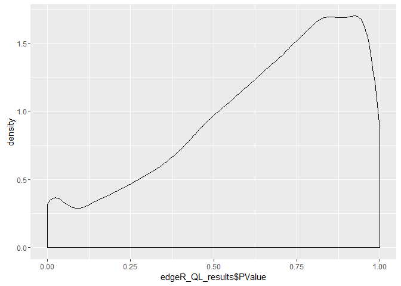

## Summary of results


```
## [1] "there are 15 DE genes from limma"
```

```
## [1] "there are 164 DE genes from edgeR glmQLFit"
```

```
## [1] "there are 52 DE genes from edgeR glmFit"
```

```r
venn(list(
  edgeR_QL = edgeR_QL_results %>% subset(FDR<0.05) %>% rownames(.),
  limma = limma_results %>% subset(adj.P.Val<0.05) %>% rownames(.),
  edgeR = edgeR_results %>% subset(FDR<0.05) %>% rownames(.)
))
```

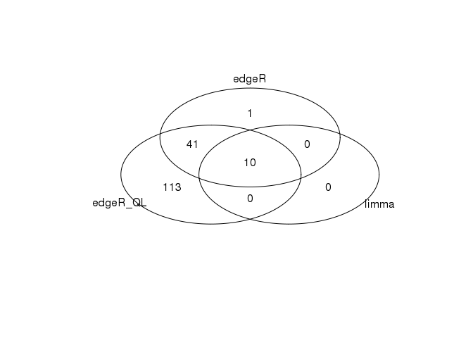

## Check for cannonical gene that should be differentially expressed


```r
rn6_gene <- read.table("../Data_Analysis/rn6_genes.txt") %>% tbl_df() %>%
  select(gene = V1, V7) %>% 
  unique()

cannonical_gene <- c("Prl", "Xist", "Dby", "Eif2s3y", "Rps4y2", "Smcy", "Uty", "Eif2s3")

rn6_gene_interest <- rn6_gene %>%
  filter(V7 %in% cannonical_gene)

rn6_gene_interest
```

```
## Source: local data frame [7 x 2]
## 
##                   gene      V7
##                 (fctr)  (fctr)
## 1 ENSRNOT00000043543.2  Rps4y2
## 2 ENSRNOT00000092019.1  Eif2s3
## 3 ENSRNOT00000082421.1  Eif2s3
## 4 ENSRNOT00000081124.1  Eif2s3
## 5 ENSRNOT00000082648.1     Uty
## 6 ENSRNOT00000088593.1 Eif2s3y
## 7 ENSRNOT00000023412.4     Prl
```


```r
right_join(rn6_gene, edgeR_QL_results %>% add_rownames("gene"), by = "gene")  %>%
  filter(gene %in% rn6_gene_interest$gene) %>% kable("markdown")
```

```
## Warning in right_join_impl(x, y, by$x, by$y): joining factor and character
## vector, coercing into character vector
```


|gene                 |V7      |      logFC|   logCPM|           LR|    PValue|       FDR|
|:--------------------|:-------|----------:|--------:|------------:|---------:|---------:|
|ENSRNOT00000088593.1 |Eif2s3y | 14.0854776| 5.053390| 1481.2322968| 0.0000000| 0.0000000|
|ENSRNOT00000082648.1 |Uty     | 12.2375307| 3.214705|  456.0808041| 0.0000000| 0.0000000|
|ENSRNOT00000092019.1 |Eif2s3  | -0.6675812| 7.769330|   48.0627248| 0.0000000| 0.0000000|
|ENSRNOT00000082421.1 |Eif2s3  | -1.2963958| 1.077961|    8.8985483| 0.0028540| 0.2480257|
|ENSRNOT00000081124.1 |Eif2s3  | -0.2888773| 3.162468|    1.4936701| 0.2216479| 0.9999733|
|ENSRNOT00000043543.2 |Rps4y2  | -0.0252202| 2.446263|    0.0075271| 0.9308630| 0.9999733|

Looks like some of cannonical genes are differentially expressed. Yay!


```r
# write.table(edgeR_QL_results %>% subset(FDR<0.05) %>% rownames(.), file = "/projects/epigenomics/users/thui/stat540/methylation_data/homer/de_transcripts.txt", row.names = F, col.names = F, quote = F)
```

```r
edge_QL_final <- edgeR_QL_results %>% subset(FDR<0.05) %>% add_rownames("gene")

output_results <- rnaseq_male_Female %>% 
  filter(gene %in% edge_QL_final$gene) %>%
  # head(100) %>%
  group_by(gene, gender) %>%
  summarize(log_mean_exp = mean(gExp) %>% round(digits = 2)) %>%
  spread(key = gender, value = log_mean_exp) %>%
  inner_join(., edge_QL_final) %>%
  mutate(gExp_up_in_female = Female > male) %>%
  select(-LR, -logCPM, -Female, -male, -PValue) %>%
  inner_join(., rn6_gene) %>%
  mutate(logFC = round(logFC, 3),
         FDR = round (FDR, 3))
```

```
## Joining by: "gene"
## Joining by: "gene"
```

```
## Warning in inner_join_impl(x, y, by$x, by$y): joining character vector and
## factor, coercing into character vector
```

```r
write.table(output_results, file = "../Data_Analysis/RNAseq_result/DE_genes/glmQLFit_DE_genes.tsv", row.names = F, col.names = T, quote = F, sep = "\t")
```

## Compare vs NOIse-seq


```r
rnaseq_samples <- rnaseq %>%select(contains("vehicle"))

library(NOISeq)
```

```
## Loading required package: Biobase
```

```
## Loading required package: BiocGenerics
```

```
## Loading required package: parallel
```

```
## 
## Attaching package: 'BiocGenerics'
```

```
## The following objects are masked from 'package:parallel':
## 
##     clusterApply, clusterApplyLB, clusterCall, clusterEvalQ,
##     clusterExport, clusterMap, parApply, parCapply, parLapply,
##     parLapplyLB, parRapply, parSapply, parSapplyLB
```

```
## The following object is masked from 'package:limma':
## 
##     plotMA
```

```
## The following objects are masked from 'package:dplyr':
## 
##     combine, intersect, setdiff, union
```

```
## The following objects are masked from 'package:stats':
## 
##     IQR, mad, xtabs
```

```
## The following objects are masked from 'package:base':
## 
##     anyDuplicated, append, as.data.frame, as.vector, cbind,
##     colnames, do.call, duplicated, eval, evalq, Filter, Find, get,
##     grep, grepl, intersect, is.unsorted, lapply, lengths, Map,
##     mapply, match, mget, order, paste, pmax, pmax.int, pmin,
##     pmin.int, Position, rank, rbind, Reduce, rownames, sapply,
##     setdiff, sort, table, tapply, union, unique, unlist, unsplit
```

```
## Welcome to Bioconductor
## 
##     Vignettes contain introductory material; view with
##     'browseVignettes()'. To cite Bioconductor, see
##     'citation("Biobase")', and for packages 'citation("pkgname")'.
```

```
## Loading required package: splines
```

```
## Loading required package: Matrix
```

```
## Warning: package 'Matrix' was built under R version 3.2.4
```

```
## 
## Attaching package: 'Matrix'
```

```
## The following object is masked from 'package:tidyr':
## 
##     expand
```

```
## 
## Attaching package: 'NOISeq'
```

```
## The following object is masked from 'package:edgeR':
## 
##     rpkm
```

```r
noiseq_factors <- data.frame(gender = rep(c("female", "male"), each=3), row.names = colnames(rnaseq_samples))

noiseq_data <- readData(data = rnaseq_samples, factors = noiseq_factors)

noiseq_results <- noiseqbio(input = noiseq_data, factor = "gender", norm = "tmm", filter = 1, cpm = 0.3)
```

```
## Computing Z values...
## Filtering out low count features...
## 26695 features are to be kept for differential expression analysis with filtering method 1
## ...k-means clustering done
## Size of 15 clusters:
##  [1] 15758     9   137  4765  2615    46    85   530   880  1510     5
## [12]    37   298     1    19
## Resampling cluster...[1] 1
```

```
## Warning: Quick-TRANSfer stage steps exceeded maximum (= 787900)
```

```
## Warning: Quick-TRANSfer stage steps exceeded maximum (= 787900)

## Warning: Quick-TRANSfer stage steps exceeded maximum (= 787900)

## Warning: Quick-TRANSfer stage steps exceeded maximum (= 787900)

## Warning: Quick-TRANSfer stage steps exceeded maximum (= 787900)

## Warning: Quick-TRANSfer stage steps exceeded maximum (= 787900)

## Warning: Quick-TRANSfer stage steps exceeded maximum (= 787900)

## Warning: Quick-TRANSfer stage steps exceeded maximum (= 787900)

## Warning: Quick-TRANSfer stage steps exceeded maximum (= 787900)
```

```
## Size of 15 subclusters of cluster: 1
##  [1]   38  632  206 6520    5  113  498  797 1061 1939  448  701  868 1342
## [15]  590
## [1] 2
## [1] 3
## [1] 4
## Size of 15 subclusters of cluster: 4
##  [1]   6   3 305 275 778 544  15 638 412 239  24 430 403 378 315
## [1] 5
## Size of 15 subclusters of cluster: 5
##  [1] 241 143  24 182 295 252   2  23 368 211 160 286 125 165 138
## [1] 6
## [1] 7
## [1] 8
## [1] 9
## [1] 10
## Size of 15 subclusters of cluster: 10
##  [1]   7  88   5  56 159 107  87  97  87 166 119 204 108  67 153
## [1] 11
## [1] 12
## [1] 13
## [1] 14
## [1] 15
## Computing Z for noise...
## Computing probability of differential expression...
## p0 = 0.426451208081965
## Probability
##    Min. 1st Qu.  Median    Mean 3rd Qu.    Max.    NA's 
##   0.000   0.312   0.697   0.569   0.834   1.000    4202
```

```r
noiseq_hits <- degenes(noiseq_results)
```

```
## [1] "51 differentially expressed features"
```

```r
DE.plot(output = noiseq_results, q = 0.95, graphic = "expr")
```

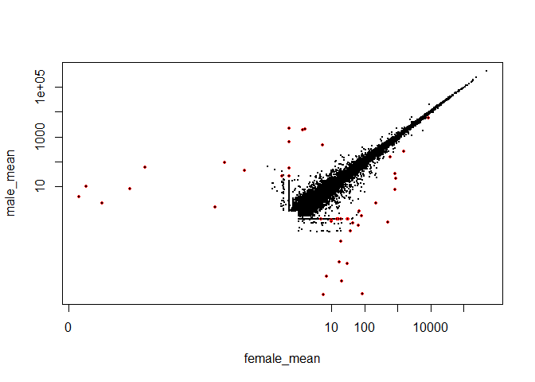

```
## [1] "51 differentially expressed features"
```

```r
x<-venn(list(
  edgeR_glmQLFit = edgeR_QL_results %>% subset(FDR<0.05) %>% rownames(.),
  noiseSeq = rownames(noiseq_hits),
  edgeR_glmFit = edgeR_results %>% subset(FDR<0.05) %>% rownames(.)
))
```

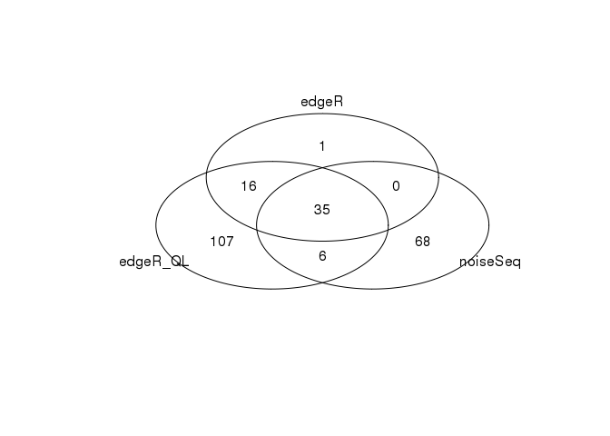

```r
x <- attr(x, "intersection")
```


```r
full_data <- rnaseq_samples %>%
  DGEList(group = rep(c("f","m"), each = 3))

cpm(full_data) %>% subset(rownames(.) %in% x$noiseSeq) %>% round(2)
```

