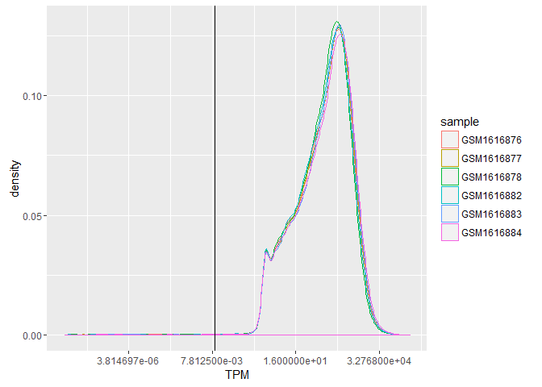
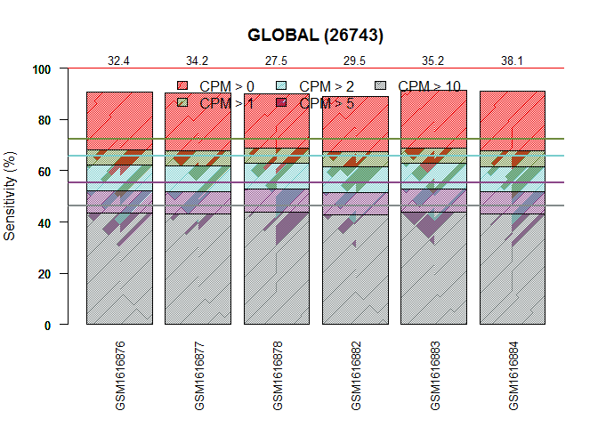
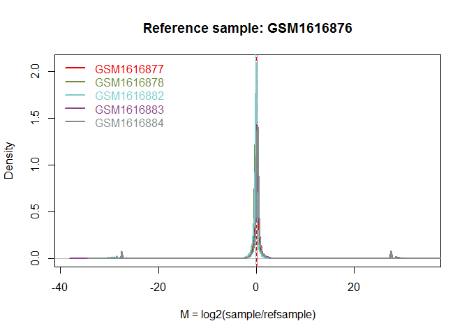
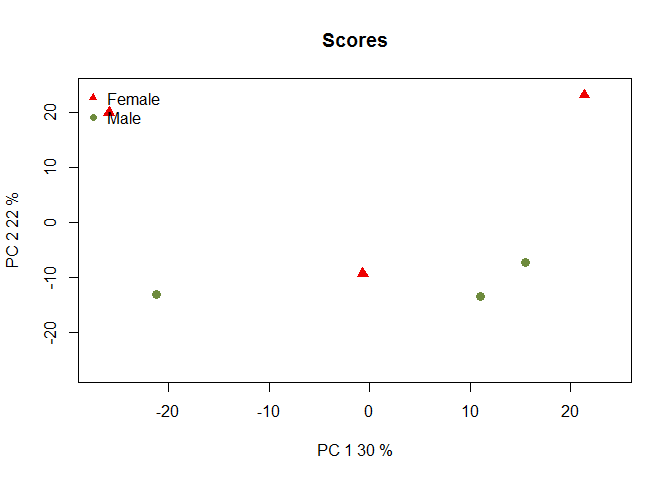
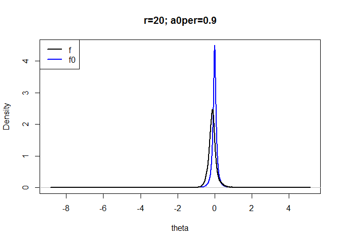

# Analysis pipeline for finding differentially expressed genes from RNAseq `TPM` read counts using `R` package `NOISeq`
Rashed  
March 14, 2016  


# Steps to find out differentially expressed genes using `NOISeq` package in `R`

The analysis pipeline consists of the following steps.

 1. Data preparation and import data to make `NOISeq` object
 2. Checking Quality control of the data (Check for bias and quality control report)
 3. Normalization of the raw read counts
 4. Filtering (basically low read counts need to be filtered out)
 5. Finding the differentially expressed features/genes using one of the three analysis which suits best

# Data preparation for comparing male and female vehicle

`NOISeq` requires two pieces of information to work that must be provided to the readData function: the expression data (data) and the factors defining the experimental groups to be studied or compared (factors). However, in order to perform the quality control of the data or normalize them, other additional annotations need to be provided such as the feature length, the GC content, the biological classification of the features (e.g. Ensembl biotypes), or the chromosome position of each feature. 

The expression data must be provided in a matrix or a `data.frame` `R` object, having as many rows as the number of features to be studied and as many columns as the number of samples in the experiment. The expression data can be both read counts or normalized expression data such as RPKM values, and also any other normalized expression values.


```r
library(knitr)
library(rmarkdown)
###TPM
datn <- read.table(file="C:/Users/Rashed/Documents/all_github/team_treed_rats-DNA-methylation/RNASeq_data/new_data_Tony_TPM/RNAseq_new_merged_raw.txt", header = TRUE)
head(datn)
```

```
##                      GSM1616876  GSM1616877 GSM1616878 GSM1616879
## ENSRNOT00000000008.4 13479.9000 13954.90000 10476.1000 10085.2000
## ENSRNOT00000000009.5     7.4817     3.08747    37.3347     0.0000
## ENSRNOT00000000010.5     5.0000     2.00000     7.0000     8.0000
## ENSRNOT00000000011.5   483.9430   994.97700  1481.4500  1121.1400
## ENSRNOT00000000013.5    26.1448    39.64010    32.2676    24.7112
## ENSRNOT00000000018.7     8.0000    13.00000     9.0000    10.0000
##                       GSM1616880 GSM1616881  GSM1616882  GSM1616883
## ENSRNOT00000000008.4 12750.30000 10308.9000 13948.60000 13201.80000
## ENSRNOT00000000009.5     8.35104    63.4705     1.03554     3.13629
## ENSRNOT00000000010.5     0.00000     1.0000     4.00000     2.00000
## ENSRNOT00000000011.5   875.27000   472.7480   479.68200  1301.00000
## ENSRNOT00000000013.5    33.15810    29.8314    40.41700    56.21000
## ENSRNOT00000000018.7    11.00000    11.0000     6.00000    11.00000
##                       GSM1616884  GSM1616885 GSM1616886  GSM1616887
## ENSRNOT00000000008.4 15736.60000 14505.60000 9138.13000 11147.00000
## ENSRNOT00000000009.5     3.08939     8.30744    1.02008     4.16758
## ENSRNOT00000000010.5     2.00000     3.00000    2.00000     4.00000
## ENSRNOT00000000011.5  1101.97000  1205.73000  362.97600   914.95900
## ENSRNOT00000000013.5    37.99390    45.31130   17.26170    34.08810
## ENSRNOT00000000018.7    11.00000    16.00000    4.00000     5.00000
```

```r
str(datn)
```

```
## 'data.frame':	30897 obs. of  12 variables:
##  $ GSM1616876: num  13479.9 7.48 5 483.94 26.14 ...
##  $ GSM1616877: num  13954.9 3.09 2 994.98 39.64 ...
##  $ GSM1616878: num  10476.1 37.3 7 1481.5 32.3 ...
##  $ GSM1616879: num  10085.2 0 8 1121.1 24.7 ...
##  $ GSM1616880: num  12750.3 8.35 0 875.27 33.16 ...
##  $ GSM1616881: num  10308.9 63.5 1 472.7 29.8 ...
##  $ GSM1616882: num  13948.6 1.04 4 479.68 40.42 ...
##  $ GSM1616883: num  13201.8 3.14 2 1301 56.21 ...
##  $ GSM1616884: num  15736.6 3.09 2 1101.97 37.99 ...
##  $ GSM1616885: num  14505.6 8.31 3 1205.73 45.31 ...
##  $ GSM1616886: num  9138.13 1.02 2 362.98 17.26 ...
##  $ GSM1616887: num  11147 4.17 4 914.96 34.09 ...
```

```r
###comparing male and female vehicle

####data preparation

###count data
#can input raw or norrmalized count. here we put rpkm values as count
countsfm <- datn[,c(1:3, 7:9)]
head(countsfm)
```

```
##                      GSM1616876  GSM1616877 GSM1616878  GSM1616882
## ENSRNOT00000000008.4 13479.9000 13954.90000 10476.1000 13948.60000
## ENSRNOT00000000009.5     7.4817     3.08747    37.3347     1.03554
## ENSRNOT00000000010.5     5.0000     2.00000     7.0000     4.00000
## ENSRNOT00000000011.5   483.9430   994.97700  1481.4500   479.68200
## ENSRNOT00000000013.5    26.1448    39.64010    32.2676    40.41700
## ENSRNOT00000000018.7     8.0000    13.00000     9.0000     6.00000
##                       GSM1616883  GSM1616884
## ENSRNOT00000000008.4 13201.80000 15736.60000
## ENSRNOT00000000009.5     3.13629     3.08939
## ENSRNOT00000000010.5     2.00000     2.00000
## ENSRNOT00000000011.5  1301.00000  1101.97000
## ENSRNOT00000000013.5    56.21000    37.99390
## ENSRNOT00000000018.7    11.00000    11.00000
```

```r
#str(countsfm)
dim(countsfm)
```

```
## [1] 30897     6
```

Factors are the variables indicating the experimental group for each sample. They must be given to the `readData` function in a data frame object. This data frame must have as many rows as samples (columns in data object) and as many columns or factors as different sample annotations the user wants to use. Be careful here, the order of the elements of the factor must coincide with the order of the samples (columns) in the expression data file provided.

## Import data to make `NOISeq` object

Once we have created in `R` the count data matrix, the data frame for the factors we have to pack all this information into a `NOISeq` object by using the readData function. An example on how it works is shown below. It is noted the rows with zero counts in all samples are deleted. These have no impact on the analysis.


```r
##densityplot
require(dplyr)
```

```
## Loading required package: dplyr
```

```
## 
## Attaching package: 'dplyr'
```

```
## The following objects are masked from 'package:stats':
## 
##     filter, lag
```

```
## The following objects are masked from 'package:base':
## 
##     intersect, setdiff, setequal, union
```

```r
require(ggplot2)
```

```
## Loading required package: ggplot2
```

```
## Warning: package 'ggplot2' was built under R version 3.2.4
```

```r
require(tidyr)
```

```
## Loading required package: tidyr
```

```r
expression_mf_long <- countsfm %>% 
  add_rownames() %>%
  gather(key = sample, value = TPM, ... = -rowname)

expression_mf_long %>%
  ggplot(aes(TPM, color = sample)) +
  geom_density() +
  scale_x_continuous(trans = "log2") +
  geom_vline(xintercept = 0.01)
```

```
## Warning: Removed 40184 rows containing non-finite values (stat_density).
```

<!-- -->

```r
###removing rows with all zero counts

countsfmnz <- countsfm[countsfm[,1] != 0 | countsfm[,2] != 0 | countsfm[,3] != 0 | countsfm[,4] != 0 | countsfm[,5] != 0 | countsfm[,6] != 0 , ]
dim(countsfmnz)
```

```
## [1] 26743     6
```

```r
#reduced to 26743 genes

###design (factor var) for NOISeq
meta_dat <- read.table(file="C:/Users/Rashed/Documents/all_github/team_treed_rats-DNA-methylation/RNASeq_data/new_data_Tony_TPM/sailfish_file_table.txt")
colnames(meta_dat) <- c("SRR ID", "sample.no", "gender", "treatment")
row.names(meta_dat) <- meta_dat$sample.no
meta_dat <- data.frame(meta_dat[,c(1,3,4)])
head(meta_dat)
```

```
##                SRR.ID gender treatment
## GSM1616876 SRR1813698 Female   vehicle
## GSM1616877 SRR1813699 Female   vehicle
## GSM1616878 SRR1813700 Female   vehicle
## GSM1616879 SRR1813701 Female       zeb
## GSM1616880 SRR1813702 Female       zeb
## GSM1616881 SRR1813703 Female       zeb
```

```r
factorsfm <- data.frame(meta_dat[c(1:3,7:9),])
head(factorsfm)
```

```
##                SRR.ID gender treatment
## GSM1616876 SRR1813698 Female   vehicle
## GSM1616877 SRR1813699 Female   vehicle
## GSM1616878 SRR1813700 Female   vehicle
## GSM1616882 SRR1813704   Male   vehicle
## GSM1616883 SRR1813705   Male   vehicle
## GSM1616884 SRR1813706   Male   vehicle
```

```r
factorsfm <- droplevels(factorsfm)

###converting data into a NOISeq object
library(NOISeq)
```

```
## Loading required package: Biobase
```

```
## Loading required package: BiocGenerics
```

```
## Loading required package: parallel
```

```
## 
## Attaching package: 'BiocGenerics'
```

```
## The following objects are masked from 'package:parallel':
## 
##     clusterApply, clusterApplyLB, clusterCall, clusterEvalQ,
##     clusterExport, clusterMap, parApply, parCapply, parLapply,
##     parLapplyLB, parRapply, parSapply, parSapplyLB
```

```
## The following objects are masked from 'package:dplyr':
## 
##     combine, intersect, setdiff, union
```

```
## The following objects are masked from 'package:stats':
## 
##     IQR, mad, xtabs
```

```
## The following objects are masked from 'package:base':
## 
##     anyDuplicated, append, as.data.frame, as.vector, cbind,
##     colnames, do.call, duplicated, eval, evalq, Filter, Find, get,
##     grep, grepl, intersect, is.unsorted, lapply, lengths, Map,
##     mapply, match, mget, order, paste, pmax, pmax.int, pmin,
##     pmin.int, Position, rank, rbind, Reduce, rownames, sapply,
##     setdiff, sort, table, tapply, union, unique, unlist, unsplit
```

```
## Welcome to Bioconductor
## 
##     Vignettes contain introductory material; view with
##     'browseVignettes()'. To cite Bioconductor, see
##     'citation("Biobase")', and for packages 'citation("pkgname")'.
```

```
## Loading required package: splines
```

```
## Loading required package: Matrix
```

```
## Warning: package 'Matrix' was built under R version 3.2.4
```

```
## 
## Attaching package: 'Matrix'
```

```
## The following object is masked from 'package:tidyr':
## 
##     expand
```

```r
require(NOISeq)
datafm <- NOISeq::readData(data = countsfmnz, factors = factorsfm) #using readData function from NOISeq
datafm
```

```
## ExpressionSet (storageMode: lockedEnvironment)
## assayData: 26743 features, 6 samples 
##   element names: exprs 
## protocolData: none
## phenoData
##   sampleNames: GSM1616876 GSM1616877 ... GSM1616884 (6 total)
##   varLabels: SRR.ID gender treatment
##   varMetadata: labelDescription
## featureData: none
## experimentData: use 'experimentData(object)'
## Annotation:
```


##check the information included

Data created is checked here. 


```r
#check what information is included
str(datafm)
```

```
## Formal class 'ExpressionSet' [package "Biobase"] with 7 slots
##   ..@ experimentData   :Formal class 'MIAME' [package "Biobase"] with 13 slots
##   .. .. ..@ name             : chr ""
##   .. .. ..@ lab              : chr ""
##   .. .. ..@ contact          : chr ""
##   .. .. ..@ title            : chr ""
##   .. .. ..@ abstract         : chr ""
##   .. .. ..@ url              : chr ""
##   .. .. ..@ pubMedIds        : chr ""
##   .. .. ..@ samples          : list()
##   .. .. ..@ hybridizations   : list()
##   .. .. ..@ normControls     : list()
##   .. .. ..@ preprocessing    : list()
##   .. .. ..@ other            : list()
##   .. .. ..@ .__classVersion__:Formal class 'Versions' [package "Biobase"] with 1 slot
##   .. .. .. .. ..@ .Data:List of 2
##   .. .. .. .. .. ..$ : int [1:3] 1 0 0
##   .. .. .. .. .. ..$ : int [1:3] 1 1 0
##   ..@ assayData        :<environment: 0x000000001d189130> 
##   ..@ phenoData        :Formal class 'AnnotatedDataFrame' [package "Biobase"] with 4 slots
##   .. .. ..@ varMetadata      :'data.frame':	3 obs. of  1 variable:
##   .. .. .. ..$ labelDescription: chr [1:3] NA NA NA
##   .. .. ..@ data             :'data.frame':	6 obs. of  3 variables:
##   .. .. .. ..$ SRR.ID   : Factor w/ 6 levels "SRR1813698","SRR1813699",..: 1 2 3 4 5 6
##   .. .. .. ..$ gender   : Factor w/ 2 levels "Female","Male": 1 1 1 2 2 2
##   .. .. .. ..$ treatment: Factor w/ 1 level "vehicle": 1 1 1 1 1 1
##   .. .. ..@ dimLabels        : chr [1:2] "sampleNames" "sampleColumns"
##   .. .. ..@ .__classVersion__:Formal class 'Versions' [package "Biobase"] with 1 slot
##   .. .. .. .. ..@ .Data:List of 1
##   .. .. .. .. .. ..$ : int [1:3] 1 1 0
##   ..@ featureData      :Formal class 'AnnotatedDataFrame' [package "Biobase"] with 4 slots
##   .. .. ..@ varMetadata      :'data.frame':	0 obs. of  1 variable:
##   .. .. .. ..$ labelDescription: chr(0) 
##   .. .. ..@ data             :'data.frame':	26743 obs. of  0 variables
##   .. .. ..@ dimLabels        : chr [1:2] "featureNames" "featureColumns"
##   .. .. ..@ .__classVersion__:Formal class 'Versions' [package "Biobase"] with 1 slot
##   .. .. .. .. ..@ .Data:List of 1
##   .. .. .. .. .. ..$ : int [1:3] 1 1 0
##   ..@ annotation       : chr(0) 
##   ..@ protocolData     :Formal class 'AnnotatedDataFrame' [package "Biobase"] with 4 slots
##   .. .. ..@ varMetadata      :'data.frame':	0 obs. of  1 variable:
##   .. .. .. ..$ labelDescription: chr(0) 
##   .. .. ..@ data             :'data.frame':	6 obs. of  0 variables
##   .. .. ..@ dimLabels        : chr [1:2] "sampleNames" "sampleColumns"
##   .. .. ..@ .__classVersion__:Formal class 'Versions' [package "Biobase"] with 1 slot
##   .. .. .. .. ..@ .Data:List of 1
##   .. .. .. .. .. ..$ : int [1:3] 1 1 0
##   ..@ .__classVersion__:Formal class 'Versions' [package "Biobase"] with 1 slot
##   .. .. ..@ .Data:List of 4
##   .. .. .. ..$ : int [1:3] 3 2 2
##   .. .. .. ..$ : int [1:3] 2 30 0
##   .. .. .. ..$ : int [1:3] 1 3 0
##   .. .. .. ..$ : int [1:3] 1 0 0
```

```r
head(assayData(datafm)$exprs) ###give the expression data with rpkm counts
```

```
##                      GSM1616876  GSM1616877 GSM1616878  GSM1616882
## ENSRNOT00000000008.4 13479.9000 13954.90000 10476.1000 13948.60000
## ENSRNOT00000000009.5     7.4817     3.08747    37.3347     1.03554
## ENSRNOT00000000010.5     5.0000     2.00000     7.0000     4.00000
## ENSRNOT00000000011.5   483.9430   994.97700  1481.4500   479.68200
## ENSRNOT00000000013.5    26.1448    39.64010    32.2676    40.41700
## ENSRNOT00000000018.7     8.0000    13.00000     9.0000     6.00000
##                       GSM1616883  GSM1616884
## ENSRNOT00000000008.4 13201.80000 15736.60000
## ENSRNOT00000000009.5     3.13629     3.08939
## ENSRNOT00000000010.5     2.00000     2.00000
## ENSRNOT00000000011.5  1301.00000  1101.97000
## ENSRNOT00000000013.5    56.21000    37.99390
## ENSRNOT00000000018.7    11.00000    11.00000
```

```r
head(pData(datafm))
```

```
##                SRR.ID gender treatment
## GSM1616876 SRR1813698 Female   vehicle
## GSM1616877 SRR1813699 Female   vehicle
## GSM1616878 SRR1813700 Female   vehicle
## GSM1616882 SRR1813704   Male   vehicle
## GSM1616883 SRR1813705   Male   vehicle
## GSM1616884 SRR1813706   Male   vehicle
```

```r
head(featureData(datafm)@data)
```

```
## data frame with 0 columns and 6 rows
```

#Checking Quality control of the data

Data processing and sequencing experiment design in RNA-seq are not straightforward. Therefore, once the expression levels (read counts) have been obtained, it is absolutely necessary to be able
to detect potential biases or contamination before proceeding with further analysis (e.g. differential expression). The technology biases, such as the transcript length, GC content, PCR artifacts, uneven transcript read coverage, contamination by off-target transcripts or big differences in transcript distributions, are factors that interfere in the linear relationship between transcript abundance and the number of mapped reads at a gene locus (counts). These all are not relevent here!!!

##Some exploratory plot

There are several types of exploratory plots that can be obtained. They will be described in detail in the following sections. To generate any of these plots, first of all, `dat `function must be applied on the input data (`NOISeq` object) to obtain the information to be plotted. The user must specify the type of plot the data are to be computed for (argument type). Once the data for the plot have been generated with dat function, the plot will be drawn with the `explo.plot` function. 


```r
#### Quality control of count data
#need not for already normalized count I think

##Generating data for exploratory plots
#can't do so due to lack of information on biotype detection, sequencing depth and expression 
#quantification, sequencing bias detection and batch effect exploration

##count distribution per sample
countsplo <- dat(datafm, factor = NULL, type="countsbio")
```

```
## [1] "Count distributions are to be computed for:"
## [1] "GSM1616876" "GSM1616877" "GSM1616878" "GSM1616882" "GSM1616883"
## [6] "GSM1616884"
```

```r
explo.plot(countsplo, toplot = 1, samples =NULL, plottype = "boxplot")
```

<!-- -->

```r
###not give much info as all samples are normalized

#sensitivity plot

explo.plot(countsplo, toplot = 1, samples =NULL, plottype = "barplot")
```

<!-- -->

```r
#showing number of features with low counts for each samples 
```

Features with low counts are, in general, less reliable and may introduce noise in the data that makes more difficult to extract the relevant information, for instance, the differentially expressed features. The “Sensitivity plot” in above figure helps to decide the threshold to remove low-count features by indicating the proportion of such features that are present in our data. In this plot, the bars show the percentage of features within each sample having more than 0 counts
per million (CPM), or more than 1, 2, 5 and 10 CPM. The horizontal lines are the corresponding percentage of features with those CPM in at least one of the samples (or experimental conditions if the factor parameter is not NULL). 

##Bias things


```r
###Sequencing bias detection

##not needed as the countsa re already normalized

#length bias plot: he “lengthbias” plot describes the relationship between the feature length 
#and the expression values. For each bin, the 5% trimmed mean of the corresponding expression
#values (CPM if norm=FALSE or values provided if norm=TRUE) is computed and depicted in Y axis.

#lengthbiasfm <- dat(datafm, factor = "Vehicle", norm = TRUE, type = "lengthbias")
#explo.plot(lengthbiasfm, samples = NULL, toplot = "global")
#show(lengthbiasfm)
#can't run as we haven't the feature length
```

##RNA composition

When two samples have different RNA composition, the distribution of sequencing reads across the features is different in such a way that although a feature had the same number of read counts in both samples, it would not mean that it was equally expressed in both. To check if this bias is present in the data, the “cd” plot and the correponding diagnostic test can be used. In this case, each sample s is compared to the reference sample r (which can be arbitrarily chosen). To do that, M values are computed as $log2(counts_{s} = counts_{r})$. If no bias is present, it should be expected that the median of M values for each comparison is 0. Otherwise, it would
be indicating that expression levels in one of the samples tend to be higher than in the other, and this could lead to false discoveries when computing differencial expression. Confidence intervals for the M median are also computed by bootstrapping. If value 0 does not fall inside the interval, it means that the deviation of the sample with regard to the reference sample is statistically significant. It must be indicated if the data provided are already normalized (`norm=TRUE`) or not (`norm=FALSE`). The reference sample may be indicated with the `refColumn` parameter (by default, the first column is used). Additional plot parameters may also be used to modify some aspects of the plot.


```r
####RNA composition

###to check bias cd plot is used

fmcd <- dat(datafm, type = "cd", norm = TRUE, refColumn = 1)
```

```
## [1] "Reference sample is: GSM1616876"
## [1] "Confidence intervals for median of M:"
##            0.5%                 99.5%                Diagnostic Test
## GSM1616877 "0.018783656771664"  "0.0312874441294442" "FAILED"       
## GSM1616878 "-0.190330310133488" "-0.176973451278627" "FAILED"       
## GSM1616882 "-0.14641335357757"  "-0.135638819148605" "FAILED"       
## GSM1616883 "0.12534964414862"   "0.138691295305362"  "FAILED"       
## GSM1616884 "0.187089414351703"  "0.198186137346977"  "FAILED"       
## [1] "Diagnostic test: FAILED. Normalization is required to correct this bias."
```

```r
explo.plot(fmcd)
```

<!-- -->

##Batch effect exploration

One of the techniques that can be used to visualize if the experimental samples are clustered according to the experimental design or if there is an unwanted source of noise in the data that hampers this clustering is the Principal Component Analysis (PCA). Now we can run the following code to plot the samples scores for the two principal components of the PCA and color them by the factor “Vehicle”. 


```r
###pca plot

fmPCA = dat(datafm, type = "PCA")
explo.plot(fmPCA, factor = "gender")
```

<!-- -->


## QC report

The QCreport function allows the user to quickly generate a pdf report showing the exploratory plots described in this section to compare either two samples (if `factor=NULL`) or two experimental conditions (if factor is indicated). Depending on the biological information provided (biotypes, length or GC content), the number of plots included in the report may differ.


```r
###Quality control report

QCreport(datafm, samples = NULL, factor = "gender", norm = TRUE)
```

```
## [1] "Counts per million distributions are to be computed for:"
## [1] "Female" "Male"  
## [1] "Reference sample is: GSM1616876"
## [1] "Confidence intervals for median of M:"
##            0.5%                 99.5%                Diagnostic Test
## GSM1616877 "0.01874683485917"   "0.0305320810612332" "FAILED"       
## GSM1616878 "-0.189941193826288" "-0.176539228229846" "FAILED"       
## GSM1616882 "-0.146877273569809" "-0.135798247092583" "FAILED"       
## GSM1616883 "0.125229083799977"  "0.138554522519175"  "FAILED"       
## GSM1616884 "0.187074461944049"  "0.198811224282182"  "FAILED"       
## [1] "Diagnostic test: FAILED. Normalization is required to correct this bias."
```

```
## png 
##   2
```

```r
#diagnostic test failed.
#result shows normalization is required to correct for bias....confused!!!
```

This report can be generated before normalizing the data (`norm = FALSE`) or after normalization to check if unwanted effects were corrected (`norm = TRUE`). Please note that the data are log-transformed when computing Principal Component Analysis (PCA).

#Normalization


```r
###Normalization
#not needed as normalization is done already.
```


# Low-count Filtering

Excluding features with low counts improves, in general, differential expression results, no matter the method being used, since noise in the data is reduced. However, the best procedure to filter these low count features has not been yet decided nor implemented in the differential expression packages. `NOISeq` includes three methods to filter out features with low counts:

 1. **CPM** (method 1): The user chooses a value for the parameter counts per million (CPM) in a sample under which a feature is considered to have low counts. The cutoff for a condition with $s$ samples is $CPM × s$. Features with sum of expression values below the condition cutoff in all conditions are removed. Also a cutoff for the coefficient of variation (in percentage) per condition may be established to eliminate features with inconsistent expression values.
 2. **Wilcoxon test** (method 2): For each feature and condition, $H_{0} : m = 0$ is tested versus $H_{1} : m > 0$, where $m$ is the median of counts per condition. Features with $p-value > 0.05$ in all conditions are filtered out. P-values can be corrected for multiple testing using the $p.adj$ option. This method is only recommended when the number of replicates per condition is at least 5.
 3. **Proportion test** (method 3): Similar procedure to the Wilcoxon test but testing $H_{0} : p = p_{0}$ versus $H_{1} : p > p_{0}$, where p is the feature relative expression and $p_{0} = CPM/10^{6}$. Features with $p-value > 0.05$ in all conditions are filtered out. P-values can be corrected for multiple testing using the $p.adj$ option. 
 
The first method is displayed here as we can't apply the other two due to lack of information. 


```r
###Low-count filtering
##Using CPM
fmfilt <- filtered.data(countsfmnz, factor = factorsfm$gender, norm = TRUE, 
                       depth = NULL, method = 1, cv.cutoff = 100, cpm = 1, p.adj = "fdr")
```

```
## Filtering out low count features...
## 23611 features are to be kept for differential expression analysis with filtering method 1
```

```r
#Filtering out low count features...
#14458 features are to be kept for differential expression analysis with filtering method 1
#The “Sensitivity plot” described in previous section can help to take decisions on the CPM 
#threshold to use in methods 1 and 3. 

##Using proportion test
#cant do as we haven't sequence depth info
```

#Differential Expression

The `NOISeq` package computes differential expression between two experimental conditions given the expression level of the considered features. The package includes two non-parametric approaches for differential expression analysis: `NOISeq` for technical replicates or no replication at all, and `NOISeqBIO`, which is optimized for the use of biological replicates. Both methods take read counts from RNA-seq as the expression values, in addition to previously normalized data and read counts from other NGS technologies. 

However, when using `NOISeq` or `NOISeqBIO` to compute differential expression, it is not necessary to normalize or filter low counts before applying these methods because they include these options. Thus, normalization can be done automatically by choosing the corresponding value for the parameter `norm`. If the data have been previously normalized, norm parameter must be set to “n”. Regarding the low-count filtering, it is not necessary to filter in `NOISeq` method. In contrast, it is recommended to do it in NOISeqBIO, which by default filters out low-count features with CPM method (`filter=1`).

##Several possible options

`NOISeq` method was designed to compute differential expression on data with technical replicates (NOISeq-real) or no replicates at all (NOISeq-sim). 

###Description of the process in general

 - If there are technical replicates available, it summarizes them by summing up them. It is also possible to apply this method on biological replicates, that are averaged instead of summed. However, for biological replicates `NOISeqBIO` are recommended. 
 - `NOISeq` computes the following differential expression statistics for each feature: M (which is the log2-ratio of the two conditions) and D (the value of the difference between conditions).
 - Expression levels equal to 0 are replaced with the given constant $k > 0$, in order to avoid infinite or undetermined M-values. If $k = NULL$, the 0 is replaced by the midpoint between 0 and the next non-zero value in the expression matrix. 
 - A feature is considered to be differentially expressed if its corresponding M and D values are likely to be higher than in noise. Noise distribution is obtained by comparing all pairs of replicates within the same condition. The corresponding M and D values are pooled together to generate the distribution. Changes in expression between conditions with the same magnitude than changes in expression between replicates within the same condition should not be considered as differential expression. 
 - Thus, by comparing the (M, D) values of a given feature against the noise distribution, `NOISeq` obtains the “probability of differential expression” for this feature. If the odds $Pr(differential expression)/Pr(non-differential expression)$ are higher than a given threshold, the feature is considered to be differentially expressed between conditions. For instance, an odds value of 4:1 is equivalent to $q = Pr(differential expression) = 0.8$ and it means that the feature is 4 times more likely to be differentially expressed than non-differentially expressed.
 - The `NOISeq` algorithm compares replicates within the same condition to estimate noise distribution (`NOISeq-real`). 
 - When no replicates are available, `NOISeq-sim` simulates technical replicates in order to estimate the differential expression probability. 
 - `NOISeqBIO` is optimized for the use on biological replicates (at least 2 per condition). It was developed by joining the philosophy of our previous work together with the ideas from *Efron et al.*. In our case, we defined the differential expression statistic $\theta$ as $(M + D)/2$, where M and D are the statistics defined in the previous sectionbut including a correction for the biological variability of the corresponding feature.


```r
####Differential expression
#NOISeqBIO: recommended when we have biological replicates
fmnoiseqbio <- noiseqbio(datafm, k = 0.5, norm = "n", nclust = 50, factor = "gender", 
                         r = 20, adj = 1.5, plot = TRUE, a0per = 0.9, random.seed = 12345, 
                         filter = 1)
```

```
## Computing Z values...
## Filtering out low count features...
## 24882 features are to be kept for differential expression analysis with filtering method 1
## ...k-means clustering done
## Size of 50 clusters:
##  [1]  229  316   49  727   24  726  909   10  311  110    5  755 5769  751
## [15]  403   50  994   16    6  660   16  639  167 1499  529   83  345 2155
## [29]  182   15  448  801    1  164   32   40  735  309   12  193   10  275
## [43]  224 1175  676   82    1  470  598  186
## Resampling cluster...[1] 1
## [1] 2
## [1] 3
## [1] 4
## [1] 5
## [1] 6
## [1] 7
## [1] 8
## [1] 9
## [1] 10
## [1] 11
## [1] 12
## [1] 13
## Size of 50 subclusters of cluster: 13
##  [1]  172  120   15   96   21   87   19  196   22  100   40   14  308  110
## [15]   33   94   51 1313   14   60   62  204   17    2   12    6   20   92
## [29]  226   40  475  100  309  101  166  227  107   13   54  139   18  169
## [43]   12   12   40   24  115   49   28   45
## [1] 14
## [1] 15
## [1] 16
## [1] 17
## [1] 18
## [1] 19
## [1] 20
## [1] 21
## [1] 22
## [1] 23
## [1] 24
## Size of 50 subclusters of cluster: 24
##  [1] 34 50 41 32 15  7 23 67 16 29 15 80 63 74 15  3 10  3 29  1 23 25 12
## [24]  2  6 27 57 66  6  7 13 14 62 14 26 64  4 16  5 74 44 68 18 55 30  2
## [47] 13 36 82 21
## [1] 25
## [1] 26
## [1] 27
## [1] 28
## Size of 50 subclusters of cluster: 28
##  [1]  71  20  54  52  20   6  10  52  28  16  20   6   7 129  16  43  32
## [18]   5   7  39  34   8  13  44 123  97  76  37  27  40  52   2 134   4
## [35]  30   3  54  33 101  41  78  79  13   9 120  88  76  29  19  58
## [1] 29
## [1] 30
## [1] 31
## [1] 32
## [1] 33
## [1] 34
## [1] 35
## [1] 36
## [1] 37
## [1] 38
## [1] 39
## [1] 40
## [1] 41
## [1] 42
## [1] 43
## [1] 44
## Size of 50 subclusters of cluster: 44
##  [1] 23 14 47 32 48  3  6  4  7  6 47 54 39 22  6 13  1 23  4  2  2 43 19
## [24] 61 19  2 21 14 48  2 18 39  2 22  4 35  1 31  4 17  7 31  2 67 44 78
## [47] 11 29 50 51
## [1] 45
## [1] 46
## [1] 47
## [1] 48
## [1] 49
## [1] 50
## Computing Z for noise...
## Computing probability of differential expression...
```

<!-- -->

```
## p0 = 0.319444828882255
## Probability
##    Min. 1st Qu.  Median    Mean 3rd Qu.    Max.    NA's 
##  0.0000  0.4935  0.8315  0.6826  0.9248  1.0000    1861
```

The output `fmnoiseq1@results[[1]]$prob` gives the estimated probability of differential expression for each feature. Note that when using NOISeq, these probabilities are not equivalent to p-values. The higher the probability, the more likely that the difference in expression is due to the change in the experimental condition and not to chance. 

##Select the differentially expressed features/genes

Once we have obtained the differential expression probability for each one of the features by using `NOISeq` or `NOISeqBIO` function, we may want to select the differentially expressed features for a given threshold q. This can be done with degenes function on the “output” object using the parameter q.With the argument M we choose if we want all the differentially expressed features, only the differentially expressed features that are more expressed in condition 1 than in condition 2 (M = “up”) or only the differentially expressed features that are under-expressed
in condition 1 with regard to condition 2 (M = “down”):


```r
fmnoiseqbio.deg <- degenes(fmnoiseqbio, q = 0.95, M = NULL)
```

```
## [1] "109 differentially expressed features"
```

```r
knitr::kable(fmnoiseqbio.deg, digits = 3, format = "markdown") 
```


|                     | Female_mean| Male_mean|  theta|  prob|  log2FC|
|:--------------------|-----------:|---------:|------:|-----:|-------:|
|ENSRNOT00000025446.6 |       0.006|   102.135| -3.731| 1.000| -14.143|
|ENSRNOT00000054976.4 |     517.522|     0.335|  2.491| 1.000|  10.593|
|ENSRNOT00000057623.1 |    1441.517|   268.723|  2.496| 1.000|   2.423|
|ENSRNOT00000058068.5 |       0.000|     6.766| -4.010| 1.000| -19.808|
|ENSRNOT00000075940.1 |     834.130|    21.551|  3.960| 1.000|   5.274|
|ENSRNOT00000076538.1 |     795.266|    33.268|  2.847| 1.000|   4.579|
|ENSRNOT00000087861.1 |      31.308|     0.008|  3.113| 1.000|  11.908|
|ENSRNOT00000088593.1 |       0.500|  2265.800| -8.862| 1.000| -12.146|
|ENSRNOT00000090390.1 |       0.000|     2.333| -3.982| 1.000| -21.089|
|ENSRNOT00000082648.1 |       0.500|   631.539| -6.222| 1.000| -10.303|
|ENSRNOT00000007657.5 |      20.550|     0.002|  3.045| 1.000|  13.691|
|ENSRNOT00000086056.1 |       1.333|  1956.493| -6.279| 1.000| -10.519|
|ENSRNOT00000022669.6 |      81.253|     0.000|  4.000| 1.000|  17.584|
|ENSRNOT00000009240.5 |       0.000|    11.333| -6.314| 1.000| -25.342|
|ENSRNOT00000008857.7 |       5.834|     0.000|  3.096| 1.000|  13.815|
|ENSRNOT00000066726.2 |       0.000|     4.000| -6.465| 1.000| -25.072|
|ENSRNOT00000092078.1 |       1.500|  2066.873| -5.946| 1.000| -10.428|
|ENSRNOT00000088616.1 |       5.131|   496.784| -3.042| 1.000|  -6.597|
|ENSRNOT00000092178.1 |       0.500|    26.369| -3.481| 1.000|  -5.721|
|ENSRNOT00000086550.1 |       0.000|    59.339| -7.091| 1.000| -21.292|
|ENSRNOT00000091100.1 |      61.774|     0.267|  2.168| 1.000|   7.854|
|ENSRNOT00000021877.5 |      14.251|     0.500|  2.536| 1.000|   4.833|
|ENSRNOT00000091696.1 |       0.500|    57.794| -2.472| 1.000|  -6.853|
|ENSRNOT00000083617.1 |      37.679|     0.500|  1.988| 1.000|   6.236|
|ENSRNOT00000079225.1 |      15.815|     0.500|  2.355| 1.000|   4.983|
|ENSRNOT00000072762.3 |       0.022|    37.703| -2.343| 1.000| -10.716|
|ENSRNOT00000015127.5 |       0.500|    16.791| -1.939| 1.000|  -5.070|
|ENSRNOT00000089650.1 |       0.500|     5.212| -1.937| 1.000|  -3.382|
|ENSRNOT00000009041.6 |       0.333|    45.485| -1.744| 1.000|  -7.092|
|ENSRNOT00000016474.3 |      34.282|     0.167|  1.634| 1.000|   7.684|
|ENSRNOT00000088312.1 |       0.500|    14.502| -1.716| 1.000|  -4.858|
|ENSRNOT00000072786.2 |      15.014|     0.008|  2.328| 1.000|  10.792|
|ENSRNOT00000017749.6 |      33.148|     0.500|  2.020| 1.000|   6.051|
|ENSRNOT00000034599.1 |     217.553|     2.100|  1.647| 1.000|   6.695|
|ENSRNOT00000009419.3 |       0.500|    16.903| -1.704| 1.000|  -5.079|
|ENSRNOT00000029878.6 |      13.426|     0.500|  1.591| 1.000|   4.747|
|ENSRNOT00000071846.2 |       0.500|    16.788| -1.701| 1.000|  -5.069|
|ENSRNOT00000007398.4 |       0.120|    56.415| -1.913| 0.999|  -8.881|
|ENSRNOT00000088272.1 |       0.500|     6.988| -1.578| 0.999|  -3.805|
|ENSRNOT00000088534.1 |       0.500|     6.988| -1.578| 0.999|  -3.805|
|ENSRNOT00000089138.1 |      39.013|     0.333|  1.818| 0.998|   6.871|
|ENSRNOT00000066268.1 |       0.500|     4.102| -1.692| 0.998|  -3.036|
|ENSRNOT00000082036.1 |       0.500|    32.383| -1.384| 0.997|  -6.017|
|ENSRNOT00000021322.4 |       0.500|    12.575| -1.387| 0.996|  -4.652|
|ENSRNOT00000086999.1 |      10.013|     0.393|  1.814| 0.996|   4.670|
|ENSRNOT00000051060.5 |      18.445|   177.607| -1.391| 0.993|  -3.267|
|ENSRNOT00000083841.1 |       0.003|     1.642| -1.902| 0.991|  -9.148|
|ENSRNOT00000075947.2 |    6655.740|  8566.260| -1.394| 0.991|  -0.364|
|ENSRNOT00000074261.2 |       0.500|    10.850| -1.295| 0.991|  -4.440|
|ENSRNOT00000078616.1 |       0.333|    15.807| -1.190| 0.990|  -5.567|
|ENSRNOT00000035577.6 |       0.500|     3.000| -1.191| 0.990|  -2.585|
|ENSRNOT00000018794.8 |    3104.793|  4182.433| -1.219| 0.990|  -0.430|
|ENSRNOT00000031851.4 |       0.500|     5.532| -1.188| 0.990|  -3.468|
|ENSRNOT00000076159.1 |       0.182|    14.144| -1.186| 0.989|  -6.280|
|ENSRNOT00000066517.2 |       0.205|     6.333| -1.332| 0.989|  -4.948|
|ENSRNOT00000033968.7 |      27.380|     0.500|  1.574| 0.989|   5.775|
|ENSRNOT00000087897.1 |       6.986|     0.002|  2.108| 0.989|  11.720|
|ENSRNOT00000002376.8 |       0.333|    21.889| -1.680| 0.989|  -6.037|
|ENSRNOT00000073435.2 |       0.333|    21.889| -1.680| 0.989|  -6.037|
|ENSRNOT00000086460.1 |       0.500|     6.175| -1.230| 0.987|  -3.627|
|ENSRNOT00000051619.3 |       4.667|     0.500|  1.768| 0.987|   3.222|
|ENSRNOT00000092719.1 |       0.500|    17.315| -1.179| 0.985|  -5.114|
|ENSRNOT00000025290.5 |       0.333|     8.015| -1.285| 0.985|  -4.588|
|ENSRNOT00000084157.1 |       0.500|     3.667| -1.343| 0.984|  -2.874|
|ENSRNOT00000078080.1 |       0.500|     4.529| -1.781| 0.983|  -3.179|
|ENSRNOT00000050551.5 |       0.500|     5.334| -1.360| 0.982|  -3.415|
|ENSRNOT00000008319.8 |       0.335|    12.472| -1.316| 0.981|  -5.220|
|ENSRNOT00000021996.4 |       0.644|    19.304| -1.282| 0.981|  -4.905|
|ENSRNOT00000086729.1 |       0.333|    15.047| -1.282| 0.981|  -5.496|
|ENSRNOT00000073993.1 |       0.500|     4.124| -1.239| 0.981|  -3.044|
|ENSRNOT00000086342.1 |       0.500|     8.996| -1.401| 0.980|  -4.169|
|ENSRNOT00000007638.7 |       0.500|     5.968| -1.282| 0.980|  -3.577|
|ENSRNOT00000085588.1 |      64.283|     0.963|  1.799| 0.977|   6.060|
|ENSRNOT00000091885.1 |       0.500|    16.738| -1.168| 0.975|  -5.065|
|ENSRNOT00000017383.5 |       0.500|     6.780| -1.246| 0.975|  -3.761|
|ENSRNOT00000081447.1 |       0.383|    20.162| -1.662| 0.973|  -5.718|
|ENSRNOT00000042331.4 |      18.065|     0.500|  1.734| 0.973|   5.175|
|ENSRNOT00000077579.1 |       0.500|    16.491| -1.163| 0.972|  -5.044|
|ENSRNOT00000092314.1 |       0.339|    19.676| -1.252| 0.971|  -5.859|
|ENSRNOT00000081588.1 |       0.333|    14.105| -1.155| 0.969|  -5.403|
|ENSRNOT00000077313.1 |    8523.070| 11075.167| -1.153| 0.967|  -0.378|
|ENSRNOT00000086164.1 |       0.167|    14.257| -1.152| 0.967|  -6.419|
|ENSRNOT00000079011.1 |       0.500|    15.937| -1.152| 0.967|  -4.994|
|ENSRNOT00000004780.4 |       0.500|     6.644| -1.256| 0.967|  -3.732|
|ENSRNOT00000072538.2 |      17.530|     0.500|  1.183| 0.965|   5.132|
|ENSRNOT00000078402.1 |       5.533|     0.500|  1.187| 0.965|   3.468|
|ENSRNOT00000082344.1 |       0.500|     6.615| -1.269| 0.965|  -3.726|
|ENSRNOT00000091468.1 |      15.565|     0.171|  1.178| 0.964|   6.511|
|ENSRNOT00000075020.1 |       0.500|     6.173| -1.146| 0.964|  -3.626|
|ENSRNOT00000002636.7 |      15.877|     0.333|  1.191| 0.964|   5.574|
|ENSRNOT00000083593.1 |      10.094|     0.450|  1.564| 0.963|   4.487|
|ENSRNOT00000051497.5 |       0.500|    16.156| -1.145| 0.963|  -5.014|
|ENSRNOT00000038729.2 |      18.024|     0.500|  1.192| 0.963|   5.172|
|ENSRNOT00000078703.1 |       0.500|     4.833| -1.066| 0.960|  -3.273|
|ENSRNOT00000073353.1 |       0.333|    10.508| -1.068| 0.959|  -4.978|
|ENSRNOT00000092019.1 |    8400.613|  5742.963|  1.700| 0.959|   0.549|
|ENSRNOT00000058675.3 |       0.667|     6.624| -1.063| 0.959|  -3.313|
|ENSRNOT00000013366.7 |      18.908|     0.061|  1.722| 0.958|   8.272|
|ENSRNOT00000068395.3 |       8.846|     0.500|  1.313| 0.958|   4.145|
|ENSRNOT00000086929.1 |       6.332|     0.333|  1.166| 0.958|   4.248|
|ENSRNOT00000011552.4 |       0.500|     4.189| -1.059| 0.956|  -3.067|
|ENSRNOT00000075842.1 |       0.333|    10.193| -1.059| 0.956|  -4.934|
|ENSRNOT00000085414.1 |      17.787|     0.220|  1.468| 0.955|   6.338|
|ENSRNOT00000074325.1 |    8929.433| 21858.300| -1.056| 0.953|  -1.292|
|ENSRNOT00000006128.5 |       0.500|     6.477| -1.136| 0.953|  -3.695|
|ENSRNOT00000006339.6 |       0.167|     9.561| -1.135| 0.952|  -5.842|
|ENSRNOT00000082614.1 |       5.236|     0.500|  1.162| 0.952|   3.388|
|ENSRNOT00000001133.5 |    2615.967|  3587.390| -1.055| 0.951|  -0.456|
|ENSRNOT00000091297.1 |     349.519|  1026.949| -1.134| 0.950|  -1.555|

```r
fmnoiseqbio.deg1 <- degenes(fmnoiseqbio, q = 0.95, M = "up")
```

```
## [1] "36 differentially expressed features (up in first condition)"
```

```r
knitr::kable(fmnoiseqbio.deg1, digits = 3, format = "markdown") 
```


|                     | Female_mean| Male_mean| theta|  prob| log2FC|
|:--------------------|-----------:|---------:|-----:|-----:|------:|
|ENSRNOT00000054976.4 |     517.522|     0.335| 2.491| 1.000| 10.593|
|ENSRNOT00000057623.1 |    1441.517|   268.723| 2.496| 1.000|  2.423|
|ENSRNOT00000075940.1 |     834.130|    21.551| 3.960| 1.000|  5.274|
|ENSRNOT00000076538.1 |     795.266|    33.268| 2.847| 1.000|  4.579|
|ENSRNOT00000087861.1 |      31.308|     0.008| 3.113| 1.000| 11.908|
|ENSRNOT00000007657.5 |      20.550|     0.002| 3.045| 1.000| 13.691|
|ENSRNOT00000022669.6 |      81.253|     0.000| 4.000| 1.000| 17.584|
|ENSRNOT00000008857.7 |       5.834|     0.000| 3.096| 1.000| 13.815|
|ENSRNOT00000091100.1 |      61.774|     0.267| 2.168| 1.000|  7.854|
|ENSRNOT00000021877.5 |      14.251|     0.500| 2.536| 1.000|  4.833|
|ENSRNOT00000083617.1 |      37.679|     0.500| 1.988| 1.000|  6.236|
|ENSRNOT00000079225.1 |      15.815|     0.500| 2.355| 1.000|  4.983|
|ENSRNOT00000016474.3 |      34.282|     0.167| 1.634| 1.000|  7.684|
|ENSRNOT00000072786.2 |      15.014|     0.008| 2.328| 1.000| 10.792|
|ENSRNOT00000017749.6 |      33.148|     0.500| 2.020| 1.000|  6.051|
|ENSRNOT00000034599.1 |     217.553|     2.100| 1.647| 1.000|  6.695|
|ENSRNOT00000029878.6 |      13.426|     0.500| 1.591| 1.000|  4.747|
|ENSRNOT00000089138.1 |      39.013|     0.333| 1.818| 0.998|  6.871|
|ENSRNOT00000086999.1 |      10.013|     0.393| 1.814| 0.996|  4.670|
|ENSRNOT00000033968.7 |      27.380|     0.500| 1.574| 0.989|  5.775|
|ENSRNOT00000087897.1 |       6.986|     0.002| 2.108| 0.989| 11.720|
|ENSRNOT00000051619.3 |       4.667|     0.500| 1.768| 0.987|  3.222|
|ENSRNOT00000085588.1 |      64.283|     0.963| 1.799| 0.977|  6.060|
|ENSRNOT00000042331.4 |      18.065|     0.500| 1.734| 0.973|  5.175|
|ENSRNOT00000072538.2 |      17.530|     0.500| 1.183| 0.965|  5.132|
|ENSRNOT00000078402.1 |       5.533|     0.500| 1.187| 0.965|  3.468|
|ENSRNOT00000091468.1 |      15.565|     0.171| 1.178| 0.964|  6.511|
|ENSRNOT00000002636.7 |      15.877|     0.333| 1.191| 0.964|  5.574|
|ENSRNOT00000083593.1 |      10.094|     0.450| 1.564| 0.963|  4.487|
|ENSRNOT00000038729.2 |      18.024|     0.500| 1.192| 0.963|  5.172|
|ENSRNOT00000092019.1 |    8400.613|  5742.963| 1.700| 0.959|  0.549|
|ENSRNOT00000013366.7 |      18.908|     0.061| 1.722| 0.958|  8.272|
|ENSRNOT00000068395.3 |       8.846|     0.500| 1.313| 0.958|  4.145|
|ENSRNOT00000086929.1 |       6.332|     0.333| 1.166| 0.958|  4.248|
|ENSRNOT00000085414.1 |      17.787|     0.220| 1.468| 0.955|  6.338|
|ENSRNOT00000082614.1 |       5.236|     0.500| 1.162| 0.952|  3.388|

```r
fmnoiseqbio.deg2 <- degenes(fmnoiseqbio, q = 0.95, M = "down")
```

```
## [1] "73 differentially expressed features (down in first condition)"
```

```r
knitr::kable(fmnoiseqbio.deg2, digits = 3, format = "markdown") 
```


|                     | Female_mean| Male_mean|  theta|  prob|  log2FC|
|:--------------------|-----------:|---------:|------:|-----:|-------:|
|ENSRNOT00000025446.6 |       0.006|   102.135| -3.731| 1.000| -14.143|
|ENSRNOT00000058068.5 |       0.000|     6.766| -4.010| 1.000| -19.808|
|ENSRNOT00000088593.1 |       0.500|  2265.800| -8.862| 1.000| -12.146|
|ENSRNOT00000090390.1 |       0.000|     2.333| -3.982| 1.000| -21.089|
|ENSRNOT00000082648.1 |       0.500|   631.539| -6.222| 1.000| -10.303|
|ENSRNOT00000086056.1 |       1.333|  1956.493| -6.279| 1.000| -10.519|
|ENSRNOT00000009240.5 |       0.000|    11.333| -6.314| 1.000| -25.342|
|ENSRNOT00000066726.2 |       0.000|     4.000| -6.465| 1.000| -25.072|
|ENSRNOT00000092078.1 |       1.500|  2066.873| -5.946| 1.000| -10.428|
|ENSRNOT00000088616.1 |       5.131|   496.784| -3.042| 1.000|  -6.597|
|ENSRNOT00000092178.1 |       0.500|    26.369| -3.481| 1.000|  -5.721|
|ENSRNOT00000086550.1 |       0.000|    59.339| -7.091| 1.000| -21.292|
|ENSRNOT00000091696.1 |       0.500|    57.794| -2.472| 1.000|  -6.853|
|ENSRNOT00000072762.3 |       0.022|    37.703| -2.343| 1.000| -10.716|
|ENSRNOT00000015127.5 |       0.500|    16.791| -1.939| 1.000|  -5.070|
|ENSRNOT00000089650.1 |       0.500|     5.212| -1.937| 1.000|  -3.382|
|ENSRNOT00000009041.6 |       0.333|    45.485| -1.744| 1.000|  -7.092|
|ENSRNOT00000088312.1 |       0.500|    14.502| -1.716| 1.000|  -4.858|
|ENSRNOT00000009419.3 |       0.500|    16.903| -1.704| 1.000|  -5.079|
|ENSRNOT00000071846.2 |       0.500|    16.788| -1.701| 1.000|  -5.069|
|ENSRNOT00000007398.4 |       0.120|    56.415| -1.913| 0.999|  -8.881|
|ENSRNOT00000088272.1 |       0.500|     6.988| -1.578| 0.999|  -3.805|
|ENSRNOT00000088534.1 |       0.500|     6.988| -1.578| 0.999|  -3.805|
|ENSRNOT00000066268.1 |       0.500|     4.102| -1.692| 0.998|  -3.036|
|ENSRNOT00000082036.1 |       0.500|    32.383| -1.384| 0.997|  -6.017|
|ENSRNOT00000021322.4 |       0.500|    12.575| -1.387| 0.996|  -4.652|
|ENSRNOT00000051060.5 |      18.445|   177.607| -1.391| 0.993|  -3.267|
|ENSRNOT00000083841.1 |       0.003|     1.642| -1.902| 0.991|  -9.148|
|ENSRNOT00000075947.2 |    6655.740|  8566.260| -1.394| 0.991|  -0.364|
|ENSRNOT00000074261.2 |       0.500|    10.850| -1.295| 0.991|  -4.440|
|ENSRNOT00000078616.1 |       0.333|    15.807| -1.190| 0.990|  -5.567|
|ENSRNOT00000035577.6 |       0.500|     3.000| -1.191| 0.990|  -2.585|
|ENSRNOT00000018794.8 |    3104.793|  4182.433| -1.219| 0.990|  -0.430|
|ENSRNOT00000031851.4 |       0.500|     5.532| -1.188| 0.990|  -3.468|
|ENSRNOT00000076159.1 |       0.182|    14.144| -1.186| 0.989|  -6.280|
|ENSRNOT00000066517.2 |       0.205|     6.333| -1.332| 0.989|  -4.948|
|ENSRNOT00000002376.8 |       0.333|    21.889| -1.680| 0.989|  -6.037|
|ENSRNOT00000073435.2 |       0.333|    21.889| -1.680| 0.989|  -6.037|
|ENSRNOT00000086460.1 |       0.500|     6.175| -1.230| 0.987|  -3.627|
|ENSRNOT00000092719.1 |       0.500|    17.315| -1.179| 0.985|  -5.114|
|ENSRNOT00000025290.5 |       0.333|     8.015| -1.285| 0.985|  -4.588|
|ENSRNOT00000084157.1 |       0.500|     3.667| -1.343| 0.984|  -2.874|
|ENSRNOT00000078080.1 |       0.500|     4.529| -1.781| 0.983|  -3.179|
|ENSRNOT00000050551.5 |       0.500|     5.334| -1.360| 0.982|  -3.415|
|ENSRNOT00000008319.8 |       0.335|    12.472| -1.316| 0.981|  -5.220|
|ENSRNOT00000021996.4 |       0.644|    19.304| -1.282| 0.981|  -4.905|
|ENSRNOT00000086729.1 |       0.333|    15.047| -1.282| 0.981|  -5.496|
|ENSRNOT00000073993.1 |       0.500|     4.124| -1.239| 0.981|  -3.044|
|ENSRNOT00000086342.1 |       0.500|     8.996| -1.401| 0.980|  -4.169|
|ENSRNOT00000007638.7 |       0.500|     5.968| -1.282| 0.980|  -3.577|
|ENSRNOT00000091885.1 |       0.500|    16.738| -1.168| 0.975|  -5.065|
|ENSRNOT00000017383.5 |       0.500|     6.780| -1.246| 0.975|  -3.761|
|ENSRNOT00000081447.1 |       0.383|    20.162| -1.662| 0.973|  -5.718|
|ENSRNOT00000077579.1 |       0.500|    16.491| -1.163| 0.972|  -5.044|
|ENSRNOT00000092314.1 |       0.339|    19.676| -1.252| 0.971|  -5.859|
|ENSRNOT00000081588.1 |       0.333|    14.105| -1.155| 0.969|  -5.403|
|ENSRNOT00000077313.1 |    8523.070| 11075.167| -1.153| 0.967|  -0.378|
|ENSRNOT00000086164.1 |       0.167|    14.257| -1.152| 0.967|  -6.419|
|ENSRNOT00000079011.1 |       0.500|    15.937| -1.152| 0.967|  -4.994|
|ENSRNOT00000004780.4 |       0.500|     6.644| -1.256| 0.967|  -3.732|
|ENSRNOT00000082344.1 |       0.500|     6.615| -1.269| 0.965|  -3.726|
|ENSRNOT00000075020.1 |       0.500|     6.173| -1.146| 0.964|  -3.626|
|ENSRNOT00000051497.5 |       0.500|    16.156| -1.145| 0.963|  -5.014|
|ENSRNOT00000078703.1 |       0.500|     4.833| -1.066| 0.960|  -3.273|
|ENSRNOT00000073353.1 |       0.333|    10.508| -1.068| 0.959|  -4.978|
|ENSRNOT00000058675.3 |       0.667|     6.624| -1.063| 0.959|  -3.313|
|ENSRNOT00000011552.4 |       0.500|     4.189| -1.059| 0.956|  -3.067|
|ENSRNOT00000075842.1 |       0.333|    10.193| -1.059| 0.956|  -4.934|
|ENSRNOT00000074325.1 |    8929.433| 21858.300| -1.056| 0.953|  -1.292|
|ENSRNOT00000006128.5 |       0.500|     6.477| -1.136| 0.953|  -3.695|
|ENSRNOT00000006339.6 |       0.167|     9.561| -1.135| 0.952|  -5.842|
|ENSRNOT00000001133.5 |    2615.967|  3587.390| -1.055| 0.951|  -0.456|
|ENSRNOT00000091297.1 |     349.519|  1026.949| -1.134| 0.950|  -1.555|

Please remember that, when using `NOISeq`, the probability of differential expression is not equivalent to 1 − pvalue. We recommend for q to use values around 0.8. However, when using `NOISeqBIO`, the probability of differential expression would be equivalent to 1 − FDR, where FDR can be considered as an adjusted p-value. Hence, in this case, it would be more convenient to use q = 0.95. 

#Comments

I am confused at the output found!!! Seems less differential genes. But the result is some better than the rpkm results!!!


