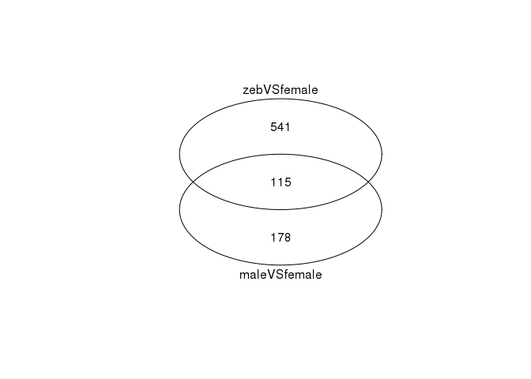

# 3.1-DE_genes_femaleVSzeb
Tony  
3/29/2016  

Find all DE genes between femaleVSzeb


```r
library(dplyr)
library(ggplot2)
library(tidyr)
library(knitr)
library(edgeR)
library(gplots)
library(pheatmap)
```

## Load data


```r
femaleVSmale_de_genes <- read.table("../Data_Analysis/RNAseq_result/DE_genes/glmQLFit_DE_genes.tsv", header = TRUE)

rnaseq <- read.table(file="../RNASeq_data/new_data_Tony_TPM/RNAseq_new_merged_raw.txt", header = TRUE, stringsAsFactors = FALSE) 

dim(rnaseq)
```

```
## [1] 30897    12
```

```r
rnaseq_meta <- read.table(file = "../RNASeq_data/new_data_Tony_TPM/sailfish_file_table.txt", stringsAsFactors = FALSE)

colnames(rnaseq) <- with(rnaseq_meta, paste(V3, V4, 1:12, sep = "_"))

rnaseq_meta$samples <- with(rnaseq_meta, paste(V3, V4, 1:12, sep = "_"))

rn6_gene <- read.table("../Data_Analysis/rn6_genes.txt") %>% tbl_df() %>%
  select(gene = V1, V7) %>% 
  unique()
```


```r
edgeR_DGElist_females <- rnaseq %>%
  select(contains("female")) %>%
  DGEList(group = rep(c("f","fz"), each = 3)) %>%
  calcNormFactors() 

design_matrix <- rnaseq_meta %>% filter(V3 == "Female") %>% model.matrix(~V4, .)
rownames(design_matrix) <- edgeR_DGElist_females$samples %>% rownames()

edgeR_DGElist_females_trends <- edgeR_DGElist_females %>% 
  # estimateDisp(design_matrix)
  estimateGLMCommonDisp(design_matrix, verbose=TRUE) %>%
  estimateGLMTrendedDisp(design_matrix) %>%
  estimateGLMTagwiseDisp(design_matrix)
```

```
## Disp = 0.04935 , BCV = 0.2221
```

```r
plotBCV(edgeR_DGElist_females_trends)
```


```r
plotMDS.DGEList(edgeR_DGElist_females_trends)
```


## Call DEGs


```r
fitQL <- glmQLFit(edgeR_DGElist_females_trends, design_matrix, robust = TRUE) %>% glmLRT(coef = 2)

edgeR_QL_results <- topTags(fitQL, n = Inf) %>% as.data.frame()

edgeR_QL_results %>% head() %>% kable("markdown")
```


|                     |     logFC|   logCPM|        LR| PValue| FDR|
|:--------------------|---------:|--------:|---------:|------:|---:|
|ENSRNOT00000020926.5 |  5.410772| 6.594403| 1842.8714|      0|   0|
|ENSRNOT00000005311.6 |  3.462860| 6.643088| 1004.0328|      0|   0|
|ENSRNOT00000073850.3 |  3.773508| 6.347845| 1000.9276|      0|   0|
|ENSRNOT00000004956.4 |  2.639911| 6.524903|  607.6930|      0|   0|
|ENSRNOT00000016423.6 |  3.036035| 5.986156|  564.2095|      0|   0|
|ENSRNOT00000018630.5 | -1.869578| 6.864109|  366.9711|      0|   0|


```r
qplot(edgeR_QL_results$PValue)
```

```
## `stat_bin()` using `bins = 30`. Pick better value with `binwidth`.
```


```
## [1] "there are 656 DE genes at FDR < 0.05"
```

## Check overlaps


```r
venn(list(
  maleVSfemale = femaleVSmale_de_genes$gene,
  zebVSfemale = rownames(subset(edgeR_QL_results, FDR < 0.05))
))
```



### Save intermediate gene list of femaleVSfemale+zeb


```r
edgeR_QL_results %>%
  round(3) %>%
  add_rownames("gene") %>%
  filter(FDR < 0.05) %>% 
  write.table(file = "../Data_Analysis/RNAseq_result/DE_genes/3.1-femVSfemZeb_allDE_genes.tsv", row.names = F, col.names = T, quote = F, sep = "\t")
```


## Get final gene list

Genes that are DE between female VS male or zeb


```r
final_dualDE_genes <- edgeR_QL_results %>%
  round(3) %>%
  add_rownames("gene") %>%
  filter(FDR < 0.05) %>%
  filter(gene %in% femaleVSmale_de_genes$gene) %>%
  mutate(logFC = logFC < 0) %>%
  select(gene, gExp_up_in_FemaleVSzeb = logFC, FDR_zeb = FDR) %>%
  inner_join(., femaleVSmale_de_genes %>% select(gene, gExp_up_in_femaleVSmale = gExp_up_in_female, FDR_male = FDR, name = V7))
```

```
## Joining by: "gene"
```

```
## Warning in inner_join_impl(x, y, by$x, by$y): joining character vector and
## factor, coercing into character vector
```

```r
x <- table(final_dualDE_genes$gExp_up_in_FemaleVSzeb == final_dualDE_genes$gExp_up_in_femaleVSmale)
```

Of the 115 genes DE between both conditions, 104 are in the same "direction" compared to female

### Just a quick heatmap based on these genes


```r
final_dualDE_genes %>% head() %>% kable("markdown")
```


|gene                 |gExp_up_in_FemaleVSzeb | FDR_zeb|gExp_up_in_femaleVSmale | FDR_male|name     |
|:--------------------|:----------------------|-------:|:-----------------------|--------:|:--------|
|ENSRNOT00000020926.5 |FALSE                  |       0|TRUE                    |        0|Ptgds    |
|ENSRNOT00000005311.6 |FALSE                  |       0|TRUE                    |        0|Col1a1   |
|ENSRNOT00000004956.4 |FALSE                  |       0|TRUE                    |        0|Col3a1   |
|ENSRNOT00000018630.5 |TRUE                   |       0|TRUE                    |        0|Cdhr1    |
|ENSRNOT00000054976.4 |TRUE                   |       0|TRUE                    |        0|Actg1    |
|ENSRNOT00000009556.7 |FALSE                  |       0|FALSE                   |        0|Hsp90aa1 |

```r
gene_list <- final_dualDE_genes %>% .$gene

plot_heatmap <- rnaseq %>%
  select(-starts_with("Male_zeb")) %>%
  subset(rownames(.) %in% gene_list) %>%
  DGEList() %>%
  cpm()

labels <- rn6_gene %>%
  filter(gene %in% gene_list) %>%
  mutate(name = make.names(V7, unique = T)) %>%
  arrange(gene)

rownames(plot_heatmap) <- labels$name
```

Color scale represents `log10(count+1)`


```r
pheatmap(log(plot_heatmap+1, 10), show_rownames = T, cluster_cols = hclust(as.dist(1-cor(plot_heatmap, method = "spearman")), method = "ward.D2"), clustering_method = "ward.D2",
         color = colorRampPalette(c("#ffffb2", "#feb24c", "#bd0026"))(9))
```


Try z-score normalization within rows.


```r
pheatmap(log(plot_heatmap+1, 10), show_rownames = T, scale = "row", cluster_cols = hclust(as.dist(1-cor(plot_heatmap, method = "spearman")), method = "ward.D2"), clustering_method = "ward.D2",
         color = colorRampPalette(c("#4575b4", "#abd9e9", "#ffffbf", "#fdae61", "#d73027"))(9))
```


## save results

Print only the concordant genes


```r
final <- final_dualDE_genes %>%
  filter(gExp_up_in_FemaleVSzeb == gExp_up_in_femaleVSmale) %>%
  mutate(gExp_up_in_FemaleVSall = gExp_up_in_FemaleVSzeb) %>%
  select(gene, name, gExp_up_in_FemaleVSall)

gExp <- rnaseq %>%
  select(-starts_with("Male_zeb")) %>%
  subset(rownames(.) %in% gene_list) %>%
  DGEList() %>%
  cpm() %>% 
  as.data.frame() %>%
  add_rownames("gene") %>%
  gather(key = sample, value = gExp, -gene) %>%
  mutate(group = gsub("\\_[1-9]", "", sample)) %>%
  group_by(gene, group) %>%
  summarize(mean = mean(gExp) %>% round(3)) %>%
  spread(key = group, value = mean) %>%
  ungroup() %>%
  inner_join(., final, by = "gene")

head(gExp) %>% kable("markdown")
```


|gene                 | Female_vehicle| Female_zeb| Male_vehicle|name           |gExp_up_in_FemaleVSall |
|:--------------------|--------------:|----------:|------------:|:--------------|:----------------------|
|ENSRNOT00000001437.6 |        111.518|      0.000|        0.000|Daglb          |TRUE                   |
|ENSRNOT00000002376.8 |          0.000|    514.732|      523.749|Clcn2          |FALSE                  |
|ENSRNOT00000003791.6 |      21012.848|  11135.378|    13882.146|LOC100910414   |TRUE                   |
|ENSRNOT00000005289.7 |      20567.477|  25727.937|    36435.373|Rab3gap1       |FALSE                  |
|ENSRNOT00000005432.5 |      19390.555|   9526.256|    16353.768|AABR07016056.1 |TRUE                   |
|ENSRNOT00000006128.5 |          0.000|    151.516|      170.757|Wars           |FALSE                  |

```r
gExp %>%
  write.table(file = "../Data_Analysis/RNAseq_result/DE_genes/3.1-femVSfemZeb_glmQLFit_DE_genes.tsv", row.names = F, col.names = T, quote = F, sep = "\t")
```
