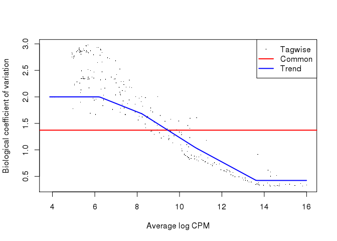
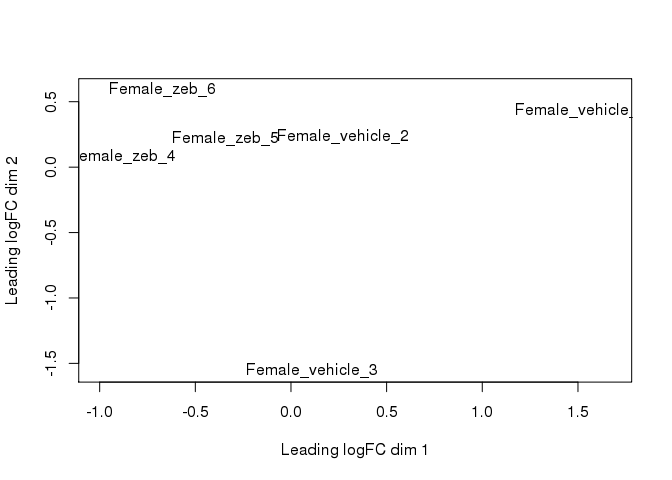
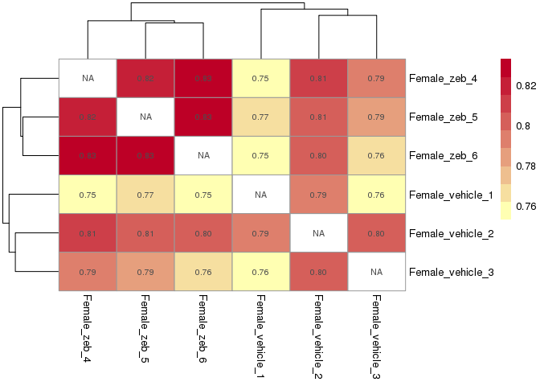
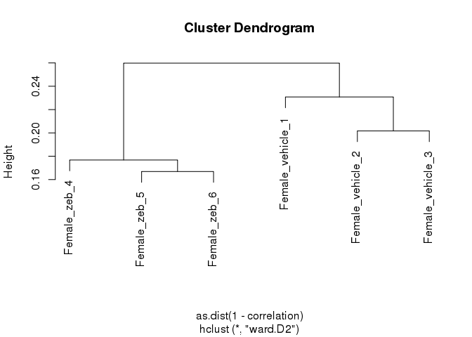
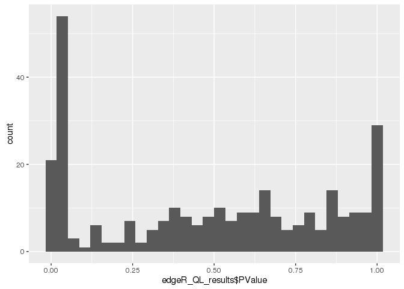
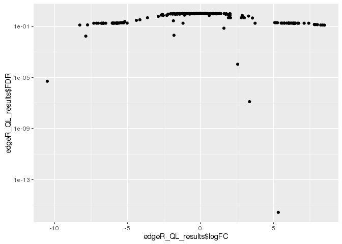
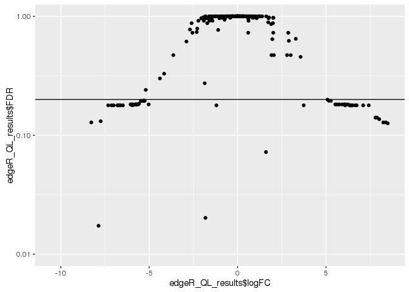
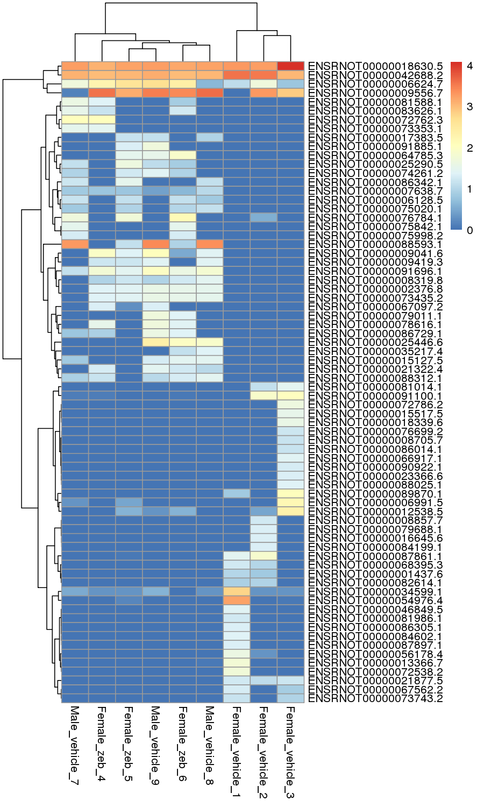
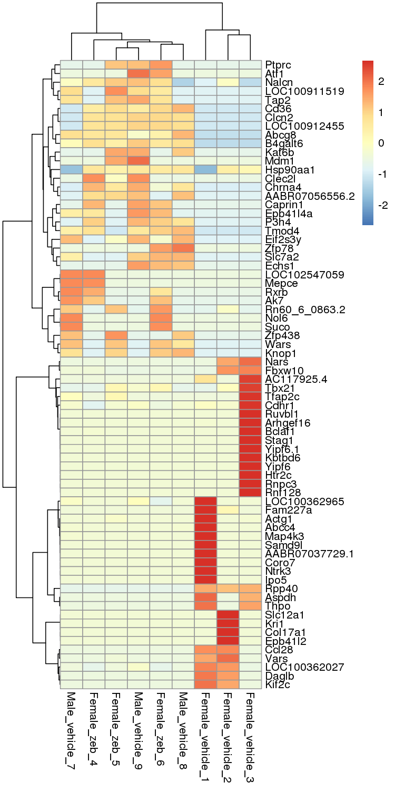

# 3 - DE_genes_femaleVSfemaleZeb
Tony  
3/23/2016  


```r
library(dplyr)
library(ggplot2)
require(tidyr)
require(knitr)
require(edgeR)
require(gplots)
require(pheatmap)
```

## Load data


```r
femaleVSmale_de_genes <- read.table("../Data_Analysis/RNAseq_result/DE_genes/glmQLFit_DE_genes.tsv", header = TRUE)

rnaseq <- read.table(file="../RNASeq_data/new_data_Tony_TPM/RNAseq_new_merged_raw.txt", header = TRUE, stringsAsFactors = FALSE) 

dim(rnaseq)
```

```
## [1] 30897    12
```

```r
rnaseq_meta <- read.table(file = "../RNASeq_data/new_data_Tony_TPM/sailfish_file_table.txt", stringsAsFactors = FALSE)

colnames(rnaseq) <- with(rnaseq_meta, paste(V3, V4, 1:12, sep = "_"))

rnaseq_meta$samples <- with(rnaseq_meta, paste(V3, V4, 1:12, sep = "_"))

rn6_gene <- read.table("rn6_genes.txt") %>% tbl_df() %>%
  select(gene = V1, V7) %>% 
  unique()
```

## Prepare DGEList object and design matrix


```r
rnaseq_subset <- rnaseq %>% 
  # subset genes to only the genes that were differentially expressed between male and female
  subset(rownames(.) %in% femaleVSmale_de_genes$gene)

edgeR_DGElist_females <- rnaseq_subset %>%
  select(contains("female")) %>%
  DGEList(group = rep(c("f","fz"), each = 3)) %>%
  calcNormFactors(method = "TMM") 

design_matrix <- rnaseq_meta %>% filter(V3 == "Female") %>% model.matrix(~V4, .)
rownames(design_matrix) <- edgeR_DGElist_females$samples %>% rownames()

edgeR_DGElist_females_trends <- edgeR_DGElist_females %>%
  estimateGLMCommonDisp(design_matrix, verbose=TRUE) %>%
  estimateGLMTrendedDisp(design_matrix) %>%
  estimateGLMTagwiseDisp(design_matrix)
```

```
## Disp = 1.88207 , BCV = 1.3719
```

```r
plotBCV(edgeR_DGElist_females_trends)
```



```r
plotMDS.DGEList(edgeR_DGElist_females_trends)
```



## Check for outliers


```r
correlation <- cor(rnaseq_subset %>% select(contains("female")), method = "spearman")

diag(correlation) <- NA

clustering <- hclust(as.dist(1-correlation), method = "ward.D2")

require(pheatmap)
pheatmap(correlation, cluster_rows = clustering, cluster_cols = clustering, display_numbers = T, color = colorRampPalette(c("#ffffb2", "#bd0026"))(9))
```



```r
plot(clustering)
```



Female Vehicle and Female Zeb separate out nicely (based on spearman correlation)

## Call DEGs


```r
fitQL <- glmQLFit(edgeR_DGElist_females_trends, design_matrix) %>% glmLRT(coef = 2)

edgeR_QL_results <- topTags(fitQL, n = Inf) %>% as.data.frame()

edgeR_QL_results %>% head() %>% kable("markdown")
```


|                     |      logFC|    logCPM|       LR|    PValue|       FDR|
|:--------------------|----------:|---------:|--------:|---------:|---------:|
|ENSRNOT00000020926.5 |   5.332310| 14.290960| 78.21558| 0.0000000| 0.0000000|
|ENSRNOT00000005311.6 |   3.360921| 14.294668| 37.59587| 0.0000000| 0.0000001|
|ENSRNOT00000054976.4 | -10.505286| 10.802994| 29.64235| 0.0000001| 0.0000051|
|ENSRNOT00000004956.4 |   2.547902| 14.180049| 23.17066| 0.0000015| 0.0001086|
|ENSRNOT00000034599.1 |  -7.865521|  9.583199| 13.09802| 0.0002956| 0.0173226|
|ENSRNOT00000018630.5 |  -1.819905| 14.584751| 12.47031| 0.0004135| 0.0201911|


```r
qplot(edgeR_QL_results$PValue)
```

```
## `stat_bin()` using `bins = 30`. Pick better value with `binwidth`.
```




```
## [1] "there are 6 DE genes at FDR < 0.05"
```

Very little DE genes - let's see what's happening


```r
qplot(edgeR_QL_results$logFC, edgeR_QL_results$FDR) + scale_y_log10()
```



Zoom in... and let's see where the FDR = 0.2 line is


```r
qplot(edgeR_QL_results$logFC, edgeR_QL_results$FDR) + scale_y_log10(limits = c(1e-2, 1)) + geom_hline(yintercept = 0.2)
```

```
## Warning: Removed 4 rows containing missing values (geom_point).
```




```
## [1] "there are 75 DE genes at FDR < 0.2"
```

Seems more legit to use fdr < 0.2 in this case


```r
femVsfemZeb_edge_QL_final <- edgeR_QL_results %>% subset(FDR<0.2) %>% round(3) %>% add_rownames("gene")

femVsfemZeb_edge_QL_final %>% head %>% kable("markdown")
```


|gene                 |   logFC| logCPM|     LR| PValue|   FDR|
|:--------------------|-------:|------:|------:|------:|-----:|
|ENSRNOT00000020926.5 |   5.332| 14.291| 78.216|      0| 0.000|
|ENSRNOT00000005311.6 |   3.361| 14.295| 37.596|      0| 0.000|
|ENSRNOT00000054976.4 | -10.505| 10.803| 29.642|      0| 0.000|
|ENSRNOT00000004956.4 |   2.548| 14.180| 23.171|      0| 0.000|
|ENSRNOT00000034599.1 |  -7.866|  9.583| 13.098|      0| 0.017|
|ENSRNOT00000018630.5 |  -1.820| 14.585| 12.470|      0| 0.020|

## Filter genes that are both either up or downregulated compared to female


```r
output_results <- rnaseq_subset %>% 
  select(-starts_with("Male_zeb")) %>%
  add_rownames("gene") %>%
  filter(gene %in% femVsfemZeb_edge_QL_final$gene) %>%
  gather(key = group, value = gExp, -gene) %>%
  mutate(group = as.character(gsub("\\_[1-9]", "", group))) %>%
  # head(10) %>%
  group_by(gene, group) %>%
  summarize(mean_exp = mean(gExp) %>% round(digits = 2)) %>%
  spread(key = group, value = mean_exp)
  
output_results_TF <- output_results %>%
  mutate(gExp_up_in_femaleVSmale = Female_vehicle > Male_vehicle,
         gExp_up_in_femaleVSzeb = Female_vehicle > Female_zeb,
         concordant = gExp_up_in_femaleVSmale == gExp_up_in_femaleVSzeb)

output_results_TF %>% head() %>% kable("markdown")
```


|gene                 | Female_vehicle| Female_zeb| Male_vehicle|gExp_up_in_femaleVSmale |gExp_up_in_femaleVSzeb |concordant |
|:--------------------|--------------:|----------:|------------:|:-----------------------|:----------------------|:----------|
|ENSRNOT00000001437.6 |           5.08|       0.00|         0.00|TRUE                    |TRUE                   |TRUE       |
|ENSRNOT00000002376.8 |           0.00|      26.99|        21.72|FALSE                   |FALSE                  |TRUE       |
|ENSRNOT00000004956.4 |         753.09|    4393.26|       361.08|TRUE                    |FALSE                  |FALSE      |
|ENSRNOT00000005311.6 |         498.58|    5066.94|       259.44|TRUE                    |FALSE                  |FALSE      |
|ENSRNOT00000006128.5 |           0.00|       8.29|         6.31|FALSE                   |FALSE                  |TRUE       |
|ENSRNOT00000006624.7 |          21.47|     269.47|       171.79|FALSE                   |FALSE                  |TRUE       |

Call genes concordant if their expression in Fem+Zeb and Male changes in the same way compared to Female *(eg both upregulated compared to female)*


```r
table(output_results_TF$concordant)
```

```
## 
## FALSE  TRUE 
##     3    72
```

Good, most genes are concordant

### Just a quick heatmap based on these genes


```r
gene_list <- output_results_TF %>% filter(concordant) %>% .$gene
plot_heatmap <- subset(rnaseq, rownames(rnaseq) %in% gene_list) %>% select(-starts_with("male_zeb"))
plot_heatmap <- log(plot_heatmap+1, base=10)

labels <- rn6_gene %>%
  filter(gene %in% gene_list) %>%
  mutate(name = make.names(V7, unique = T)) %>%
  arrange(gene)

rownames(plot_heatmap) <- labels$name
```

Color scale represents `log10(count+1)`


```r
pheatmap(plot_heatmap, show_rownames = T, cluster_cols = hclust(as.dist(1-cor(plot_heatmap, method = "spearman")), method = "ward.D2"), clustering_method = "ward.D2")
```



Try z-score normalization within rows.


```r
pheatmap(plot_heatmap, show_rownames = T, scale = "row", cluster_cols = hclust(as.dist(1-cor(plot_heatmap, method = "spearman")), method = "ward.D2"), clustering_method = "ward.D2")
```



## save results

Print only the concordant genes


```r
output_results_final <- output_results_TF %>%
  filter(concordant) %>%
  left_join(., femVsfemZeb_edge_QL_final) %>%
  select(-concordant) %>%
  inner_join(., rn6_gene) %>%
  select(-LR, -logCPM)
```

```
## Joining by: "gene"
## Joining by: "gene"
```

```r
output_results_final %>%
  write.table(file = "../Data_Analysis/RNAseq_result/DE_genes/femVSfemZeb_glmQLFit_DE_genes.tsv", row.names = F, col.names = T, quote = F, sep = "\t")
```
