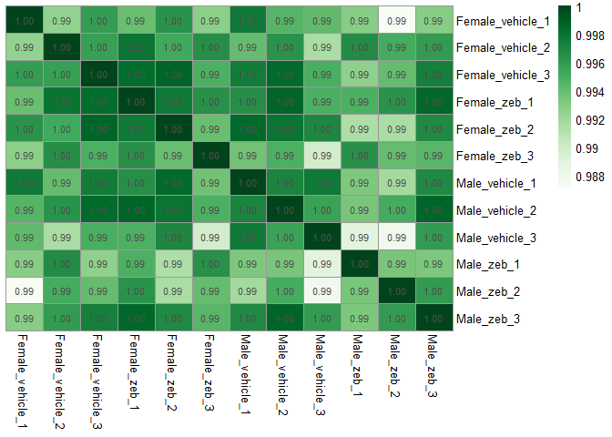
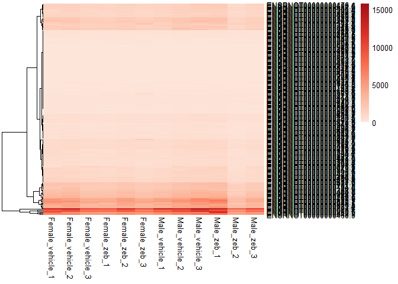
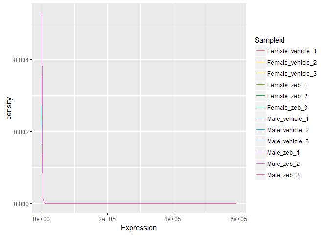
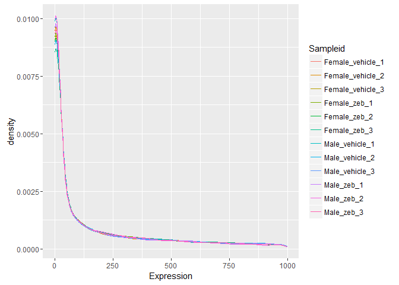

# Sailfish Sanity Checks
Emma  
23 March 2016  


```r
#Load required packages 
library(RColorBrewer)
library(pheatmap)
library(ggplot2)
library(reshape)
```


```r
#Load the sailfish data 
sfdata <- read.table("C:/Users/Emma/Documents/Masters/STAT540/team_treed_rats-DNA-methylation/RNASeq_data/new_data_Tony_TPM/RNASeq_new_merged_raw.txt")
#And metadata 
sfmeta <- read.table("C:/Users/Emma/Documents/Masters/STAT540/team_treed_rats-DNA-methylation/RNASeq_data/new_data_Tony_TPM/sailfish_file_table.txt")
```


```r
#Rearranging data 
#Rename metadata 
names(sfmeta) <- c("ID", "Sample", "Sex", "Treatment")
#Add replicate numbers
sfmeta$replicate <- c("1", "2", "3", "1", "2", "3", "1", "2", "3", "1", "2", "3")
#Make sample id column with all info
metadata <- within(sfmeta,  sampleid <- paste(Sex, Treatment, replicate, sep="_"))
#Update data file with new names
colnames(sfdata) <- metadata$sampleid
```


```r
#Make heatmap correlating the samples 
mypalette <- colorRampPalette(brewer.pal(9, "Greens"))(100)
correlated <- cor(sfdata, y = NULL, use = "everything", method = c("pearson"))
pheatmap(correlated, color = mypalette, cluster_cols = FALSE, cluster_rows = FALSE, display_numbers = T)
```



The correlation looks good. The sample that looked like a possible outlier before shows up again (Male vehicle 3), but again the correlation is still so high that I don't feel like it will affect anything. 


```r
#Taking a look at the gene expression of a few samples 
headgenes <- head(sfdata, n=200)
palette2 <- colorRampPalette(brewer.pal(5, "Reds"))(600)
pheatmap(headgenes, color = palette2, cluster_cols = FALSE)
```



The expression of this gene pick is quite low, but it gets across that none of the samples look out of place or incorrect in any way. (good!)


```r
#Melt
melted <- melt(sfdata,
     variable.name = "Sample", 
     value.name = "Expression")
```

```
## Using  as id variables
```

```r
#Rename
colnames(melted) <- c("Sampleid", "Expression")
#Density plot
(p <- ggplot(melted, aes(Expression, color = Sampleid)) + 
    stat_density(geom = "line", position = "identity"))
```



Density plot shows that all of the samples have the same expression distribution - high amount of genes have lower expression. 

Even 'zoomed right in' on the x axis, they still have the same expression density pattern: 


```r
(p <- ggplot(melted, aes(Expression, color = Sampleid)) + 
    stat_density(geom = "line", position = "identity") + scale_x_continuous(limits = c(0, 1000)))
```

```
## Warning: Removed 76904 rows containing non-finite values (stat_density).
```



